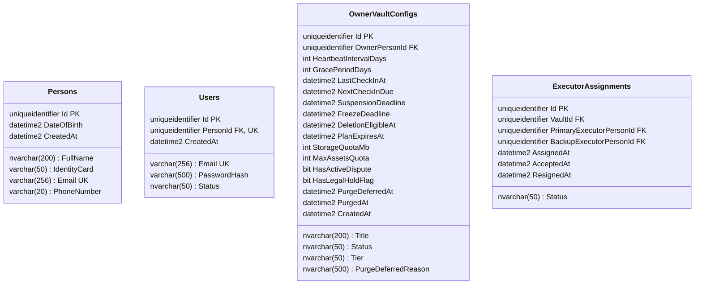
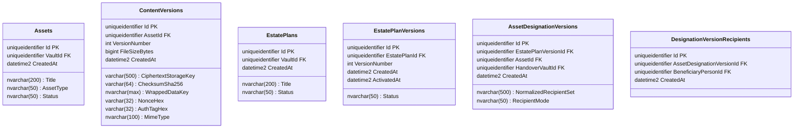
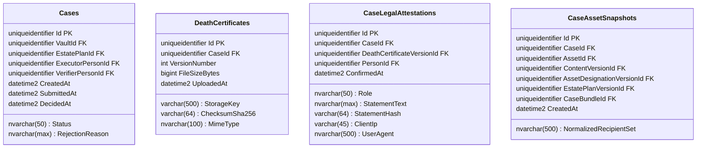
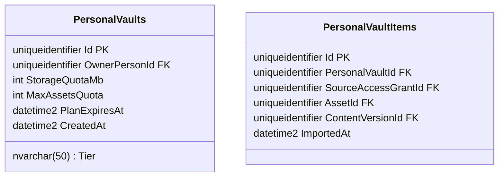
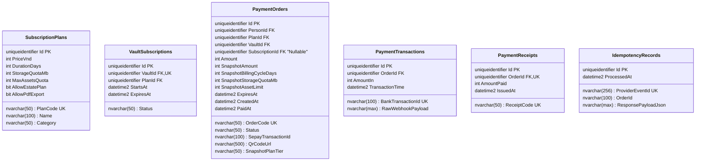

# THIẾT KẾ CƠ SỞ DỮ LIỆU LOGICAL & PHYSICAL ERD (SQL SERVER 2022 / EF CORE 10)

## DỰ ÁN: LEGACYVAULT — HỆ THỐNG LƯU GIỮ VÀ BÀN GIAO TÀI SẢN SỐ

### Phiên bản: Chuẩn Hóa Kiến Trúc Luồng Bàn Giao Nghiệp Vụ & Snapshot Bất Biến (03/10/2026) — .NET 10 LTS & SQL Server 2022

### Thiết kế: Tách bạch Case & CaseBundle, Snapshot bất biến (Asset + Version + Recipient), Cam kết nhóm N Decision -> 1 Commitment, Xác thực ủy quyền Executor và Ranh giới mật mã Shamir 2/3.

---

## 1. SƠ ĐỒ QUAN HỆ THỰC THỂ TỔNG QUAN (CONCEPTUAL & LOGICAL ERD)

### 1.1. Sơ Đồ Thực Thể Khái Niệm (Conceptual ERD)

```mermaid
erDiagram
    %% =========================================================================
    %% 1. DANH TÍNH CỐT LÕI & VAI TRÒ HỆ THỐNG
    %% =========================================================================
    PERSONS ||--o| USERS : "tài khoản xác thực (0..1)"
    USERS }o--o{ STAFF_ROLES : "gán vai trò nội bộ"
    PERSONS ||--o| OWNER_VAULTS : "sở hữu kho nguồn (0..1)"
    PERSONS ||--o{ PERSONAL_VAULTS : "sở hữu kho nhận cá nhân (0..N)"

    %% =========================================================================
    %% 2. KHO NGUỒN, TÀI SẢN & THI HÀNH
    %% =========================================================================
    OWNER_VAULTS ||--o{ ASSETS : "lưu trữ tài sản số"
    OWNER_VAULTS ||--o{ EXECUTOR_ASSIGNMENTS : "phạm vi thi hành"
    PERSONS ||--o{ EXECUTOR_ASSIGNMENTS : "được chỉ định thi hành"

    %% =========================================================================
    %% 3. KẾ HOẠCH DI SẢN, PHIÊN BẢN & GÓI CHUẨN BỊ
    %% =========================================================================
    OWNER_VAULTS ||--o{ ESTATE_PLANS : "lập kế hoạch di sản"
    ESTATE_PLANS ||--|{ ESTATE_PLAN_VERSIONS : "lịch sử phiên bản (1..N)"
    ESTATE_PLAN_VERSIONS ||--o{ BUNDLES : "chuẩn bị gói bàn giao"
    BUNDLES }o--o{ ASSETS : "gom nhóm tài sản"
    BUNDLES ||--o| HANDOVER_POLICIES : "ràng buộc chính sách (0..1)"
    ESTATE_PLAN_VERSIONS ||--o{ ASSET_DESIGNATION_VERSIONS : "chỉ định theo phiên bản"
    ASSETS ||--o{ ASSET_DESIGNATION_VERSIONS : "tài sản được phân bổ"
    PERSONS ||--o{ ASSET_DESIGNATION_VERSIONS : "người được chỉ định"

    %% =========================================================================
    %% 4. GIÁM SÁT SINH TỒN (DEAD MAN'S SWITCH)
    %% =========================================================================
    OWNER_VAULTS ||--o| DMS_POLICIES : "cấu hình điểm danh (0..1)"
    DMS_POLICIES ||--o{ DMS_CYCLES : "sinh chu kỳ điểm danh"
    DMS_CYCLES ||--o{ DMS_NOTICES : "phát cảnh báo kiểm tra"
    PERSONS ||--o{ DMS_NOTICES : "nhận cảnh báo check-in"
    DMS_CYCLES o|--o| CASES : "kích hoạt khi quá hạn (0..1)"

    %% =========================================================================
    %% 5. HỒ SƠ DI SẢN, THẨM ĐỊNH & PHONG TỎA
    %% =========================================================================
    OWNER_VAULTS ||--o{ CASES : "phát sinh hồ sơ di sản"
    CASES ||--o{ DEATH_CERTIFICATES : "đính kèm giấy chứng tử"
    CASES ||--o{ CASE_ASSIGNMENTS : "lịch sử phân công thẩm định"
    PERSONS ||--o{ CASE_ASSIGNMENTS : "chuyên viên thẩm định"
    CASES ||--o{ VERIFICATION_DECISIONS : "kết luận thẩm định hồ sơ"
    PERSONS ||--o{ VERIFICATION_DECISIONS : "thẩm định viên ban hành"
    CASE_ASSIGNMENTS ||--o{ VERIFICATION_DECISIONS : "căn cứ thẩm định"
    OWNER_VAULTS ||--o{ HOLDS : "phạm vi phong tỏa kho"
    CASES o|--o{ HOLDS : "phạm vi phong tỏa hồ sơ"
    PERSONS o|--o{ HOLDS : "người đặt hoặc giải tỏa"
    PERSONS o|--o{ AUDIT_LOGS : "người thực hiện tác vụ"
    OWNER_VAULTS o|--o{ AUDIT_LOGS : "kho bị tác động"
    CASES o|--o{ AUDIT_LOGS : "hồ sơ bị tác động"

    %% =========================================================================
    %% 6. SNAPSHOT BÀN GIAO, LỊCH HẸN & PHIÊN LÀM VIỆC
    %% =========================================================================
    CASES ||--o{ CASE_BUNDLES : "chia gói bàn giao hồ sơ"
    BUNDLES ||--o{ CASE_BUNDLES : "kế thừa cấu hình kế hoạch"
    CASE_BUNDLES }o--o{ ASSETS : "chốt snapshot tài sản bất biến"
    CASE_BUNDLES ||--o{ HANDOVER_SCHEDULES : "lên lịch hẹn bàn giao"
    PERSONS }o--o{ HANDOVER_SCHEDULES : "tham gia xác nhận lịch"
    HANDOVER_SCHEDULES ||--o{ HANDOVER_NOTICES : "phát thông báo lịch"
    PERSONS ||--o{ HANDOVER_NOTICES : "nhận thông báo lịch hẹn"
    HANDOVER_SCHEDULES o|--o{ WORK_SESSIONS : "tổ chức phiên theo lịch"
    CASE_BUNDLES ||--o{ WORK_SESSIONS : "tổ chức phiên làm việc (LiveKit)"
    PERSONS }o--o{ WORK_SESSIONS : "tham gia phiên làm việc"
    WORK_SESSIONS ||--o{ RECIPIENT_AUTHORIZATIONS : "căn cứ xác minh phiên họp"
    CASE_BUNDLES ||--o{ RECIPIENT_AUTHORIZATIONS : "ủy quyền theo gói"
    PERSONS ||--o{ RECIPIENT_AUTHORIZATIONS : "người nhận được duyệt"
    PERSONS ||--o{ RECIPIENT_AUTHORIZATIONS : "Executor phê duyệt"

    %% =========================================================================
    %% 7. ĐỒNG THUẬN NHÓM, CẤP QUYỀN, TẢI VỀ & KHO CÁ NHÂN
    %% =========================================================================
    CASE_BUNDLES ||--o{ BENEFICIARY_DECISIONS : "thu thập quyết định"
    PERSONS ||--o{ BENEFICIARY_DECISIONS : "chấp nhận hoặc từ chối"
    CASE_BUNDLES ||--o{ COMMITMENTS : "ghi nhận vòng cam kết"
    COMMITMENTS o|--|{ BENEFICIARY_DECISIONS : "chốt quyết định hợp lệ (N -> 1)"
    COMMITMENTS ||--o{ ACCESS_GRANTS : "căn cứ sinh quyền truy cập"
    CASE_BUNDLES ||--o{ ACCESS_GRANTS : "phạm vi cấp quyền theo gói"
    PERSONS ||--o{ ACCESS_GRANTS : "người được cấp quyền"
    ACCESS_GRANTS }o--|{ ASSETS : "cho phép tải tài sản (>= 1)"
    ACCESS_GRANTS ||--o{ DOWNLOAD_ATTEMPTS : "nhật ký từng lần thử tải"
    DOWNLOAD_ATTEMPTS }o--|| ASSETS : "tài sản được yêu cầu tải"
    ACCESS_GRANTS ||--o| HANDOVER_RECEIPTS : "biên nhận chốt hoàn tất (0..1)"
    PERSONAL_VAULTS }o--o{ ASSETS : "tích lũy tài sản đã nhận"

    %% =========================================================================
    %% 8. BẢNG GIÁ, THUÊ BAO & THANH TOÁN (SEPAY)
    %% =========================================================================
    OWNER_VAULTS ||--o| VAULT_SUBSCRIPTIONS : "thuê bao hiện hành (0..1)"
    SUBSCRIPTION_PLANS ||--o{ VAULT_SUBSCRIPTIONS : "gói cước áp dụng"
    SUBSCRIPTION_PLANS ||--o{ PAYMENT_ORDERS : "định giá gói cước"
    PERSONS ||--o{ PAYMENT_ORDERS : "người thanh toán đơn hàng"
    OWNER_VAULTS ||--o{ PAYMENT_ORDERS : "lịch sử đơn hàng của kho"
    VAULT_SUBSCRIPTIONS o|--o{ PAYMENT_ORDERS : "đơn kích hoạt hoặc gia hạn (0..N)"
    PAYMENT_ORDERS ||--o{ PAYMENT_TRANSACTIONS : "giao dịch SePay Webhook"
    PAYMENT_ORDERS ||--o| PAYMENT_RECEIPTS : "chứng từ xác nhận thanh toán (0..1)"
```

### 1.2. Sơ Đồ Thực Thể Mức Logic (Logical ERD - Toàn Bộ Bảng & Khóa Ngoại)

```mermaid
erDiagram
    %% =========================================================================
    %% 1. DANH TÍNH, TÀI KHOẢN & VAI TRÒ NỘI BỘ
    %% =========================================================================
    PERSONS {
        uuid id PK
        nvarchar200 full_name
        varchar50 identity_card
        varchar256 email UK
        varchar20 phone_number
        datetime2 date_of_birth
        datetime2 created_at
    }

    USERS {
        uuid id PK
        uuid person_id FK,UK
        varchar256 email UK
        varchar500 password_hash
        varchar256 oidc_subject
        nvarchar50 status
        datetime2 created_at
    }

    STAFF_ROLES {
        uuid id PK
        uuid user_id FK
        nvarchar50 role_code
        datetime2 assigned_at
        uuid assigned_by_user_id FK
    }

    %% =========================================================================
    %% 2. KHO NGUỒN, TÀI SẢN & PHÂN CÔNG
    %% =========================================================================
    OWNER_VAULTS {
        uuid id PK
        uuid owner_person_id FK,UK
        nvarchar200 title
        nvarchar50 status
        nvarchar50 tier
        int storage_quota_mb
        int max_assets_quota
        datetime2 created_at
    }

    ASSETS {
        uuid id PK
        uuid vault_id FK
        nvarchar200 title
        nvarchar50 asset_type
        nvarchar50 status
        datetime2 created_at
    }

    CONTENT_VERSIONS {
        uuid id PK
        uuid asset_id FK
        int version_number
        varchar500 ciphertext_storage_key
        varchar64 checksum_sha256
        nvarcharmax wrapped_data_key
        varchar32 nonce_hex
        varchar32 auth_tag_hex
        bigint file_size_bytes
        nvarchar100 mime_type
        datetime2 created_at
    }

    EXECUTOR_ASSIGNMENTS {
        uuid id PK
        uuid vault_id FK
        uuid executor_person_id FK
        nvarchar50 status
        datetime2 assigned_at
        datetime2 accepted_at
        datetime2 resigned_at
    }

    %% =========================================================================
    %% 3. KẾ HOẠCH DI SẢN, PHIÊN BẢN, GÓI & CHỈ ĐỊNH PHÂN CẤP
    %% =========================================================================
    ESTATE_PLANS {
        uuid id PK
        uuid vault_id FK
        nvarchar200 title
        nvarchar50 status
        datetime2 created_at
    }

    ESTATE_PLAN_VERSIONS {
        uuid id PK
        uuid estate_plan_id FK
        int version_number
        nvarchar50 status
        datetime2 activated_at
        datetime2 created_at
    }

    BUNDLES {
        uuid id PK
        uuid estate_plan_version_id FK
        nvarchar200 title
        nvarchar50 recipient_mode
        nvarchar500 normalized_recipient_set
        datetime2 created_at
    }

    BUNDLE_ASSETS {
        uuid bundle_id PK,FK
        uuid asset_id PK,FK
        datetime2 added_at
    }

    HANDOVER_POLICIES {
        uuid id PK
        uuid bundle_id FK,UK
        int response_window_days
        bit require_video_session
        int consensus_threshold_percent
        datetime2 created_at
    }

    ASSET_DESIGNATION_VERSIONS {
        uuid id PK
        uuid estate_plan_version_id FK
        uuid asset_id FK
        uuid beneficiary_person_id FK
        nvarchar500 normalized_recipient_set
        nvarchar50 recipient_mode
        datetime2 created_at
    }

    %% =========================================================================
    %% 4. GIÁM SÁT SINH TỒN (DEAD MAN'S SWITCH)
    %% =========================================================================
    DMS_POLICIES {
        uuid id PK
        uuid vault_id FK,UK
        int interval_days
        int grace_period_days
        datetime2 created_at
    }

    DMS_CYCLES {
        uuid id PK
        uuid dms_policy_id FK
        datetime2 scheduled_check_in_at
        datetime2 actual_check_in_at
        nvarchar50 status
        datetime2 grace_expires_at
    }

    DMS_NOTICES {
        uuid id PK
        uuid dms_cycle_id FK
        uuid recipient_person_id FK
        nvarchar50 notice_type
        nvarchar50 channel
        datetime2 sent_at
        nvarchar50 delivery_status
    }

    %% =========================================================================
    %% 5. HỒ SƠ DI SẢN, THẨM ĐỊNH, PHONG TỎA & KIỂM TOÁN
    %% =========================================================================
    CASES {
        uuid id PK
        uuid vault_id FK
        uuid dms_cycle_id FK,UK
        nvarchar50 status
        datetime2 submitted_at
        datetime2 decided_at
        datetime2 created_at
    }

    DEATH_CERTIFICATES {
        uuid id PK
        uuid case_id FK
        varchar500 storage_key
        varchar64 checksum_sha256
        nvarchar100 mime_type
        datetime2 uploaded_at
    }

    CASE_ASSIGNMENTS {
        uuid id PK
        uuid case_id FK
        uuid assigned_person_id FK
        datetime2 assigned_at
        nvarchar50 status
    }

    VERIFICATION_DECISIONS {
        uuid id PK
        uuid case_id FK
        uuid verifier_person_id FK
        uuid case_assignment_id FK
        nvarchar50 decision_status
        nvarcharmax statement_note
        datetime2 decided_at
    }

    HOLDS {
        uuid id PK
        uuid vault_id FK
        uuid case_id FK
        nvarchar50 hold_type
        nvarchar500 reason
        uuid placed_by_person_id FK
        datetime2 placed_at
        uuid released_by_person_id FK
        datetime2 released_at
    }

    AUDIT_LOGS {
        uuid id PK
        nvarchar100 action
        uuid performed_by_person_id FK
        uuid vault_id FK
        uuid case_id FK
        varchar45 client_ip
        nvarchar500 user_agent
        varchar64 payload_hash
        datetime2 created_at
    }

    %% =========================================================================
    %% 6. SNAPSHOT BÀN GIAO, LỊCH HẸN & PHIÊN HỌP LIVEKIT
    %% =========================================================================
    CASE_BUNDLES {
        uuid id PK
        uuid case_id FK
        uuid source_bundle_id FK
        nvarchar200 title
        nvarchar50 recipient_mode
        nvarchar500 normalized_recipient_set
        nvarchar50 status
        datetime2 initial_response_due_at
        datetime2 freeze_expires_at
        datetime2 created_at
    }

    CASE_BUNDLE_ITEMS {
        uuid id PK
        uuid case_bundle_id FK
        uuid asset_id FK
        uuid content_version_id FK
        uuid asset_designation_version_id FK
        datetime2 snapshotted_at
    }

    HANDOVER_SCHEDULES {
        uuid id PK
        uuid case_bundle_id FK
        int schedule_version
        datetimeoffset scheduled_delivery_date
        uuid scheduled_by_person_id FK
        bit is_active
        datetime2 created_at
    }

    SCHEDULE_PARTICIPANTS {
        uuid id PK
        uuid handover_schedule_id FK
        uuid person_id FK
        nvarchar50 role_in_schedule
        nvarchar50 confirmation_status
        datetime2 responded_at
        nvarchar500 notes
    }

    HANDOVER_NOTICES {
        uuid id PK
        uuid handover_schedule_id FK
        uuid recipient_person_id FK
        nvarchar50 notice_type
        datetime2 sent_at
        nvarchar50 status
    }

    WORK_SESSIONS {
        uuid id PK
        uuid case_bundle_id FK
        uuid handover_schedule_id FK
        varchar100 livekit_room_name UK
        nvarchar50 status
        nvarchar50 verification_outcome
        datetime2 started_at
        datetime2 ended_at
    }

    SESSION_PARTICIPANTS {
        uuid id PK
        uuid work_session_id FK
        uuid person_id FK
        nvarchar50 role
        datetime2 joined_at
        datetime2 left_at
        bit identity_verified
    }

    RECIPIENT_AUTHORIZATIONS {
        uuid id PK
        uuid case_bundle_id FK
        uuid recipient_person_id FK
        uuid approved_by_executor_person_id FK
        uuid work_session_id FK
        bit is_authorized
        datetime2 authorized_at
        bit face_matched
        bit national_id_matched
    }

    %% =========================================================================
    %% 7. ĐỒNG THUẬN NHÓM, CẤP QUYỀN, TẢI VỀ & KHO CÁ NHÂN
    %% =========================================================================
    BENEFICIARY_DECISIONS {
        uuid id PK
        uuid case_bundle_id FK
        uuid recipient_person_id FK
        uuid commitment_id FK
        nvarchar50 decision_status
        datetime2 decided_at
        bit legal_acknowledgment
    }

    COMMITMENTS {
        uuid id PK
        uuid case_bundle_id FK
        nvarchar50 policy_mode
        datetime2 committed_at
        nvarcharmax legal_acknowledgment
    }

    ACCESS_GRANTS {
        uuid id PK
        uuid case_bundle_id FK
        uuid recipient_person_id FK
        uuid commitment_id FK
        varchar64 download_token UK
        nvarchar50 status
        datetime2 issued_at
        datetime2 expires_at
    }

    ACCESS_GRANT_ASSETS {
        uuid access_grant_id PK,FK
        uuid asset_id PK,FK
        datetime2 granted_at
    }

    DOWNLOAD_ATTEMPTS {
        uuid id PK
        uuid access_grant_id FK
        uuid asset_id FK
        datetime2 served_at
        bigint bytes_served
        varchar45 client_ip
    }

    HANDOVER_RECEIPTS {
        uuid id PK
        uuid access_grant_id FK,UK
        uuid case_bundle_id FK
        uuid beneficiary_person_id FK
        nvarchar50 receipt_number UK
        varchar64 signature_hash
        varchar64 receipt_content_hash
        datetime2 received_at
    }

    PERSONAL_VAULTS {
        uuid id PK
        uuid owner_person_id FK
        nvarchar50 tier
        int storage_quota_mb
        int max_assets_quota
        datetime2 created_at
    }

    PERSONAL_VAULT_ITEMS {
        uuid id PK
        uuid personal_vault_id FK
        uuid source_access_grant_id FK
        uuid asset_id FK
        datetime2 imported_at
    }

    %% =========================================================================
    %% 8. BẢNG GIÁ, THUÊ BAO & THANH TOÁN (SEPAY)
    %% =========================================================================
    SUBSCRIPTION_PLANS {
        uuid id PK
        nvarchar50 plan_code UK
        nvarchar100 name
        nvarchar50 category
        int price_vnd
        int duration_days
        int storage_quota_mb
        int max_assets_quota
    }

    VAULT_SUBSCRIPTIONS {
        uuid id PK
        uuid vault_id FK,UK
        uuid plan_id FK
        datetime2 starts_at
        datetime2 expires_at
        nvarchar50 status
    }

    PAYMENT_ORDERS {
        uuid id PK
        nvarchar50 order_code UK
        uuid person_id FK
        uuid plan_id FK
        uuid vault_id FK
        uuid subscription_id FK
        int amount
        nvarchar50 status
        nvarchar500 qr_code_url
        datetime2 paid_at
        datetime2 created_at
    }

    PAYMENT_TRANSACTIONS {
        uuid id PK
        uuid order_id FK
        nvarchar100 bank_transaction_id UK
        int amount_in
        datetime2 transaction_time
        nvarcharmax raw_webhook_payload
    }

    PAYMENT_RECEIPTS {
        uuid id PK
        uuid order_id FK,UK
        nvarchar50 receipt_code UK
        int amount_paid
        datetime2 issued_at
    }

    %% =========================================================================
    %% KHÓA NGOẠI LOGICAL (FOREIGN KEY RELATIONSHIPS)
    %% =========================================================================
    USERS |o--|| PERSONS : "person_id"
    STAFF_ROLES }o--|| USERS : "user_id"
    OWNER_VAULTS ||--|| PERSONS : "owner_person_id"
    ASSETS }o--|| OWNER_VAULTS : "vault_id"
    CONTENT_VERSIONS }o--|| ASSETS : "asset_id"
    EXECUTOR_ASSIGNMENTS }o--|| OWNER_VAULTS : "vault_id"
    EXECUTOR_ASSIGNMENTS }o--|| PERSONS : "executor_person_id"

    ESTATE_PLANS }o--|| OWNER_VAULTS : "vault_id"
    ESTATE_PLAN_VERSIONS }o--|| ESTATE_PLANS : "estate_plan_id"
    BUNDLES }o--|| ESTATE_PLAN_VERSIONS : "estate_plan_version_id"
    BUNDLE_ASSETS }o--|| BUNDLES : "bundle_id"
    BUNDLE_ASSETS }o--|| ASSETS : "asset_id"
    HANDOVER_POLICIES |o--|| BUNDLES : "bundle_id"

    ASSET_DESIGNATION_VERSIONS }o--|| ESTATE_PLAN_VERSIONS : "estate_plan_version_id"
    ASSET_DESIGNATION_VERSIONS }o--|| ASSETS : "asset_id"
    ASSET_DESIGNATION_VERSIONS }o--|| PERSONS : "beneficiary_person_id"

    DMS_POLICIES |o--|| OWNER_VAULTS : "vault_id"
    DMS_CYCLES }o--|| DMS_POLICIES : "dms_policy_id"
    DMS_NOTICES }o--|| DMS_CYCLES : "dms_cycle_id"
    DMS_NOTICES }o--|| PERSONS : "recipient_person_id"

    CASES }o--|| OWNER_VAULTS : "vault_id"
    CASES |o--o| DMS_CYCLES : "dms_cycle_id"
    DEATH_CERTIFICATES }o--|| CASES : "case_id"
    CASE_ASSIGNMENTS }o--|| CASES : "case_id"
    CASE_ASSIGNMENTS }o--|| PERSONS : "assigned_person_id"
    VERIFICATION_DECISIONS }o--|| CASES : "case_id"
    VERIFICATION_DECISIONS }o--|| PERSONS : "verifier_person_id"
    VERIFICATION_DECISIONS }o--|| CASE_ASSIGNMENTS : "case_assignment_id"
    HOLDS }o--|| OWNER_VAULTS : "vault_id"
    HOLDS }o--o| CASES : "case_id"
    HOLDS }o--o| PERSONS : "placed_by_person_id"
    HOLDS }o--o| PERSONS : "released_by_person_id"
    AUDIT_LOGS }o--o| PERSONS : "performed_by_person_id"
    AUDIT_LOGS }o--o| OWNER_VAULTS : "vault_id"
    AUDIT_LOGS }o--o| CASES : "case_id"

    CASE_BUNDLES }o--|| CASES : "case_id"
    CASE_BUNDLES }o--|| BUNDLES : "source_bundle_id"
    CASE_BUNDLE_ITEMS }o--|| CASE_BUNDLES : "case_bundle_id"
    CASE_BUNDLE_ITEMS }o--|| ASSETS : "asset_id"
    CASE_BUNDLE_ITEMS }o--|| CONTENT_VERSIONS : "content_version_id"
    CASE_BUNDLE_ITEMS }o--|| ASSET_DESIGNATION_VERSIONS : "asset_designation_version_id"

    HANDOVER_SCHEDULES }o--|| CASE_BUNDLES : "case_bundle_id"
    HANDOVER_SCHEDULES }o--|| PERSONS : "scheduled_by_person_id"
    SCHEDULE_PARTICIPANTS }o--|| HANDOVER_SCHEDULES : "handover_schedule_id"
    SCHEDULE_PARTICIPANTS }o--|| PERSONS : "person_id"
    HANDOVER_NOTICES }o--|| HANDOVER_SCHEDULES : "handover_schedule_id"
    HANDOVER_NOTICES }o--|| PERSONS : "recipient_person_id"

    WORK_SESSIONS }o--|| CASE_BUNDLES : "case_bundle_id"
    WORK_SESSIONS }o--o| HANDOVER_SCHEDULES : "handover_schedule_id"
    SESSION_PARTICIPANTS }o--|| WORK_SESSIONS : "work_session_id"
    SESSION_PARTICIPANTS }o--|| PERSONS : "person_id"

    RECIPIENT_AUTHORIZATIONS }o--|| CASE_BUNDLES : "case_bundle_id"
    RECIPIENT_AUTHORIZATIONS }o--|| PERSONS : "recipient_person_id"
    RECIPIENT_AUTHORIZATIONS }o--|| PERSONS : "approved_by_executor_person_id"
    RECIPIENT_AUTHORIZATIONS }o--|| WORK_SESSIONS : "work_session_id"

    BENEFICIARY_DECISIONS }o--|| CASE_BUNDLES : "case_bundle_id"
    BENEFICIARY_DECISIONS }o--|| PERSONS : "recipient_person_id"
    BENEFICIARY_DECISIONS }o--o| COMMITMENTS : "commitment_id"
    COMMITMENTS }o--|| CASE_BUNDLES : "case_bundle_id"

    ACCESS_GRANTS }o--|| CASE_BUNDLES : "case_bundle_id"
    ACCESS_GRANTS }o--|| PERSONS : "recipient_person_id"
    ACCESS_GRANTS }o--|| COMMITMENTS : "commitment_id"
    ACCESS_GRANT_ASSETS }o--|| ACCESS_GRANTS : "access_grant_id"
    ACCESS_GRANT_ASSETS }o--|| ASSETS : "asset_id"

    DOWNLOAD_ATTEMPTS }o--|| ACCESS_GRANTS : "access_grant_id"
    DOWNLOAD_ATTEMPTS }o--|| ASSETS : "asset_id"
    HANDOVER_RECEIPTS |o--|| ACCESS_GRANTS : "access_grant_id"
    HANDOVER_RECEIPTS }o--|| CASE_BUNDLES : "case_bundle_id"
    HANDOVER_RECEIPTS }o--|| PERSONS : "beneficiary_person_id"

    PERSONAL_VAULTS }o--|| PERSONS : "owner_person_id"
    PERSONAL_VAULT_ITEMS }o--|| PERSONAL_VAULTS : "personal_vault_id"
    PERSONAL_VAULT_ITEMS }o--|| ACCESS_GRANTS : "source_access_grant_id"
    PERSONAL_VAULT_ITEMS }o--|| ASSETS : "asset_id"

    VAULT_SUBSCRIPTIONS |o--|| OWNER_VAULTS : "vault_id"
    VAULT_SUBSCRIPTIONS }o--|| SUBSCRIPTION_PLANS : "plan_id"
    PAYMENT_ORDERS }o--|| PERSONS : "person_id"
    PAYMENT_ORDERS }o--|| SUBSCRIPTION_PLANS : "plan_id"
    PAYMENT_ORDERS }o--|| OWNER_VAULTS : "vault_id"
    PAYMENT_ORDERS }o--o| VAULT_SUBSCRIPTIONS : "subscription_id"
    PAYMENT_TRANSACTIONS }o--|| PAYMENT_ORDERS : "order_id"
    PAYMENT_RECEIPTS |o--|| PAYMENT_ORDERS : "order_id"
```

### 1.3. Các Quy Tắc Nghiệp Vụ & Ràng Buộc Cốt Lõi (Conceptual Rules)

1. **Đăng Ký / Đăng Nhập Trước Khi Đặt Lịch:**
   * Một `Person` được chỉ định trong di sản ban đầu có thể chưa có tài khoản (`Users = NULL`).
   * Tuy nhiên, **trước khi tham gia đề xuất hoặc xác nhận lịch bàn giao (`HandoverSchedules`)**, người thụ hưởng bắt buộc phải đăng ký/đăng nhập tài khoản `Users` và được liên kết chính xác với bản ghi `Person` trong hồ sơ snapshot.
2. **Quy Tắc Đặt Lịch & Xác Nhận Đa Chiều:**
   * Người thụ hưởng tham gia đặt lịch phải thuộc snapshot danh sách thụ hưởng của Bundle; Executor phải có phân công hiệu lực (`ExecutorAssignments.Status = Accepted`).
   * Hệ thống **lưu trạng thái xác nhận riêng biệt cho từng người** (`ScheduleParticipants.ConfirmationStatus: Pending | Confirmed | Declined | Rescheduled`), không gom chung thành một trạng thái tổng của lịch.
   * Mỗi `CaseBundle` có **tối đa một lịch hẹn hiện hành** (`IsActive = 1`). Khi dời lịch, lịch cũ chuyển sang trạng thái hủy/đã dời và lưu đầy đủ lịch sử kiểm toán.
   * Nếu `WorkSession` liên kết với `HandoverSchedule`, **cả lịch hẹn và phiên họp bắt buộc phải thuộc cùng một `CaseBundle`**.
3. **Phân Biệt Hai Quyết Định Độc Lập:**
   * **Đồng ý lịch hẹn:** Chỉ là thỏa thuận về thời gian gặp gỡ giữa Executor và người thụ hưởng (lưu tại bảng trung gian `ScheduleParticipants.ConfirmationStatus`).
   * **Đồng ý nhận tài sản (`BeneficiaryDecisions`):** Là quyết định pháp lý có điều kiện (chấp nhận hoặc từ chối phần di sản) được ghi nhận trong phiên họp. Hai quyết định này hoàn toàn tách biệt.
4. **Đăng Nhập $\neq$ Duyệt Danh Tính (Hai Vai Trò Authorization):**
   * Việc đăng nhập tài khoản (`Users`) chỉ mang tính chất xác thực truy cập phiên làm việc (Authentication).
   * Quyền tham gia phân chia di sản đòi hỏi bước **Executor phê duyệt ủy quyền danh tính (`RecipientAuthorizations`)** thông qua đối soát khuôn mặt, căn cước công dân và bằng chứng phiên video (`WorkSessions`).
   * Ở tầng logical, bảng `RecipientAuthorizations` lưu 2 khóa ngoại độc lập: `RecipientPersonId` (người thụ hưởng) và `ApprovedByExecutorPersonId` (Executor phê duyệt).
5. **Nhất Quán Phạm Vi Bundle & Phiên Bản Kế Hoạch:**
   * Tài sản trong một Bundle phải thuộc cùng một phiên bản kế hoạch với các chỉ định áp dụng (`BeneficiaryDesignations`). Tuyệt đối không được lấy danh sách người nhận từ phiên bản kế hoạch mới hơn để bàn giao cho gói tài sản thuộc snapshot cũ.
6. **Snapshot Bất Biến Hai Chiều:**
   * Mỗi `CaseBundle` khi nộp hồ sơ khóa cứng cả **Phiên bản nội dung tệp vật lý** (`ContentVersions`) và **Phiên bản chỉ định người nhận** (`BeneficiaryDesignations`), không chỉ lưu `AssetId`.
7. **Quyền Hạn Tối Thiểu (Least Privilege):**
   * Người nhận chỉ được cấp `AccessGrant` cho những tài sản mà mình có tên chỉ định trong snapshot của Bundle đó. Một Grant đã phát hành bắt buộc phải liên kết với ít nhất 1 tài sản (`1..N`).
8. **Đồng Bộ Phạm Vi Bundle (Cross-Scope Isolation):**
   * Toàn bộ `HandoverSchedules`, `WorkSessions`, `BeneficiaryDecisions`, `Commitments`, `RecipientAuthorizations` và `AccessGrants` liên quan phải thuộc về **cùng một `CaseBundle`**.
9. **Phạm Vi Đóng Băng (Hold Boundary):**
   * Mọi bản ghi `Holds` bắt buộc phải có `VaultId`. Nếu Hold có phạm vi hồ sơ cụ thể (`CaseId` khác null), `CaseId` đó bắt buộc phải thuộc đúng `VaultId` của kho.
10. **Nhật Ký Tải vs Biên Bản Chốt Nhận:**
    * `DownloadAttempts` chỉ phản ánh lưu lượng byte máy chủ đã phục vụ; chỉ khi người nhận ký xác nhận điện tử vào `HandoverReceipts` thì quy trình chuyển giao tài sản mới được coi là hoàn tất về mặt pháp lý.

---

## 2. CHI TIẾT CÁC THỰC THỂ CSDL (.NET 10 / SQL SERVER 2022)

### 2.1. Phân Hệ Người Dùng & Quản Lý Kho Nguồn (`OwnerVaultConfigs`)

* **Quy tắc:**
  * `Persons` đại diện cho một cá nhân ngoài đời thực. Mọi quan hệ Người thừa hưởng (`Beneficiary`), Người thực thi (`Executor`), Người xác minh (`Verifier`) ban đầu đều liên kết qua `Persons.Id`.
  * `ExecutorAssignments` lưu rõ Executor chính và dự phòng, ghi vết thời điểm chấp thuận và từ nhiệm.

---

### 2.2. Phân Hệ Kế Hoạch Di Sản & Phiên Bản Chỉ Định Phân Cấp (`DesignationVersions`)

* **Mô hình hóa phiên bản chỉ định phân cấp nhất quán (Chuẩn hóa P0):**
  1. **Cấp Phiên bản Kế hoạch (`EstatePlanVersions`):** Quản lý lịch sử thay đổi của bản di chúc số. Mỗi lần Owner cập nhật chỉ định, hệ thống sinh ra một `EstatePlanVersion` mới với ràng buộc:
     $$
     \mathbf{UNIQUE(EstatePlanId, VersionNumber)}
     $$
  2. **Cấp Phiên bản Chỉ định Tài sản (`AssetDesignationVersions`):** Một kế hoạch chứa nhiều tài sản, mỗi tài sản có thể trao cho một tập người nhận khác nhau (ví dụ: Tài sản 1 cho $\{A\}$, Tài sản 2 cho $\{A, B\}$, Tài sản 3 cho $\{B\}$). Mỗi tài sản có **chính xác một** cấu hình chỉ định hiệu lực trong một phiên bản kế hoạch với ràng buộc:
     $$
     \mathbf{UNIQUE(EstatePlanVersionId, AssetId)}
     $$
  3. **Cấp Dòng Người nhận (`DesignationVersionRecipients`):** Lưu chi tiết từng `BeneficiaryPersonId` trong tập người nhận, đảm bảo:
     $$
     \mathbf{UNIQUE(AssetDesignationVersionId, BeneficiaryPersonId)}
     $$
  4. **Liên kết Kho bàn giao:** Cột `HandoverVaultId` trong `AssetDesignationVersions` trỏ trực tiếp đến Kho bàn giao tự gom tương ứng với tập `(EstatePlanVersionId, NormalizedRecipientSet)`.

---

### 2.3. Phân Hệ Gói Bàn Giao (`CaseBundles`), Cam Kết Nhóm (`Commitments`) & Cấp Quyền (`AccessGrants`)

```mermaid
classDiagram
    class Bundles {
        uniqueidentifier Id PK
        uniqueidentifier EstatePlanVersionId FK
        nvarchar(200) Title
        nvarchar(50) RecipientMode
        nvarchar(500) NormalizedRecipientSet
        datetime2 CreatedAt
    }

    class BundleAssets {
        uniqueidentifier BundleId PK,FK
        uniqueidentifier AssetId PK,FK
        datetime2 AddedAt
    }

    class HandoverPolicies {
        uniqueidentifier Id PK
        uniqueidentifier BundleId FK,UK
        int ResponseWindowDays
        bit RequireVideoSession
        int ConsensusThresholdPercent
        datetime2 CreatedAt
    }

    class CaseBundles {
        uniqueidentifier Id PK
        uniqueidentifier CaseId FK
        uniqueidentifier SourceBundleId FK
        nvarchar(200) Title
        nvarchar(50) RecipientMode
        nvarchar(500) NormalizedRecipientSet
        nvarchar(50) Status
        datetime2 HandoverStartedAt
        datetime2 InitialResponseDueAt
        datetime2 FreezeStartedAt
        datetime2 FreezeExpiresAt
        binary(8) RowVersion
        datetime2 CreatedAt
    }

    class CaseBundleItems {
        uniqueidentifier Id PK
        uniqueidentifier CaseBundleId FK
        uniqueidentifier AssetId FK
        uniqueidentifier ContentVersionId FK
        uniqueidentifier AssetDesignationVersionId FK
        datetime2 AddedAt
    }

    class WorkSessions {
        uniqueidentifier Id PK
        uniqueidentifier CaseBundleId FK
        uniqueidentifier CaseId FK
        uniqueidentifier HandoverScheduleId FK "Nullable"
        varchar(100) LiveKitRoomName UK
        nvarchar(50) Status
        nvarchar(50) VerificationOutcome
        varchar(500) RecordingStorageKey
        datetime2 StartedAt
        datetime2 EndedAt
    }

    class SessionParticipants {
        uniqueidentifier Id PK
        uniqueidentifier WorkSessionId FK
        uniqueidentifier PersonId FK
        nvarchar(50) Role
        datetime2 JoinedAt
        datetime2 LeftAt
        bit IdentityVerified
    }

    class GuestHandoverSessions {
        uniqueidentifier Id PK
        varchar(64) GuestTokenHash UK
        uniqueidentifier CaseBundleId FK
        uniqueidentifier WorkSessionId FK
        uniqueidentifier BeneficiaryPersonId FK
        nvarchar(50) Status
        datetime2 CreatedAt
        datetime2 ExpiresAt
    }

    class RecipientAuthorizations {
        uniqueidentifier Id PK
        uniqueidentifier CaseBundleId FK
        uniqueidentifier RecipientPersonId FK "Người thụ hưởng được xác minh"
        uniqueidentifier ApprovedByExecutorPersonId FK "Executor phê duyệt ủy quyền"
        uniqueidentifier WorkSessionId FK "Bằng chứng phiên video"
        bit IsAuthorized
        datetime2 AuthorizedAt
        bit FaceMatched
        bit NationalIdMatched
        bit InteractiveChallengePassed
        nvarchar(500) Notes
    }

    class BeneficiaryHandoverDecisions {
        uniqueidentifier Id PK
        uniqueidentifier CaseBundleId FK
        uniqueidentifier RecipientPersonId FK
        uniqueidentifier CommitmentId FK
        nvarchar(50) DecisionStatus
        datetime2 DecidedAt
        datetime2 ReconsideredAt
        bit LegalAcknowledgment
        nvarchar(max) RejectionReason
        nvarchar(max) Note
    }

    class Commitments {
        uniqueidentifier Id PK
        uniqueidentifier CaseBundleId FK
        uniqueidentifier CaseId FK
        uniqueidentifier WorkSessionId FK
        nvarchar(50) PolicyMode
        datetime2 CommittedAt
        nvarchar(max) LegalAcknowledgment
        varchar(45) ClientIpAddress
        nvarchar(500) UserAgent
    }

    class AccessGrants {
        uniqueidentifier Id PK
        uniqueidentifier CaseBundleId FK
        uniqueidentifier CaseId FK
        uniqueidentifier RecipientPersonId FK
        uniqueidentifier CommitmentId FK
        nvarchar(50) Status
        varchar(64) DownloadToken UK
        datetime2 IssuedAt
        datetime2 ExpiresAt
    }

    class AccessGrantAssets {
        uniqueidentifier AccessGrantId PK,FK
        uniqueidentifier AssetId PK,FK
        datetime2 GrantedAt
    }

    class DownloadEvents {
        uniqueidentifier Id PK
        uniqueidentifier AccessGrantId FK
        uniqueidentifier CaseBundleId FK
        uniqueidentifier AssetId FK
        uniqueidentifier ContentVersionId FK
        datetime2 ServedAt
        bigint BytesServed
        varchar(45) ClientIpAddress
        nvarchar(500) UserAgent
    }

    class HandoverReceipts {
        uniqueidentifier Id PK
        uniqueidentifier AccessGrantId FK
        uniqueidentifier CaseBundleId FK
        uniqueidentifier BeneficiaryPersonId FK
        nvarchar(50) ReceiptNumber UK
        datetime2 ReceivedAt
        nvarchar(max) ConfirmedAssetIdsJson
        nvarchar(50) SignatureType
        nvarchar(max) RecipientSignatureData
        varchar(64) SignatureHash
        varchar(64) ReceiptContentHash
        varchar(128) ReceiptAuditDigest
    }

    class HandoverSchedules {
        uniqueidentifier Id PK
        uniqueidentifier CaseBundleId FK
        int ScheduleVersion
        datetimeoffset ScheduledDeliveryDate
        nvarchar(500) RescheduledReason
        uniqueidentifier ScheduledByPersonId FK
        bit IsActive
        datetime2 CreatedAt
    }

    class ScheduleParticipants {
        uniqueidentifier Id PK
        uniqueidentifier HandoverScheduleId FK
        uniqueidentifier PersonId FK
        nvarchar(50) RoleInSchedule
        nvarchar(50) ConfirmationStatus
        datetime2 RespondedAt
        nvarchar(500) Notes
    }

    class TransferChoices {
        uniqueidentifier Id PK
        uniqueidentifier CaseBundleId FK
        uniqueidentifier SourceRecipientPersonId FK
        uniqueidentifier TargetRecipientPersonId FK
        nvarchar(50) Status
        datetime2 CreatedAt
        datetime2 FinalizedAt
    }
```

* **1. Tách bạch `CaseId` và `CaseBundleId`**:

  * `Case`: Đại diện cho tiến trình pháp lý xác thực tử vong toàn hồ sơ.
  * `CaseBundle`: Đại diện cho một gói bàn giao độc lập với nhóm người nhận cụ thể (`NormalizedRecipientSet`).
  * Một `Case` có thể chứa $1..N$ `CaseBundle`. Chính sách đồng nhận `All-or-Nothing` chỉ áp dụng **cô lập trong từng `CaseBundle`**, không làm phong tỏa các Bundle độc lập khác của cùng một hồ sơ.
* **2. Ràng buộc Snapshot Bất Biến Người Nhận & Mốc Khóa Snapshot**:

  * **Mốc khóa Snapshot (`SubmittedAt / SnapshottedAt`):** Khi hồ sơ ở trạng thái nháp (`Draft`), danh mục tài sản và người nhận có thể điều chỉnh; nhưng ngay khi `Case` được nộp thẩm định (`SubmittedAt`), hệ thống đóng băng toàn bộ bộ ba `(AssetId, ContentVersionId, AssetDesignationVersionId)` vào `CaseBundleItems`.
  * Sau mốc này, danh sách người nhận `DesignationVersionRecipients` liên đới trở thành **bất biến tuyệt đối**; mọi thay đổi về sau phải tạo `Case` hoặc phiên bản mới theo quy trình pháp lý, không được sửa đè snapshot cũ.
  * **Kiểm soát lời mời (`GuestHandoverSessions`):** Hệ thống chỉ cho phép tạo token lời mời khi `BeneficiaryPersonId` (hoặc Email/CCCD) **đã nằm trong snapshot** của `CaseBundleItem`. Mọi thao tác tự ý thêm người nhận lúc tạo phiên khách đều bị chặn và trả mã lỗi `ErrorCodes.FORBIDDEN_RECIPIENT_NOT_IN_SNAPSHOT`.
* **3. Tách Biệt Trạng Thái Quyết Định Cá Nhân & Cam Kết Nhóm**:

  * Trong `BeneficiaryHandoverDecisions`, `DecisionStatus` biểu diễn quyết định cá nhân (`PENDING`, `ACCEPTED`, `REJECTED`, `EXPIRED`).
  * Khi người nhận bấm đồng ý (`ACCEPTED`), bản ghi chưa tự động sinh quyền truy cập; cột `CommitmentId` vẫn là `NULL` để biểu thị trạng thái **"Đang chờ cam kết nhóm (Awaiting Group Consensus)"**.
  * Chỉ khi 100% người đồng nhận trong cùng `CaseBundle` đều `ACCEPTED`, một bản ghi `Commitments` mới được tạo và cập nhật `CommitmentId` cho các quyết định liên quan.
* **4. Bảy (07) Điều Kiện Cần Và Đủ Để Phát Hành `AccessGrant`**:
  Hệ thống chỉ tạo và kích hoạt `AccessGrant` khi thỏa mãn đồng thời 7 tiêu chí:

  1. `Cases.Status == 'APPROVED'` (Hồ sơ chứng tử đã được phê duyệt pháp lý).
  2. `CaseBundleItems` toàn vẹn đúng snapshot bất biến của hồ sơ.
  3. `BeneficiaryPersonId` có tên trong danh sách chỉ định hợp lệ của Bundle.
  4. Có bản ghi `RecipientAuthorizations` hợp lệ do Executor xác nhận từ phiên họp.
  5. Cam kết nhóm (`Commitments`) đạt đủ 100% người đồng thuận (`Commitments o|--|{ BeneficiaryHandoverDecisions`).
  6. Thời điểm hiện tại đã đến hoặc sau ngày hẹn bàn giao (`now >= HandoverSchedules.ScheduledDeliveryDate`).
  7. **Không có bất kỳ lệnh phong tỏa nào** còn hiệu lực (`RescueHold == false`, `SecurityHold == false`, `LegalHold == false`).
* **5. Cơ Chế Phối Hợp & Concurrency Trên `CaseId` (Chống Race Condition)**:

  * **Giới hạn của `rowversion`:** Concurrency token (`rowversion`) của EF Core chỉ phát hiện xung đột khi `UPDATE` hoặc `DELETE`; **không tự động ngăn chặn** xung đột khi hai luồng đồng thời cùng `INSERT` (ví dụ: luồng A kiểm tra "không Hold" rồi chuẩn bị `INSERT AccessGrant`, trong khi luồng B vừa `INSERT RescueHold`).
  * **Cơ chế phối hợp bắt buộc:**
    * Mọi thao tác đặt/gỡ Hold, cấp Grant, cấp URL tải và cấp vật liệu khóa **bắt buộc phải phối hợp tuần tự theo `CaseId`**.
    * Khóa bản ghi `Cases` mục tiêu trong Database Transaction ngắn bằng `UPDLOCK, HOLDLOCK` (hoặc Transaction Isolation Level `Serializable` có phạm vi).
    * Đọc lại trạng thái `Case` và tất cả các bản ghi Hold hiệu lực ngay trong transaction trước khi cho phép chèn `AccessGrants`.
    * Ràng buộc duy nhất tại CSDL: $\mathbf{UNIQUE(CaseBundleId, RecipientPersonId, CommitmentId)}$ chống cấp trùng.
    * **Ranh giới tài nguyên:** Không giữ transaction DB suốt cuộc gọi video LiveKit hay tác vụ stream/mạng dài; chỉ mở transaction ở bước kiểm tra và commit cuối cùng.
* **6. Chuẩn Hóa Mốc Thời Gian & Quy Tắc Đóng Băng 2 Năm**:

  * **Hạn `AccessGrant`:** Mặc định cố định **72 giờ** kể từ thời điểm phát hành. Trong 72 giờ này người thụ hưởng có quyền yêu cầu phát hành URL tải và khóa bọc. Hết 72h, Grant chuyển trạng thái `EXPIRED`.
  * **Hạn Presigned URL R2:** Cố định **15 phút**. Tách biệt hoàn toàn hạn của Grant với hạn của URL tải nhị phân trực tiếp từ Cloudflare R2.
  * **Thời hạn phản hồi 7 ngày & Đóng băng 2 năm (SRS v3.11.0 & TIME-01):**
    * Người nhận có **7 ngày** (`InitialResponseDueAt = now + 7 ngày`) để đưa ra quyết định chấp nhận hoặc từ chối.
    * Nếu hết 7 ngày mà chưa phản hồi (`EXPIRED`) HOẶC có người bấm từ chối (`REJECTED`), gói bàn giao bước vào giai đoạn đóng băng bảo vệ di sản (`FreezeStartedAt = now`, `FreezeExpiresAt = now + 2 năm`).
    * **Tuyệt đối không tự coi việc im lặng là tranh chấp.** Trong suốt 2 năm đóng băng, người nhận vẫn có quyền đổi ý ký nhận lại (`ReconsideredAt`). Sau đúng 2 năm ($\text{now} \ge \text{FreezeExpiresAt}$), quyền nhận tài sản mới chính thức hết hiệu lực vĩnh viễn.
* **7. Phân Tách Ba (03) Loại Phong Tỏa & Quy Tắc Rescue Hold Chặt Chẽ**:

  * **`RescueHold`**: Do Owner kích hoạt khi phát hiện tài khoản có dấu hiệu bị chiếm đoạt / kích hoạt hồ sơ nhầm.
    * **Quy tắc giải tỏa an toàn:** Check-in của Chủ sở hữu được ghi nhận là bằng chứng Owner còn hoạt động (`AliveDistressSignal`). **Check-in KHÔNG ĐƯỢC TỰ ĐỘNG giải tỏa Hold hoặc tự mở lại bàn giao.** Hệ thống giữ nguyên Hold và chuyển sang quy trình xác minh khẩn cấp; người có thẩm quyền (hoặc quy trình xác minh 2 lớp) ra quyết định phê duyệt thì mới hủy hồ sơ hoặc giải tỏa Hold theo phạm vi.
  * **`SecurityHold`**: Do hệ thống tự động kích hoạt khi phát hiện brute-force, gian lận IP/vị trí hoặc xâm nhập. Yêu cầu xác minh kỹ thuật từ Security Administrator.
  * **`LegalHold`**: Do Tòa án, Trọng tài thương mại hoặc Cơ quan điều tra ban hành. **Chủ sở hữu check-in DMS KHÔNG ĐƯỢC PHÉP tự ý giải tỏa `LegalHold`**. Chỉ khi có văn bản hủy bỏ phong tỏa hợp pháp thì trạng thái này mới được gỡ bỏ.
  * **Nguyên tắc độc lập:** Khi một Case có nhiều loại Hold đồng thời, việc giải tỏa `RescueHold` **vẫn phải giữ nguyên** các lệnh `SecurityHold` hoặc `LegalHold` đang có hiệu lực.
* **8. Phân Tách Ghi Nhận Máy Chủ (`DownloadEvents`) & Biên Nhận Người Nhận (`HandoverReceipts`)**:

  * `DownloadEvents`: Ghi vết ở tầng máy chủ khi server phục vụ byte dữ liệu hoặc ký phát Presigned URL từ R2 (chứng minh hệ thống đã bàn giao tệp về mặt kỹ thuật).
  * `HandoverReceipts`: Biên nhận pháp lý điện tử do chính người nhận ký xác nhận sau khi đã mở/tải thành công trên client (chứng minh người nhận đã tiếp nhận đầy đủ di sản).
* **9. Ranh Giới Mật Mã Học & Thiết Kế Đề Xuất Phân Phối Khóa (Cryptographic Trust Boundary)**:

  * **Ranh giới hiện hành (Theo tài liệu `KIEN_TRUC_MAT_MA_VA_LUU_TRU_DI_SAN.md`):** Mô hình gốc là *Server-side Decryption with Client-side Passphrase Processing*. Backend giải mã tệp trong RAM và stream qua TLS 1.3 tới Client; Emergency Share do người giữ bản cứu hộ/người thừa kế giữ. Hệ thống bảo vệ dữ liệu khi nghỉ (Data-at-Rest), không thể bảo vệ dữ liệu trước quản trị viên có quyền kiểm soát toàn diện máy chủ (Host Administrator).
  * **Thiết kế đề xuất phân phối khóa (Proposed Key Distribution Protocol):**
    * *Cung cấp Emergency Share:* Mảnh 3 (Emergency Share) do Người giữ bản cứu hộ nộp lên hệ thống kèm xác thực danh tính sau khi hồ sơ đạt `Case.Status == APPROVED` (phê duyệt hồ sơ không tự động làm xuất hiện mảnh khóa này).
    * *Ràng buộc Public Key Người nhận:* Khóa công khai của người nhận phải được đăng ký và gắn chặt chẽ với bộ định danh `(GuestSession, BeneficiaryPersonId, CaseBundleId, AccessGrantId)` kèm Proof-of-Possession (PoP) signature challenge để chứng minh người nhận thực sự sở hữu private key tương ứng; tuyệt đối không tiếp nhận public key tùy ý.
    * *Bộ thuật toán mật mã chuẩn:*
      * **Phương án ECDH:** Sử dụng **ECDH trên đường cong P-256 (hoặc X25519)** để tạo Shared Secret giữa Backend và Client $\rightarrow$ dùng **HKDF-SHA256** dẫn xuất Key-Encryption-Key (KEK tạm) $\rightarrow$ bọc DEK bằng **AES-256-KW (NIST SP 800-38F)** hoặc **AES-256-GCM**.
      * **Phương án RSA:** Sử dụng **RSA-OAEP-256** với SHA-256 làm hàm băm và MGF1.
    * *Ranh giới bảo mật thực tế:* Backend vẫn phải nắm KEK/DEK trong RAM lúc giải bọc và bọc lại, do đó luồng này là *Server-assisted Key Recovery + Client-side File Decryption*, không phải End-to-End Zero-Knowledge đối với máy chủ.
  * **Giới hạn thực tế của việc thu hồi & dọn dẹp vùng nhớ:**
    * Lệnh Hold chỉ chặn phát hành Grant hoặc URL mới sau thời điểm commit; **không thể thu hồi** tệp hoặc khóa đã gửi tới thiết bị client. URL đã cấp (15 phút) có thể vẫn còn hiệu lực cho tới khi hết hạn.
    * `CryptographicOperations.ZeroMemory()` chỉ ghi đè mảng byte được chỉ định trong RAM do ứng dụng .NET quản lý; **không chứng minh** mọi bản sao ngầm ở tầng socket/TLS buffer của OS hoặc tiến trình bị crash dump đã bị xóa sạch.

---

### 2.4. Phân Hệ Hồ Sơ Chứng Tử & Hai Cam Kết Pháp Lý (`DEATH-02`)

* **Ràng buộc Snapshot bất biến:**

  * `CaseAssetSnapshots` khóa cứng bộ bốn liên kết: `(AssetId, ContentVersionId, AssetDesignationVersionId, EstatePlanVersionId)`.
  * Ràng buộc duy nhất: $\mathbf{UNIQUE(CaseId, AssetId)}$.
  * Truy vết 100% minh bạch: Từ snapshot, hệ thống biết chính xác bản mã tệp tin (`ContentVersionId`), cấu hình chỉ định và danh sách người nhận tại thời điểm nộp hồ sơ (`AssetDesignationVersionId` $\rightarrow$ `DesignationVersionRecipients`), và gói bàn giao tương ứng (`CaseBundleId`).
* **Hai bản ghi cam kết pháp lý độc lập (`DEATH-02`):**

  1. `Role = 'EXECUTOR'`: Cam kết của Người thực thi khi nộp hồ sơ.
  2. `Role = 'VERIFIER'`: Cam kết của Người xác minh khi phê duyệt hồ sơ.

  * Cả 2 bản ghi bắt buộc cùng trỏ vào đúng `DeathCertificateVersionId` được duyệt.

---

### 2.5. Phân Hệ Kho Cá Nhân & Chống Nhập Trùng Từng Tài Sản

* **Khắc phục lỗi chặn nhập tài sản thứ hai từ cùng Grant (P0):**
  * Một `AccessGrant` cấp quyền cho toàn bộ kho bàn giao (nhiều tài sản), nhưng người dùng bấm "Lưu vào Kho cá nhân" cho **từng tài sản cụ thể**.
  * **Ràng buộc Unique sửa chuẩn:**

    $$
    \mathbf{UNIQUE(PersonalVaultId, AssetId)}
    $$

    Đảm bảo:

    1. Người dùng có thể nhập nhiều tài sản khác nhau thuộc cùng một `SourceAccessGrantId`.
    2. Tuyệt đối chống nhập lặp một tài sản đã có trong kho cá nhân.

---

### 2.6. Phân Hệ Danh Mục Gói Cước & Thanh Toán SePay VietQR (SRS v3.11.0)

* **Danh mục các gói cước chuẩn mực theo SRS v3.11.0 & Mở rộng Đa niên hạn (1 năm, 5 năm, 10 năm):**

| Mã gói (`PlanCode`) | Phân loại (`Category`) | Giá (`PriceVnd`) | Thời hạn (`duration_days`) |    Hạn mức Quota    | Quyền hạn di sản & Đặc quyền dài hạn |
| :---------------------- | :------------------------- | :-----------------: | :---------: | :--------------------: | :----------------------------------------------------------- |
| `OWNER_FREE`          | `OWNER`                  |        0 đ        | Vĩnh viễn (0) |  3 tài sản / 20 MiB  | Lưu trữ cơ bản và điểm danh DMS; **không lập di sản**. |
| `LEGACY_XS` (1Y)      | `OWNER`                  |     199.000 đ     |  365 ngày  | 20 tài sản / 200 MiB | Lập kế hoạch di sản, phân công Executor, bàn giao. |
| `LEGACY_XS_5Y`        | `OWNER`                  |     799.000 đ     | 1.825 ngày | 25 tài sản / 250 MiB | Chiết khấu 20% (tiết kiệm 196k), ưu tiên SMS/Email cảnh báo. |
| `LEGACY_XS_10Y`       | `OWNER`                  |   1.290.000 đ     | 3.650 ngày | 30 tài sản / 300 MiB | Chiết khấu 35% (tiết kiệm 700k), **khóa giá 10 năm chống lạm phát**. |
| `LEGACY_XS_MAX` (1Y)  | `OWNER`                  |     399.000 đ     |  365 ngày  | 50 tài sản / 500 MiB | Toàn bộ quyền XS + Xuất PDF kế hoạch an toàn. |
| `LEGACY_XS_MAX_5Y`    | `OWNER`                  |   1.590.000 đ     | 1.825 ngày | 60 tài sản / 600 MiB | Chiết khấu 20% (tiết kiệm 405k) + 01 phiên Verifier Video Call. |
| `LEGACY_XS_MAX_10Y`   | `OWNER`                  |   2.490.000 đ     | 3.650 ngày | 100 tài sản / 1.000 MiB | Chiết khấu 38% (tiết kiệm 1.5tr), trọn vẹn 10 năm an tâm, bảo hộ LiveKit. |
| `RECIPIENT_FREE`      | `RECIPIENT`              |        0 đ        | Vĩnh viễn (0) |  2 tài sản / 20 MiB  | Lưu trữ tài sản di sản đã nhận từ kho bàn giao. |
| `RECIPIENT_PLUS`      | `RECIPIENT`              |      49.000 đ      |  30 ngày  | 10 tài sản / 200 MiB | Lưu trữ tài sản di sản đã nhận với quota lớn hơn. |

---

## 3. ĐIỀU KIỆN XÓA KHO TRẢ PHÍ (OPLAN-05 & OPLAN-06)

* **Thời điểm kho đủ điều kiện xóa:**
  $$
  \mathbf{deletion\_eligible\_at = \max(freeze\_at + 30\text{ ngày}, paid\_plan\_expires\_at + 30\text{ ngày})}
  $$
* **Quy tắc kiểm tra xóa (OPLAN-06):**
  Job worker chỉ được xóa dữ liệu vật lý của kho nguồn trả phí khi thỏa mãn đồng thời:
  1. Kho vẫn ở trạng thái đóng băng (`FROZEN_INACTIVITY`).
  2. Gói cước đã hết hạn (`now >= paid_plan_expires_at`).
  3. Chủ sở hữu chưa điểm danh hợp lệ.
  4. Đã gửi đủ 3 lần cảnh báo (lúc bắt đầu đóng băng, còn 7 ngày, còn 24 giờ).
  5. **KHÔNG CÓ** hồ sơ chứng tử đang xử lý.
  6. **KHÔNG CÓ** quy trình bàn giao đang chạy.
  7. **KHÔNG CÓ** quyền Beneficiary hoặc bản bàn giao còn hạn truy cập.
  8. **KHÔNG CÓ** khiếu nại, sự cố kỹ thuật hoặc tham chiếu lưu giữ cần bảo vệ.
* **Kho Owner Free (`OWNER_FREE`):** Tuyệt đối không tự động xóa theo quy tắc hết hạn gói (`OPLAN-05`).
