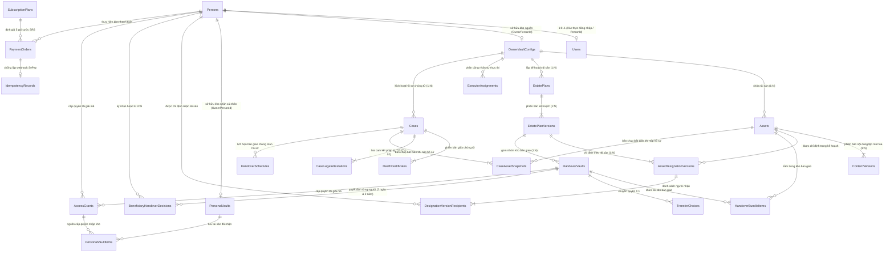
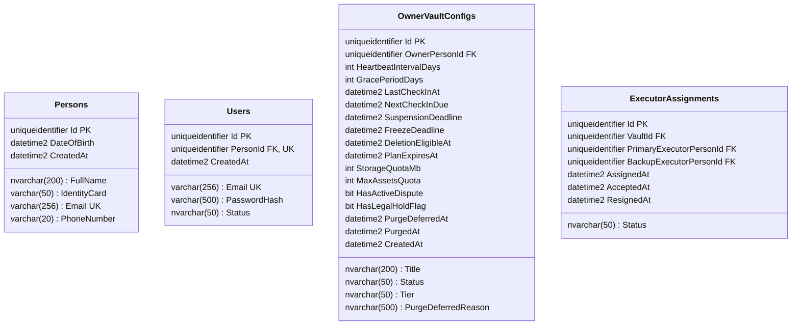
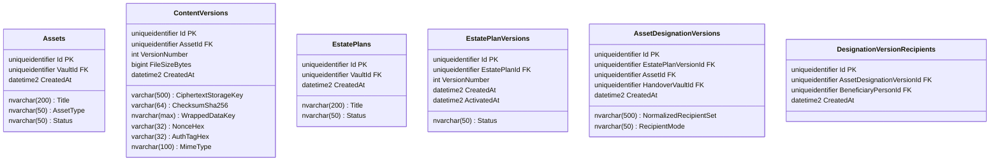
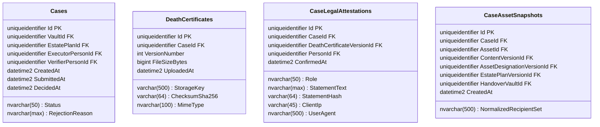
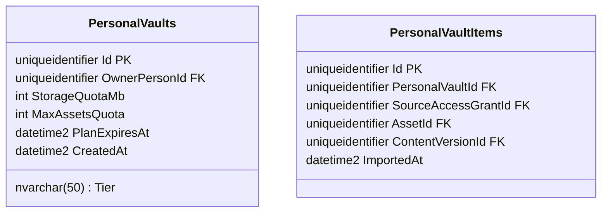
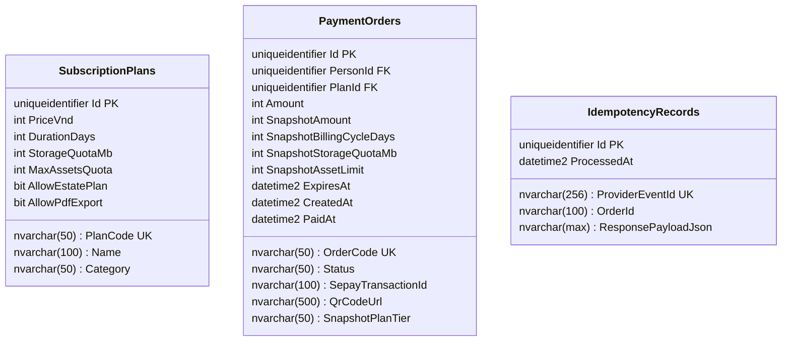

# THIẾT KẾ CƠ SỞ DỮ LIỆU LOGICAL & PHYSICAL ERD (SQL SERVER 2022 / EF CORE 10)

## DỰ ÁN: LEGACYVAULT — HỆ THỐNG LƯU GIỮ VÀ BÀN GIAO TÀI SẢN SỐ

### Phiên bản: Chuẩn Hóa Theo SRS v3.11.0 (26/09/2026) — .NET 10 LTS & SQL Server 2022

### Thiết kế: Đầy đủ 25 thực thể cơ sở dữ liệu, Khóa phiên bản chỉ định phân cấp, Quota tài sản & Lịch bàn giao toàn hồ sơ

---

## 1. SƠ ĐỒ QUAN HỆ THỰC THỂ (ERD DIAGRAM)

---

## 2. CHI TIẾT CÁC THỰC THỂ CSDL (.NET 10 / SQL SERVER 2022)

### 2.1. Phân Hệ Người Dùng & Quản Lý Kho Nguồn (`OwnerVaultConfigs`)

* **Quy tắc:**
  * `Persons` đại diện cho một cá nhân ngoài đời thực. Mọi quan hệ Người thừa hưởng (`Beneficiary`), Người thực thi (`Executor`), Người xác minh (`Verifier`) ban đầu đều liên kết qua `Persons.Id`.
  * `ExecutorAssignments` lưu rõ Executor chính và dự phòng, ghi vết thời điểm chấp thuận và từ nhiệm.

---

### 2.2. Phân Hệ Kế Hoạch Di Sản & Phiên Bản Chỉ Định Phân Cấp (`DesignationVersions`)

* **Mô hình hóa phiên bản chỉ định phân cấp nhất quán (Chuẩn hóa P0):**
  1. **Cấp Phiên bản Kế hoạch (`EstatePlanVersions`):** Quản lý lịch sử thay đổi của bản di chúc số. Mỗi lần Owner cập nhật chỉ định, hệ thống sinh ra một `EstatePlanVersion` mới với ràng buộc:
     $$
     \mathbf{UNIQUE(EstatePlanId, VersionNumber)}
     $$
  2. **Cấp Phiên bản Chỉ định Tài sản (`AssetDesignationVersions`):** Một kế hoạch chứa nhiều tài sản, mỗi tài sản có thể trao cho một tập người nhận khác nhau (ví dụ: Tài sản 1 cho $\{A\}$, Tài sản 2 cho $\{A, B\}$, Tài sản 3 cho $\{B\}$). Mỗi tài sản có **chính xác một** cấu hình chỉ định hiệu lực trong một phiên bản kế hoạch với ràng buộc:
     $$
     \mathbf{UNIQUE(EstatePlanVersionId, AssetId)}
     $$
  3. **Cấp Dòng Người nhận (`DesignationVersionRecipients`):** Lưu chi tiết từng `BeneficiaryPersonId` trong tập người nhận, đảm bảo:
     $$
     \mathbf{UNIQUE(AssetDesignationVersionId, BeneficiaryPersonId)}
     $$
  4. **Liên kết Kho bàn giao:** Cột `HandoverVaultId` trong `AssetDesignationVersions` trỏ trực tiếp đến Kho bàn giao tự gom tương ứng với tập `(EstatePlanVersionId, NormalizedRecipientSet)`.

---

### 2.3. Phân Hệ Kho Bàn Giao Bất Biến & Lịch Bàn Giao Chung Toàn Hồ Sơ

```mermaid
classDiagram
    class HandoverVaults {
        uniqueidentifier Id PK
        uniqueidentifier EstatePlanVersionId FK
        nvarchar(200) Title
        nvarchar(50) RecipientMode
        nvarchar(500) NormalizedRecipientSet
        nvarchar(50) Status
        datetime2 HandoverStartedAt
        datetime2 InitialResponseDueAt
        datetime2 FreezeStartedAt
        datetime2 FreezeExpiresAt
        datetime2 CreatedAt
    }

    class HandoverBundleItems {
        uniqueidentifier Id PK
        uniqueidentifier HandoverVaultId FK
        uniqueidentifier AssetId FK
        uniqueidentifier ContentVersionId FK
        datetime2 AddedAt
    }

    class HandoverSchedules {
        uniqueidentifier Id PK
        uniqueidentifier CaseId FK
        int ScheduleVersion
        datetimeoffset ScheduledDeliveryDate
        nvarchar(500) RescheduledReason
        uniqueidentifier ScheduledByPersonId FK
        bit IsActive
        datetime2 CreatedAt
    }

    class TransferChoices {
        uniqueidentifier Id PK
        uniqueidentifier HandoverVaultId FK
        uniqueidentifier SourceRecipientPersonId FK
        uniqueidentifier TargetRecipientPersonId FK
        nvarchar(50) Status
        datetime2 CreatedAt
        datetime2 FinalizedAt
    }

    class BeneficiaryHandoverDecisions {
        uniqueidentifier Id PK
        uniqueidentifier HandoverVaultId FK
        uniqueidentifier RecipientPersonId FK
        nvarchar(50) DecisionStatus
        datetime2 DecidedAt
        datetime2 ReconsideredAt
        nvarchar(max) Note
    }

    class AccessGrants {
        uniqueidentifier Id PK
        uniqueidentifier HandoverVaultId FK
        uniqueidentifier RecipientPersonId FK
        nvarchar(50) Status
        datetime2 GrantedAt
        datetime2 ExpiresAt
    }
```

* **Ràng buộc duy nhất tạo kho bàn giao:**
  $$
  \mathbf{UNIQUE(EstatePlanVersionId, NormalizedRecipientSet)}
  $$
* **Lịch hẹn bàn giao chung toàn hồ sơ (`HandoverSchedules` - Chuẩn hóa P1):**
  * SRS quy định **một ngày bàn giao duy nhất cho toàn bộ hồ sơ**, không đặt lịch lẻ theo từng kho bàn giao.
  * `HandoverSchedules` gắn trực tiếp với `CaseId`, quản lý phiên bản `ScheduleVersion` và lý do dời lịch (`RescheduledReason`).
  * Ràng buộc: $\mathbf{UNIQUE(CaseId, ScheduleVersion)}$.
  * Mọi kho `HandoverVaults` trong cùng hồ sơ đều kế thừa và đồng bộ ngày bàn giao hiệu lực từ bản ghi có `IsActive = true`.
  * `Executor` chỉ được kích hoạt bắt đầu bàn giao khi thời điểm hiện tại: $\text{now} \ge \text{ScheduledDeliveryDate}$.
* **Quy tắc mốc thời gian đóng băng 2 năm (SRS v3.11.0 & TIME-01):**
  * `HandoverVaults.FreezeStartedAt`: Được ghi nhận khi có người đầu tiên bấm **Từ chối (`REJECTED`)** HOẶC khi hết 168 giờ (`InitialResponseDueAt`) mà kho còn người **Chưa phản hồi (`EXPIRED`)**.
  * `HandoverVaults.FreezeExpiresAt`: Được tính chính xác bằng **2 năm lịch** kể từ `FreezeStartedAt`.
  * **Ranh giới hết hạn chuẩn xác (`TIME-01`):** Thao tác ký Nhận chỉ hợp lệ khi $\text{now} < \text{FreezeExpiresAt}$. Tại đúng hoặc sau mốc hết hạn ($\text{now} \ge \text{FreezeExpiresAt}$), hệ thống từ chối và khóa vĩnh viễn.

---

### 2.4. Phân Hệ Hồ Sơ Chứng Tử & Hai Cam Kết Pháp Lý (`DEATH-02`)

* **Ràng buộc Snapshot bất biến:**

  * `CaseAssetSnapshots` khóa cứng bộ bốn liên kết: `(AssetId, ContentVersionId, AssetDesignationVersionId, EstatePlanVersionId)`.
  * Ràng buộc duy nhất: $\mathbf{UNIQUE(CaseId, AssetId)}$.
  * Truy vết 100% minh bạch: Từ snapshot, hệ thống biết chính xác bản mã tệp tin (`ContentVersionId`), cấu hình chỉ định và danh sách người nhận tại thời điểm nộp hồ sơ (`AssetDesignationVersionId` $\rightarrow$ `DesignationVersionRecipients`), và kho bàn giao tương ứng (`HandoverVaultId`).
* **Hai bản ghi cam kết pháp lý độc lập (`DEATH-02`):**

  1. `Role = 'EXECUTOR'`: Cam kết của Người thực thi khi nộp hồ sơ.
  2. `Role = 'VERIFIER'`: Cam kết của Người xác minh khi phê duyệt hồ sơ.

  * Cả 2 bản ghi bắt buộc cùng trỏ vào đúng `DeathCertificateVersionId` được duyệt.

---

### 2.5. Phân Hệ Kho Cá Nhân & Chống Nhập Trùng Từng Tài Sản

* **Khắc phục lỗi chặn nhập tài sản thứ hai từ cùng Grant (P0):**
  * Một `AccessGrant` cấp quyền cho toàn bộ kho bàn giao (nhiều tài sản), nhưng người dùng bấm "Lưu vào Kho cá nhân" cho **từng tài sản cụ thể**.
  * **Ràng buộc Unique sửa chuẩn:**

    $$
    \mathbf{UNIQUE(PersonalVaultId, AssetId)}
    $$

    Đảm bảo:

    1. Người dùng có thể nhập nhiều tài sản khác nhau thuộc cùng một `SourceAccessGrantId`.
    2. Tuyệt đối chống nhập lặp một tài sản đã có trong kho cá nhân.

---

### 2.6. Phân Hệ Danh Mục Gói Cước & Thanh Toán SePay VietQR (SRS v3.11.0)

* **Danh mục 5 gói cước chuẩn mực theo SRS v3.11.0:**

| Mã gói (`PlanCode`) | Phân loại (`Category`) | Giá (`PriceVnd`) | Thời hạn |    Hạn mức Quota    | Quyền hạn di sản & PDF                                    |
| :---------------------- | :------------------------- | :-----------------: | :---------: | :--------------------: | :----------------------------------------------------------- |
| `OWNER_FREE`          | `OWNER`                  |        0 đ        | Vĩnh viễn |  3 tài sản / 20 MiB  | Lưu trữ và điểm danh DMS;**không lập di sản**. |
| `LEGACY_XS`           | `OWNER`                  |     199.000 đ     |  365 ngày  | 20 tài sản / 200 MiB | Lập kế hoạch di sản, phân công Executor, bàn giao.    |
| `LEGACY_XS_MAX`       | `OWNER`                  |     399.000 đ     |  365 ngày  | 50 tài sản / 500 MiB | Toàn bộ quyền XS + Xuất PDF kế hoạch an toàn.         |
| `RECIPIENT_FREE`      | `RECIPIENT`              |        0 đ        | Vĩnh viễn |  2 tài sản / 20 MiB  | Lưu trữ tài sản di sản đã nhận từ kho bàn giao.    |
| `RECIPIENT_PLUS`      | `RECIPIENT`              |      49.000 đ      |  30 ngày  | 10 tài sản / 200 MiB | Lưu trữ tài sản di sản đã nhận với quota lớn hơn. |

---

## 3. ĐIỀU KIỆN XÓA KHO TRẢ PHÍ (OPLAN-05 & OPLAN-06)

* **Thời điểm kho đủ điều kiện xóa:**
  $$
  \mathbf{deletion\_eligible\_at = \max(freeze\_at + 30\text{ ngày}, paid\_plan\_expires\_at + 30\text{ ngày})}
  $$
* **Quy tắc kiểm tra xóa (OPLAN-06):**
  Job worker chỉ được xóa dữ liệu vật lý của kho nguồn trả phí khi thỏa mãn đồng thời:
  1. Kho vẫn ở trạng thái đóng băng (`FROZEN_INACTIVITY`).
  2. Gói cước đã hết hạn (`now >= paid_plan_expires_at`).
  3. Chủ sở hữu chưa điểm danh hợp lệ.
  4. Đã gửi đủ 3 lần cảnh báo (lúc bắt đầu đóng băng, còn 7 ngày, còn 24 giờ).
  5. **KHÔNG CÓ** hồ sơ chứng tử đang xử lý.
  6. **KHÔNG CÓ** quy trình bàn giao đang chạy.
  7. **KHÔNG CÓ** quyền Beneficiary hoặc bản bàn giao còn hạn truy cập.
  8. **KHÔNG CÓ** khiếu nại, sự cố kỹ thuật hoặc tham chiếu lưu giữ cần bảo vệ.
* **Kho Owner Free (`OWNER_FREE`):** Tuyệt đối không tự động xóa theo quy tắc hết hạn gói (`OPLAN-05`).
