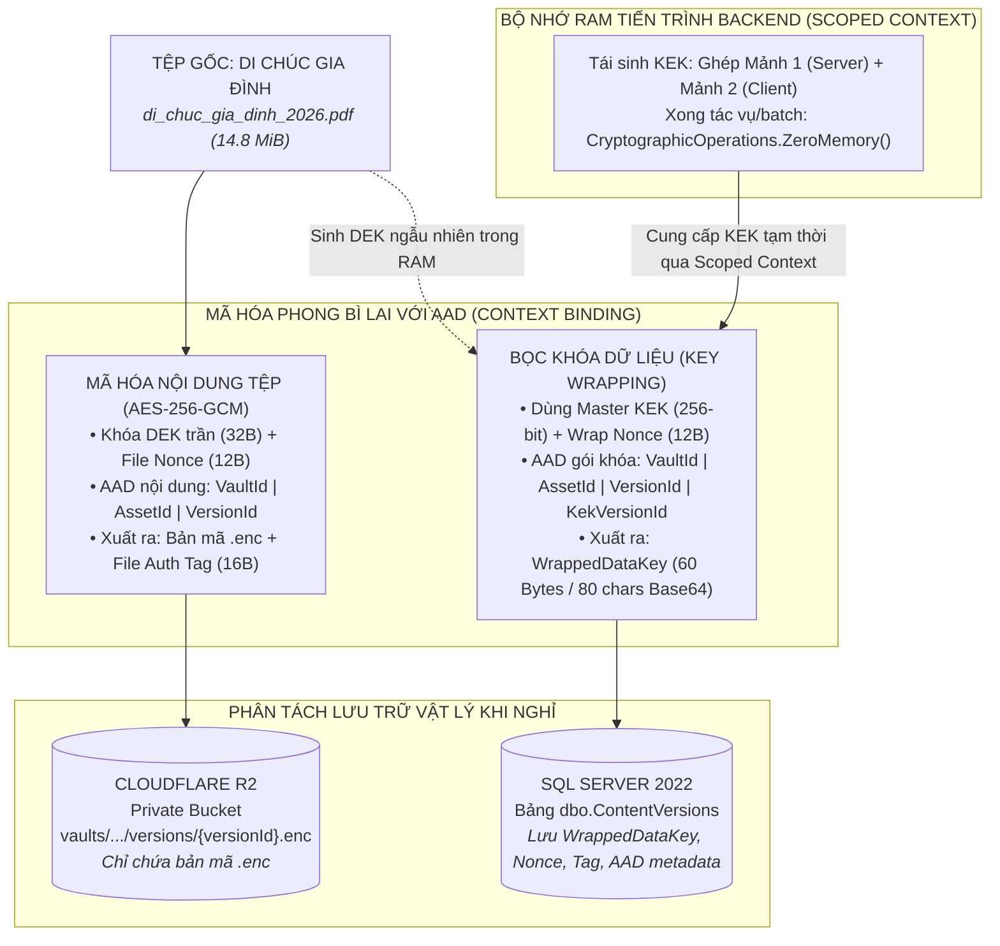
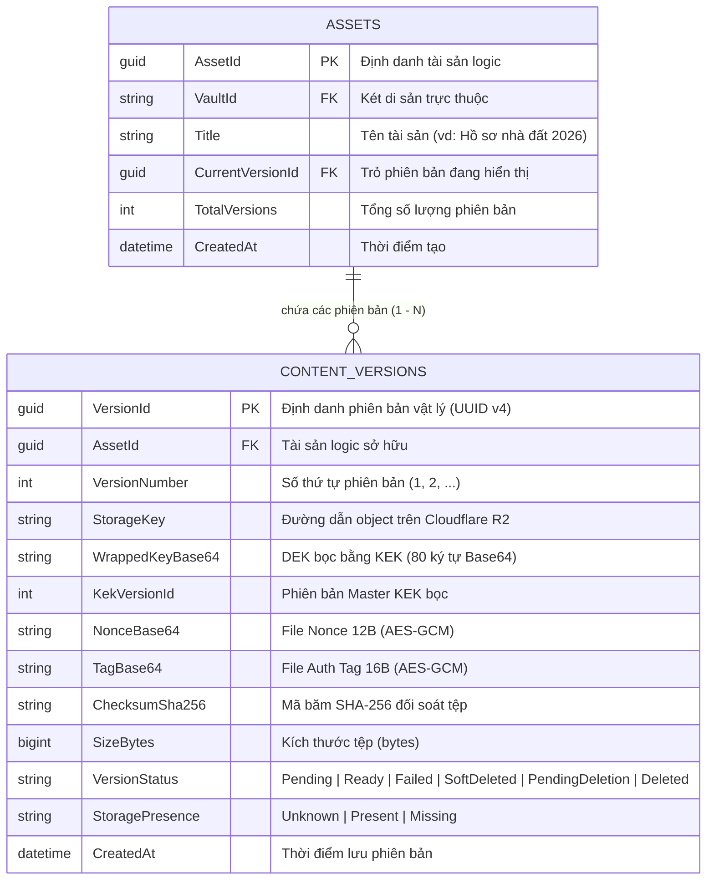
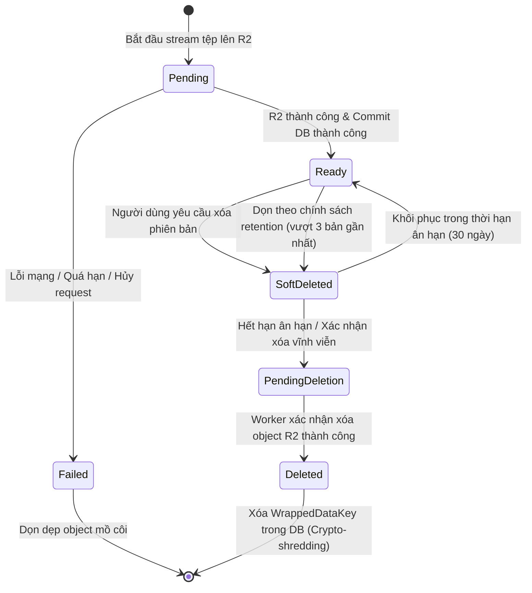
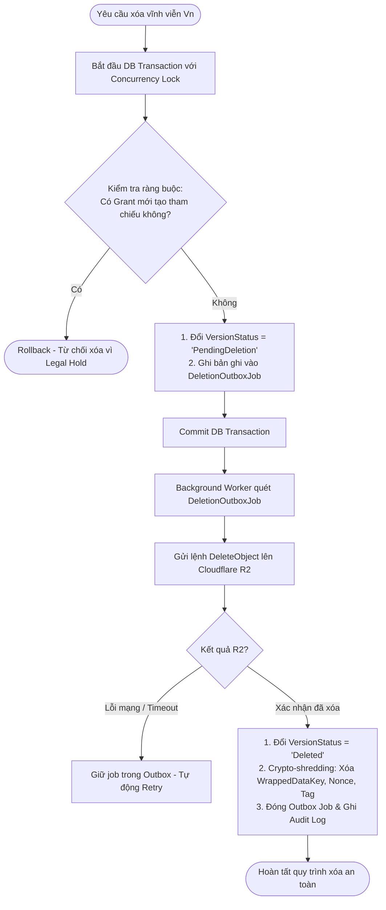
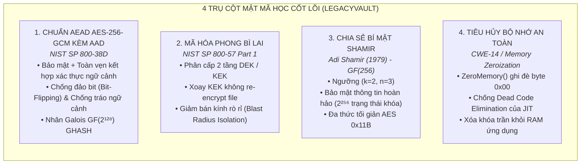

# ĐẶC TẢ KIẾN TRÚC MẬT MÃ PHONG BÌ & LƯU TRỮ DI SẢN SỐ (LEGACYVAULT)
> **Mô hình triển khai:** Giải mã tại máy chủ, Passphrase xử lý tại Client (Server-side Decryption with Client-side Passphrase Processing).  
> **Trạng thái tài liệu:** Tài liệu thiết kế kỹ thuật nguyên mẫu (Prototype Specification) — phục vụ cài đặt và kiểm chứng thực tế.  
> **Vị trí lưu trữ:** `docs/02_architecture/KIEN_TRUC_MAT_MA_VA_LUU_TRU_DI_SAN.md`.

---

## MỤC LỤC TỔNG QUAN

* [**PHẦN I: TỔNG QUAN KIẾN TRÚC & MÔ HÌNH LƯU TRỮ**](#phần-i-tổng-quan-kiến-trúc--mô-hình-lưu-trữ)
  * [1.1. Nguyên lý Thiết kế & Ranh giới Bảo mật Thực tế](#11-nguyên-lý-thiết-kế--ranh-giới-bảo-mật-thực-tế)
  * [1.2. Phân định Ba Vùng Lưu trữ Vật lý & Ba Mảnh Shamir](#12-phân-định-ba-vùng-lưu-trữ-vật-lý--ba-mảnh-shamir)
  * [1.3. Mô hình Dữ liệu Hai Tầng & Định nghĩa Ranh giới Bất biến](#13-mô-hình-dữ-liệu-hai-tầng--định-nghĩa-ranh-giới-bất-biến)
* [**PHẦN II: QUY TRÌNH KỸ THUẬT & MÃ NGUỒN TRIỂN KHAI (.NET C#)**](#phần-ii-quy-trình-kỹ-thuật--mã-nguồn-triển-khai-net-c)
  * [2.1. Kiểm soát Nhập lượng (Admission Controller) & Quản lý Hàng đợi](#21-kiểm-soát-nhập-lượng-admission-controller--quản-lý-hàng-đợi)
  * [2.2. Chiều Inbound: Tải lên, Mã hóa AES-GCM với AAD & Chống Ghi đĩa ngầm](#22-chiều-inbound-tải-lên-mã-hóa-aes-gcm-với-aad--chống-ghi-đĩa-ngầm)
  * [2.3. Chiều Outbound: Kiểm tra Quyền, Mở bọc DEK với AAD & Stream Tệp](#23-chiều-outbound-kiểm-tra-quyền-mở-bọc-dek-với-aad--stream-tệp)
  * [2.4. Bảng Thông số Kỹ thuật Mẫu & Kiểm tra Định dạng Minh họa](#24-bảng-thông-số-kỹ-thuật-mẫu--kiểm-tra-định-dạng-minh-họa)
* [**PHẦN III: QUẢN LÝ VÒNG ĐỜI KHÓA, PHIÊN BẢN & DUNG LƯỢNG**](#phần-iii-quản-lý-vòng-đời-khóa-phiên-bản--dung-lượng)
  * [3.1. Quản trị Bộ nhớ RAM & Vòng đời KEK (Request / Batch Context)](#31-quản-trị-bộ-nhớ-ram--vòng-đời-kek-request--batch-context)
  * [3.2. Chuẩn hóa Mô hình Trạng thái Phiên bản (3 Trục Độc lập)](#32-chuẩn-hóa-mô-hình-trạng-thái-phiên-bản-3-trục-độc-lập)
  * [3.3. Chính sách Lưu giữ (Retention) & Cơ chế Đặt trước Quota](#33-chính-sách-lưu-giữ-retention--cơ-chế-đặt-trước-quota)
  * [3.4. Quy trình Xóa Bền vững (Durable Deletion) & Tiêu hủy Mật mã](#34-quy-trình-xóa-bền-vững-durable-deletion--tiêu-hủy-mật-mã)
  * [3.5. Ba Cấp độ Thay đổi Khóa & Xoay KEK Chịu lỗi (Resumable Rotation)](#35-ba-cấp-độ-thay-đổi-khóa--xoay-kek-chịu-lỗi-resumable-rotation)
  * [3.6. Bản chất Mật mã Shamir 2/3 & Cơ chế Ủy thác Chuyển giao Di sản](#36-bản-chất-mật-mã-shamir-23--cơ-chế-ủy-thác-chuyển-giao-di-sản)
* [**PHẦN IV: KỊCH BẢN THỰC TẾ & NỀN TẢNG LÝ THUYẾT TOÁN HỌC**](#phần-iv-kịch-bản-thực-tế--nền-tảng-lý-thuyết-toán-học)
  * [4.1. Bốn Kịch bản Vận hành Điển hình (End-to-End Walkthroughs)](#41-bốn-kịch-bản-vận-hành-điển-hình-end-to-end-walkthroughs)
  * [4.2. Cơ sở Lý thuyết Mật mã học Liên quan](#42-cơ-sở-lý-thuyết-mật-mã-học-liên-quan)

---

# PHẦN I: TỔNG QUAN KIẾN TRÚC & MÔ HÌNH LƯU TRỮ

### 1.1. Nguyên lý Thiết kế & Ranh giới Bảo mật Thực tế

Hệ thống áp dụng mô hình **Mã hóa phong bì (Envelope Encryption)** kết hợp **Chia sẻ bí mật Shamir (Shamir's Secret Sharing trên trường hữu hạn $\text{GF}(256)$)** nhằm đạt mục tiêu: **Bảo vệ dữ liệu khi nghỉ (Data-at-Rest), phân tách quyền kiểm soát, ngăn ngừa việc lộ lọt dữ liệu khi một thành phần lưu trữ đơn lẻ (CSDL hoặc Object Storage) bị xâm nhập.**



#### Ranh giới bảo mật (Trust Boundary):
1. **Ranh giới giải mã tại máy chủ:** Đây là mô hình *giải mã tại máy chủ, passphrase được xử lý tại client*, không phải mô hình Client-side End-to-End Encryption thuần túy. Tại thời điểm mở két để đọc hoặc tải file, máy chủ nhận đủ 2 mảnh để tái tạo KEK và giải mã DEK trong bộ nhớ RAM phục vụ phiên xử lý.
2. **Giới hạn kiểm soát đối với Quản trị viên máy chủ (Host Administrator):** Vì tiến trình backend phải giải mã dữ liệu và xử lý khóa trong RAM, kiến trúc này **không thể bảo vệ dữ liệu trước quản trị viên kiểm soát hoàn toàn hệ điều hành máy chủ** (người có quyền dump bộ nhớ tiến trình hoặc can thiệp runtime). Mục tiêu cốt lõi của kiến trúc là bảo vệ dữ liệu khi nghỉ (at-rest), chống lại việc lộ lọt dữ liệu từ Database Administrator (DBA), rò rỉ bản sao lưu CSDL hoặc lộ bucket lưu trữ Cloudflare R2 đơn phương.
3. **Passphrase được xử lý tại Client:** Trình duyệt phía người dùng chạy thuật toán dẫn xuất khóa (KDF: Argon2id) từ Passphrase để mở khóa `Owner Share`. Máy chủ **không bao giờ tiếp nhận hoặc lưu trữ chuỗi ký tự Passphrase thô**.
4. **Lưu trữ bản mã Owner Share:** Bản mã Owner share được lưu cùng salt, tham số KDF, nonce, tag và `KekVersionId`. Nếu chỉ lưu cục bộ trên thiết bị, người dùng cần cơ chế sao lưu (như xuất mã phục hồi / Emergency Kit) để mở két trên thiết bị khác.
5. **Ràng buộc ngữ cảnh bằng AAD (Authenticated Additional Data):** Mọi thao tác AES-GCM đều gắn kèm AAD cố định chứa `VaultId`, `AssetId`, `VersionId` nhằm ngăn chặn kẻ tấn công tráo đổi bản mã hoặc metadata giữa các tài sản khác nhau trong cùng hệ thống.

---

### 1.2. Phân định Ba Vùng Lưu trữ Vật lý & Ba Mảnh Shamir

| Thành phần | Nơi lưu trữ vật lý | Bản chất dữ liệu | Đặc tính bảo mật |
| :--- | :--- | :--- | :--- |
| **Tệp bản mã (`.enc`)** | **Cloudflare R2** *(Private Bucket)* | Luồng byte nhị phân đã mã hóa AES-256-GCM (`15,518,920 Bytes`). | Không chứa khóa. Kẻ xâm nhập chỉ thấy khối byte ngẫu nhiên vô nghĩa. |
| **Gói `WrappedDataKey`** | **SQL Server 2022** *(Bảng `[dbo].[ContentVersions]`)* | Chuỗi Base64 dài đúng **80 ký tự** từ gói nhị phân 60 bytes: `[12B Nonce] + [16B Tag] + [32B Encrypted DEK]`. | Được bọc bằng Master KEK qua AES-256-GCM kèm AAD. Không thể mở nếu thiếu KEK. |
| **Mảnh 1 (System Share)** | **SQL Server 2022** *(Bọc bằng Cloud KMS / App Key)* | Điểm tọa độ Shamir tại $x = 1$. | Đứng đơn lẻ cung cấp đúng **0-bit thông tin** về Master KEK theo định lý bảo mật của Claude Shannon. |
| **Mảnh 2 (Owner Share)** | **Lưu tại Client / Thiết bị người dùng** *(Bọc bằng PassphraseKey)* | Điểm tọa độ Shamir tại $x = 2$, được mã hóa bằng khóa dẫn xuất từ Passphrase qua Argon2id. | Chỉ được giải mã tại client khi người dùng mở két và gửi lên server theo phạm vi request/batch context. |
| **Mảnh 3 (Emergency Share)** | **Bản in cứu hộ / Người thừa kế** | Điểm tọa độ Shamir tại $x = 3$. | Dùng để khôi phục khi mất Passphrase theo quy trình di sản hợp pháp. |
| **KEK & DEK trần** | **RAM tiến trình Backend** *(Bộ nhớ tạm thời)* | Khóa đối xứng 256-bit nguyên vẹn. | **Không lưu đĩa/DB**. Tồn tại trong phạm vi request/batch context và được ghi đè trong `finally`. |

---

### 1.3. Mô hình Dữ liệu Hai Tầng & Định nghĩa Ranh giới Bất biến



#### Định nghĩa chuẩn xác về Tính Bất biến (Immutability Boundary):
Khái niệm "bất biến" trong hệ thống được định nghĩa cụ thể theo từng thành phần dữ liệu, không cấm các thao tác quản trị hợp lệ:

| Thành phần dữ liệu | Có được phép thay đổi? | Quy tắc quản lý |
| :--- | :---: | :--- |
| **Nội dung bản mã `.enc` của phiên bản** | **TUYỆT ĐỐI KHÔNG** | Không bao giờ sửa đè khối byte trên R2. Muốn đổi nội dung tệp phải tạo phiên bản mới. |
| **Khóa DEK mã hóa nội dung** | **TUYỆT ĐỐI KHÔNG** | DEK gắn chặt với ciphertext của phiên bản đó. Nếu DEK bị lộ, phải tải file về mã hóa bằng DEK mới trên phiên bản mới. |
| **Gói `WrappedDataKey`** | **CÓ THỂ CẬP NHẬT** | Cho phép bọc lại bằng KEK mới khi thực hiện xoay Master KEK (Key Rotation), có ghi log audit. |
| **Trạng thái phiên bản & Đối soát** | **CÓ THỂ CẬP NHẬT** | Cập nhật theo vòng đời (`Ready` $\rightarrow$ `SoftDeleted` $\rightarrow$ `PendingDeletion` $\rightarrow$ `Deleted`) và đối soát (`StoragePresence`). |
| **Con trỏ `Assets.CurrentVersionId`** | **CÓ THỂ CẬP NHẬT** | Cho phép đổi con trỏ sang phiên bản khác của cùng Asset khi người dùng thực hiện chuyển bản hiện hành hoặc Rollback. |

---

# PHẦN II: QUY TRÌNH KỸ THUẬT & MÃ NGUỒN TRIỂN KHAI (.NET C#)

### 2.1. Kiểm soát Nhập lượng (Admission Controller) & Quản lý Hàng đợi

Cơ chế điều tiết đồng thời dùng chung cho cả Upload và Download, phân tách rõ ràng giữa **số tác vụ đang chạy (`_runningCount`)** và **số tác vụ đang xếp hàng (`_waitingCount`)**:

```csharp
public static class CryptoAdmissionController
{
    private static readonly SemaphoreSlim ConcurrencySemaphore = new(5, 5); // Tối đa 5 tác vụ song song
    private static int _runningCount = 0;
    private static int _waitingCount = 0;
    private const int MaxWaitingQueueLimit = 20; // Hàng đợi tối đa 20 yêu cầu chờ

    public static async Task<IDisposable?> TryAcquireSlotAsync(TimeSpan timeout, CancellationToken ct)
    {
        // 1. Kiểm tra giới hạn hàng đợi chờ trước khi cho phép xếp hàng
        if (Interlocked.Increment(ref _waitingCount) > MaxWaitingQueueLimit)
        {
            Interlocked.Decrement(ref _waitingCount);
            return null; // Quá tải hàng đợi -> Báo HTTP 503 ngay lập tức
        }

        try
        {
            // 2. Chờ nhận slot thực thi
            if (!await ConcurrencySemaphore.WaitAsync(timeout, ct))
            {
                return null; // Hết thời gian chờ -> Báo HTTP 503
            }

            Interlocked.Increment(ref _runningCount);
            return new AdmissionReleaser();
        }
        finally
        {
            Interlocked.Decrement(ref _waitingCount);
        }
    }

    private sealed class AdmissionReleaser : IDisposable
    {
        private int _disposed = 0;
        public void Dispose()
        {
            if (Interlocked.Exchange(ref _disposed, 1) == 0)
            {
                Interlocked.Decrement(ref _runningCount);
                ConcurrencySemaphore.Release();
            }
        }
    }
}
```

---

### 2.2. Chiều Inbound: Tải lên, Mã hóa AES-GCM với AAD & Chống Ghi đĩa ngầm

Để chống ghi đĩa ngầm của `IFormFile`, hệ thống dùng `MultipartReader` đọc trực tiếp request stream vào mảng byte cố định, đồng thời áp dụng AAD ràng buộc ngữ cảnh:

```csharp
public async Task HandleUploadEnvelopeAsync(
    Guid vaultId, 
    Guid assetId, 
    byte[] ownerShareBytes, 
    HttpContext context, 
    CancellationToken ct)
{
    const int MaxAllowedBytes = 20 * 1024 * 1024; // Giới hạn cứng 20 MiB cho prototype
    
    // 1. Kiểm soát nhập lượng (Admission Control)
    using var admissionSlot = await CryptoAdmissionController.TryAcquireSlotAsync(TimeSpan.FromSeconds(10), ct);
    if (admissionSlot == null)
    {
        context.Response.StatusCode = StatusCodes.Status503ServiceUnavailable;
        await context.Response.WriteAsync("Hàng đợi mật mã đang quá tải hoặc hết thời gian chờ.", ct);
        return;
    }

    // 2. Xác thực định dạng Multipart Content-Type
    if (!context.Request.HasFormContentType || !MediaTypeHeaderValue.TryParse(context.Request.ContentType, out var mediaType))
    {
        context.Response.StatusCode = StatusCodes.Status415UnsupportedMediaType;
        return;
    }

    var boundary = HeaderUtilities.RemoveQuotes(mediaType.Boundary).Value;
    if (string.IsNullOrWhiteSpace(boundary))
    {
        context.Response.StatusCode = StatusCodes.Status400BadRequest;
        return;
    }

    byte[]? plaintextBuffer = null;
    int actualLength = 0;

    try
    {
        plaintextBuffer = new byte[MaxAllowedBytes];
        var reader = new MultipartReader(boundary, context.Request.Body);

        MultipartSection? section;
        while ((section = await reader.ReadNextSectionAsync(ct)) != null)
        {
            if (!ContentDispositionHeaderValue.TryParse(section.ContentDisposition, out var disposition) 
                || !disposition.IsFileDisposition())
            {
                continue;
            }

            int bytesRead;
            while ((bytesRead = await section.Body.ReadAsync(
                plaintextBuffer.AsMemory(actualLength, MaxAllowedBytes - actualLength), ct)) > 0)
            {
                actualLength += bytesRead;
                if (actualLength >= MaxAllowedBytes)
                {
                    byte[] probe = new byte[1];
                    try
                    {
                        if (await section.Body.ReadAsync(probe, ct) > 0)
                        {
                            throw new InvalidOperationException($"Tệp vượt quá giới hạn dung lượng ({MaxAllowedBytes} bytes).");
                        }
                    }
                    finally
                    {
                        CryptographicOperations.ZeroMemory(probe);
                    }
                }
            }
            break;
        }

        if (actualLength == 0)
        {
            throw new InvalidOperationException("Không tìm thấy nội dung tệp tin hợp lệ.");
        }

        Guid versionId = Guid.NewGuid();
        await ProcessEncryptionAndUploadAsync(vaultId, assetId, versionId, ownerShareBytes, plaintextBuffer.AsMemory(0, actualLength), ct);
    }
    finally
    {
        if (plaintextBuffer != null)
        {
            CryptographicOperations.ZeroMemory(plaintextBuffer);
        }
    }
}

private async Task ProcessEncryptionAndUploadAsync(
    Guid vaultId, 
    Guid assetId, 
    Guid versionId, 
    byte[] ownerShareBytes,
    ReadOnlyMemory<byte> plaintextMemory, 
    CancellationToken ct)
{
    byte[] checksumSha256 = SHA256.HashData(plaintextMemory.Span);

    // 1. Tái tạo KEK trong phạm vi Scoped Context từ 2 mảnh Shamir
    int currentKekVersionId = await DatabaseService.GetCurrentKekVersionIdAsync(vaultId, ct);
    byte[] systemShareBytes = await DatabaseService.GetSystemShareAsync(vaultId, currentKekVersionId, ct);
    byte[]? masterKek = null;

    try
    {
        masterKek = ShamirSecretSharing.Combine(systemShareBytes, ownerShareBytes);
    }
    finally
    {
        CryptographicOperations.ZeroMemory(systemShareBytes);
        CryptographicOperations.ZeroMemory(ownerShareBytes);
    }

    byte[]? dek = null;
    try
    {
        dek = RandomNumberGenerator.GetBytes(32);
        byte[] fileNonce = RandomNumberGenerator.GetBytes(12);
        byte[] ciphertext = new byte[plaintextMemory.Length];
        byte[] fileTag = new byte[16];

        // 2. Tạo AAD cho tầng nội dung (Ràng buộc VaultId | AssetId | VersionId)
        // Lưu ý: Không đưa KekVersionId vào đây để việc xoay KEK không làm hỏng AAD của file
        byte[] contentAad = Encoding.UTF8.GetBytes($"LV_CONTENT_V1|{vaultId}|{assetId}|{versionId}");

        using (var aesGcm = new AesGcm(dek, 16))
        {
            aesGcm.Encrypt(fileNonce, plaintextMemory.Span, ciphertext, fileTag, contentAad);
        }

        // 3. Bọc DEK bằng Master KEK kèm AAD gói khóa
        byte[] wrapNonce = RandomNumberGenerator.GetBytes(12);
        byte[] encryptedDek = new byte[32];
        byte[] wrapTag = new byte[16];
        byte[] wrapAad = Encoding.UTF8.GetBytes($"LV_DEK_WRAP_V1|{vaultId}|{assetId}|{versionId}|{currentKekVersionId}");

        using (var aesWrap = new AesGcm(masterKek, 16))
        {
            aesWrap.Encrypt(wrapNonce, dek, encryptedDek, wrapTag, wrapAad);
        }

        byte[] combinedWrappedKey = new byte[60];
        Buffer.BlockCopy(wrapNonce, 0, combinedWrappedKey, 0, 12);
        Buffer.BlockCopy(wrapTag, 0, combinedWrappedKey, 12, 16);
        Buffer.BlockCopy(encryptedDek, 0, combinedWrappedKey, 28, 32);

        string wrappedKeyBase64 = Convert.ToBase64String(combinedWrappedKey);
        string storageKey = $"vaults/{vaultId}/assets/{assetId}/versions/{versionId}.enc";

        // 4. Lưu lên R2
        await StorageService.UploadToR2Async(storageKey, ciphertext, ct);

        try
        {
            // 5. Lưu siêu dữ liệu vào SQL Server
            await DatabaseService.SaveContentVersionAsync(new ContentVersionRecord
            {
                VersionId = versionId,
                AssetId = assetId,
                StorageKey = storageKey,
                WrappedKeyBase64 = wrappedKeyBase64,
                KekVersionId = currentKekVersionId,
                NonceBase64 = Convert.ToBase64String(fileNonce),
                TagBase64 = Convert.ToBase64String(fileTag),
                ChecksumSha256 = Convert.ToHexString(checksumSha256).ToLowerInvariant(),
                SizeBytes = ciphertext.Length,
                VersionStatus = "Ready",
                StoragePresence = "Present"
            }, ct);
        }
        catch (Exception ex)
        {
            await HandleUploadDbFailureAsync(storageKey, versionId, ex);
            throw;
        }
    }
    finally
    {
        if (dek != null)
        {
            CryptographicOperations.ZeroMemory(dek);
        }
        if (masterKek != null)
        {
            CryptographicOperations.ZeroMemory(masterKek);
        }
    }
}
```

---

### 2.3. Chiều Outbound: Kiểm tra Quyền, Mở bọc DEK với AAD & Stream Tệp

```mermaid
sequenceDiagram
    autonumber
    actor User as Người dùng (Client Browser)
    participant API as Backend ASP.NET Core
    participant DB as SQL Server 2022
    participant R2 as Cloudflare R2 Bucket
    participant RAM as Bộ nhớ RAM (Scoped Context)

    User->>API: POST /api/v1/assets/{id}/download (kèm Owner Share)
    API->>API: AdmissionController.TryAcquireSlotAsync()
    API->>DB: Kiểm tra quyền truy cập (Chủ sở hữu hoặc Grant hợp lệ)
    API->>DB: Đọc ContentVersionRecord (theo AssetId & VersionId)
    DB-->>API: Trả về KekVersionId, StorageKey, WrappedDataKey, Nonce, Tag, SHA-256, SizeBytes
    
    API->>DB: Lấy Mảnh 1 (System Share) theo KekVersionId
    DB-->>API: SystemShareBytes (x=1)
    
    API->>RAM: Ghép Shamir GF(256): Mảnh 1 + Mảnh 2 -> Master KEK
    Note over API,RAM: finally { ZeroMemory(systemShare); ZeroMemory(ownerShare); }
    Note over API,RAM: Bắt đầu try/finally bảo vệ Master KEK ở lớp ngoài cùng
    
    API->>RAM: Dùng Master KEK + Wrap AAD giải bọc WrappedDataKey (AES-GCM) -> Thu DEK trần
    API->>R2: DownloadStreamAsync(StorageKey) (Kiểm soát giới hạn SizeBytes)
    R2-->>API: Trả về luồng Byte Ciphertext .enc
    
    API->>RAM: Dùng DEK trần + FileNonce + Content AAD giải mã (AES-256-GCM)
    API->>API: Đối soát: Khớp Auth Tag 128-bit & Checksum SHA-256
    
    API->>User: Stream file bản rõ ra HttpResponse.Body
    Note over API,RAM: finally: ZeroMemory(plaintext), ZeroMemory(dek), ZeroMemory(masterKek)
    API->>API: AdmissionController.Release()
```

```csharp
public async Task HandleDownloadAssetVersionAsync(
    Guid vaultId,
    Guid assetId, 
    Guid? requestedVersionId, 
    byte[] clientOwnerShareBytes,
    ClaimsPrincipal userPrincipal,
    HttpContext context, 
    CancellationToken ct)
{
    // 1. Kiểm soát nhập lượng
    using var admissionSlot = await CryptoAdmissionController.TryAcquireSlotAsync(TimeSpan.FromSeconds(10), ct);
    if (admissionSlot == null)
    {
        context.Response.StatusCode = StatusCodes.Status503ServiceUnavailable;
        await context.Response.WriteAsync("Hàng đợi mật mã đang quá tải. Vui lòng thử lại sau.", ct);
        return;
    }

    // 2. Kiểm tra thẩm quyền truy cập (Access Control Verification)
    bool hasAccess = await AuthorizationService.AuthorizeAssetAccessAsync(userPrincipal, vaultId, assetId, ct);
    if (!hasAccess)
    {
        context.Response.StatusCode = StatusCodes.Status403Forbidden;
        return;
    }

    // 3. Đọc bản ghi phiên bản file & kiểm tra tính hợp lệ của quan hệ
    var record = await DatabaseService.GetContentVersionAsync(assetId, requestedVersionId, ct);
    if (record == null || (record.VersionStatus != "Ready" && record.VersionStatus != "Archived"))
    {
        context.Response.StatusCode = StatusCodes.Status404NotFound;
        return;
    }

    // 4. Tái tạo Master KEK trong phạm vi Scoped Context
    byte[] systemShareBytes = await DatabaseService.GetSystemShareAsync(vaultId, record.KekVersionId, ct);
    byte[]? masterKek = null;

    try
    {
        masterKek = ShamirSecretSharing.Combine(systemShareBytes, clientOwnerShareBytes);
    }
    finally
    {
        CryptographicOperations.ZeroMemory(systemShareBytes);
        CryptographicOperations.ZeroMemory(clientOwnerShareBytes);
    }

    // BẮT BUỘC: try/finally quản lý masterKek ở lớp ngoài cùng
    try
    {
        byte[] combined = Convert.FromBase64String(record.WrappedKeyBase64);
        if (combined.Length != 60)
        {
            throw new CryptographicException("Độ dài gói WrappedKey không hợp lệ.");
        }

        byte[] wrapNonce = combined[0..12];
        byte[] wrapTag = combined[12..28];
        byte[] encryptedDek = combined[28..60];

        byte[]? dek = null;
        try
        {
            dek = new byte[32];
            byte[] wrapAad = Encoding.UTF8.GetBytes($"LV_DEK_WRAP_V1|{vaultId}|{assetId}|{record.VersionId}|{record.KekVersionId}");

            using (var aesWrap = new AesGcm(masterKek, 16))
            {
                aesWrap.Decrypt(wrapNonce, encryptedDek, wrapTag, dek, wrapAad);
            }

            // 5. Tải ciphertext từ R2 có kiểm soát kích thước chặt chẽ
            byte[] ciphertext = await StorageService.DownloadBoundedAsync(record.StorageKey, record.SizeBytes, ct);

            byte[] fileNonce = Convert.FromBase64String(record.NonceBase64);
            byte[] fileTag = Convert.FromBase64String(record.TagBase64);
            byte[] plaintext = new byte[ciphertext.Length];
            byte[] contentAad = Encoding.UTF8.GetBytes($"LV_CONTENT_V1|{vaultId}|{assetId}|{record.VersionId}");

            try
            {
                using (var aesGcm = new AesGcm(dek, 16))
                {
                    aesGcm.Decrypt(fileNonce, ciphertext, fileTag, plaintext, contentAad);
                }

                // 6. Đối soát Checksum SHA-256
                byte[] computedHash = SHA256.HashData(plaintext);
                if (!Convert.ToHexString(computedHash).Equals(record.ChecksumSha256, StringComparison.OrdinalIgnoreCase))
                {
                    throw new CryptographicException("Đối soát Checksum SHA-256 thất bại: tệp đã bị sai lệch.");
                }

                await SendFileStreamResponseAsync(context.Response, plaintext, record.FileName, record.ContentType, ct);
            }
            finally
            {
                CryptographicOperations.ZeroMemory(plaintext);
            }
        }
        finally
        {
            if (dek != null)
            {
                CryptographicOperations.ZeroMemory(dek);
            }
        }
    }
    finally
    {
        if (masterKek != null)
        {
            CryptographicOperations.ZeroMemory(masterKek);
        }
    }
}
```

---

### 2.4. Bảng Thông số Kỹ thuật Mẫu & Kiểm tra Định dạng Minh họa

*(Các giá trị chuỗi và byte dưới đây dùng để minh họa định dạng và kiểm tra độ dài dữ liệu, không dùng làm khóa/nonce thực tế).*

| Thuộc tính | Định dạng & Kiểu dữ liệu | Giá trị minh họa hợp lệ |
| :--- | :--- | :--- |
| **Tên tệp di sản** | Chuỗi ký tự UTF-8 | `di_chuc_gia_dinh_2026.pdf` |
| **Kích thước tệp** | Số nguyên byte | `15,518,920 Bytes` (~14.8 MiB) |
| **Mã băm SHA-256** | Hex (64 ký tự thường) | `8f4b23a9c7d1e5f8a2b3c4d5e6f7a8b9c0d1e2f3a4b5c6d7e8f9a0b1c2d3e4f5` |
| **Khóa DEK trần** | 32 bytes (256 bits) | `0x7a3f89b1c2d0e4f5...` *(chỉ tồn tại trong RAM)* |
| **Master KEK** | 32 bytes (256 bits) | `0xe4c89b3f71a0d2e5...` *(chỉ tồn tại trong RAM)* |
| **Gói WrappedDataKey** | Nhị phân: 60 bytes<br>**Base64: đúng 80 ký tự** | `TL01k9Xz9xF12aB3vB83c7DeF9a0B1c23d4e8a91bc7f02e5a6b7c8d9e0f1a2b3kL90aB1cD2eF3g4h` |
| **File Nonce (Hex)** | 12 bytes (96 bits Hex) | `0x9a0f12ab3cd4e5f60718293a` |
| **File Auth Tag (Hex)** | 16 bytes (128 bits Hex) | `0xb83c7def9a0b1c2d3e4f5a6b7c8d9e0f` |
| **Đường dẫn R2** | Chuỗi Object Storage key | `vaults/pv_11111111/assets/ast_98afbd90/versions/ver_01k9d7a2.enc` |
| **Bảng lưu trữ DB** | SQL Server 2022 | `[dbo].[ContentVersions]` |

```csharp
// Kiểm tra định dạng minh họa (Illustrative Format Assertion)
byte[] testPackage = new byte[60];
RandomNumberGenerator.Fill(testPackage); // Dữ liệu giả lập kiểm tra định dạng Base64

string base64String = Convert.ToBase64String(testPackage);

Debug.Assert(testPackage.Length == 60);
Debug.Assert(base64String.Length == 80);
Debug.Assert(!base64String.EndsWith("="), "60 bytes chia hết cho 3 nên không có ký tự padding '='.");
Debug.Assert(Convert.FromBase64String(base64String).AsSpan().SequenceEqual(testPackage));
```

---

# PHẦN III: QUẢN LÝ VÒNG ĐỜI KHÓA, PHIÊN BẢN & DUNG LƯỢNG

### 3.1. Quản trị Bộ nhớ RAM & Vòng đời KEK (Request / Batch Context)

* **Ước lượng tiêu thụ RAM:** Khi giải mã tệp $15\text{ MiB}$, hệ thống cần đồng thời:
  * Buffer bản mã từ R2: $\approx 15\text{ MiB}$.
  * Buffer bản rõ sau giải mã: $\approx 15\text{ MiB}$.
  * Tổng tối thiểu hai buffer chính: $\approx 30\text{ MiB}$.
  * Cả hai buffer đều vượt $85.000\text{ bytes}$ nên được đưa vào **Large Object Heap (LOH)** (chỉ thu gom trong GC Gen 2).
  * Với 5 tác vụ song song, hai buffer chính chiếm $\approx 150\text{ MiB}$ (chưa tính buffer upload, S3 SDK và runtime). Cần đo tải thực tế để chốt hạn mức tiến trình.
* **Vòng đời KEK (Request/Batch-scoped Context):**
  * KEK không được lưu trong các field tĩnh hoặc singleton dùng chung. KEK được truyền qua `ScopedContext` của request hoặc batch.
  * Khi xử lý một lô 5 file trong cùng một lần mở két: Bộ điều phối Batch giữ KEK trong RAM suốt quá trình xử lý 5 file và gọi `ZeroMemory(masterKek)` khi toàn bộ lô kết thúc.
* **Giới hạn của `ZeroMemory()`:** Hàm chỉ ghi đè mảng byte được chỉ định trong RAM do ứng dụng quản lý; không thể đảm bảo xóa các bản sao ở tầng socket/TLS buffer của OS hoặc khi tiến trình bị tắt đột ngột (killed).

---

### 3.2. Chuẩn hóa Mô hình Trạng thái Phiên bản (3 Trục Độc lập)

Hệ thống phân tách rõ 3 khía cạnh quản lý phiên bản độc lập để tránh nhập nhằng:



1. **Trục 1: Trạng thái Vòng đời Phiên bản (`VersionStatus`):**
   * `Pending`: Đang stream lên R2 và chờ commit DB.
   * `Ready`: Đã lưu thành công cả R2 và DB, đối soát SHA-256 khớp.
   * `Failed`: Tải lên thất bại, chờ dọn dẹp.
   * `SoftDeleted`: Đánh dấu xóa mềm trong thời gian ân hạn 30 ngày.
   * `PendingDeletion`: Đã hết ân hạn, đang đưa vào hàng đợi xóa object trên R2.
   * `Deleted`: Object trên R2 đã bị xóa, `WrappedDataKey` đã bị tiêu hủy mật mã.
2. **Trục 2: Trạng thái Hiện diện Vật lý (`StoragePresence`):**
   * `Unknown`: Chưa đối soát.
   * `Present`: Object tồn tại hợp lệ trên Cloudflare R2.
   * `Missing`: R2 trả về `404 Not Found` (không tìm thấy object).
3. **Trục 3: Bản Hiện hành (`Assets.CurrentVersionId`):**
   * Con trỏ trỏ đến phiên bản mặc định hiển thị trên giao diện.
   * **Ràng buộc:** Con trỏ chỉ được trỏ vào phiên bản có cùng `AssetId` và đang ở trạng thái `VersionStatus = 'Ready'`. Khi khôi phục một bản `SoftDeleted`, bản đó trở về trạng thái `Ready` trong danh sách lịch sử; con trỏ `CurrentVersionId` **không tự động bị thay đổi** trừ khi người dùng chủ động chọn "Đặt làm bản hiện hành".

---

### 3.3. Chính sách Lưu giữ (Retention) & Cơ chế Đặt trước Quota

Mỗi phiên bản làm tăng dung lượng lưu trữ — chủ yếu trên **Cloudflare R2** (10 bản của file 15 MB $\approx 150\text{ MB}$ bản mã), trong khi CSDL SQL Server chỉ tăng thêm 10 dòng metadata.

* **Chính sách lưu giữ:**
  $$\text{Tổng số phiên bản trên R2} = (\text{Tối đa 3 bản gần nhất}) + (\text{Bản đang xóa mềm 30 ngày}) + (\text{Bản có Legal Hold / Grant Lock})$$
  1. **Bản mới nhất:** Luôn được bảo vệ và lưu trữ vô điều kiện.
  2. **Chính sách 3 phiên bản gần nhất (Rolling 3 Versions):** Duy trì tối đa 3 bản gần nhất.
  3. **Khóa bảo vệ tham chiếu di sản (Legal Hold / Grant Reference Lock):** Nếu một phiên bản cũ đang được gắn vào một **Hồ sơ chuyển giao di sản (Inheritance Grant)** hoặc di chúc đã niêm phong, phiên bản đó **tuyệt đối không bị xóa tự động** cho đến khi tham chiếu hết hiệu lực.
  4. **Nguyên tắc an toàn:** Chỉ kích hoạt dọn dẹp bản cũ sau khi bản mới đã đạt trạng thái `Ready`.
* **Cơ chế Đặt trước Quota (Quota Reservation):**
  * Quota tài khoản được tính theo **tổng dung lượng thực tế của tất cả các phiên bản chưa xóa vật lý trên R2**.
  * Khi bắt đầu upload, hệ thống thực hiện "đặt trước" (reserve) dung lượng dự kiến trong DB. Nếu tổng dung lượng hiện tại + dung lượng đặt trước vượt quota, request bị từ chối ngay lập tức, ngăn chặn việc nhiều upload đồng thời cùng vượt hạn mức.

---

### 3.4. Quy trình Xóa Bền vững (Durable Deletion) & Tiêu hủy Mật mã

Quy trình xóa phối hợp chặt chẽ giữa SQL Server và Cloudflare R2 thông qua mẫu thiết kế **Transactional Outbox / Durable Job**:



1. **Phối hợp đồng thời với Grant:** Bước kiểm tra tham chiếu Grant và bước đánh dấu `PendingDeletion` được thực hiện trong **cùng một Transaction CSDL có khóa lạc quan/bi quan (Concurrency Control)**, đảm bảo không có Grant mới nào xuất hiện xen giữa hai bước.
2. **Tác vụ xóa bền vững (Durable Job):** Nếu máy chủ khởi động lại sau khi đánh dấu `PendingDeletion`, worker nền khi restart sẽ quét bảng `DeletionOutboxJob` để tiếp tục gửi lệnh xóa sang R2.
3. **Tiêu hủy Mật mã (Cryptographic Erase theo NIST SP 800-88 Rev. 1):**
   * Sau khi R2 xác nhận xóa object, hệ thống xóa ngay `WrappedDataKey`, `Nonce`, `Tag` khỏi DB vận hành.
   * Để đạt mức an toàn cao nhất, chính sách sao lưu CSDL phải áp dụng chu kỳ xoay vòng (Retention Policy) cho Transaction Log và Backup định kỳ, đảm bảo các bản ghi khóa cũ bị ghi đè hoàn toàn theo thời gian.

---

### 3.5. Ba Cấp độ Thay đổi Khóa & Xoay KEK Chịu lỗi (Resumable Rotation)

```
┌─────────────────────────────────────────────────────────────────────────────────────────┐
│                           PHÂN ĐỊNH 3 QUY TRÌNH THAY ĐỔI KHÓA                           │
├───────────────────────┬───────────────────────────────┬─────────────────────────────────┤
│ THAO TÁC              │ DỮ LIỆU CẦN CẬP NHẬT          │ PHẠM VI ẢNH HƯỞNG               │
├───────────────────────┼───────────────────────────────┼─────────────────────────────────┤
│ 1. Đổi Passphrase     │ • Bản mã Owner share          │ • KEK giữ nguyên.               │
│    (KEK giữ nguyên)   │ • Salt và tham số KDF         │ • Không chạm vào Wrapped DEK hay│
│                       │                               │   tệp trên R2. Phải chạy KDF.   │
├───────────────────────┼───────────────────────────────┼─────────────────────────────────┤
│ 2. Xoay Master KEK    │ • Cặp 3 mảnh Shamir mới       │ • Giải bọc DEK bằng KEK cũ rồi  │
│    (Đổi KEK định kỳ)  │ • Bọc lại các Wrapped DEK     │   bọc bằng KEK mới trong CSDL.  │
│                       │ • Cập nhật KekVersionId       │ • Tệp trên R2 KHÔNG CẦN TẢI VỀ. │
├───────────────────────┼───────────────────────────────┼─────────────────────────────────┤
│ 3. Xoay DEK           │ • Sinh DEK mới                │ • Phải tải tệp về, giải mã rồi  │
│    (Khóa tệp bị lộ)   │ • Mã hóa lại toàn bộ tệp      │   mã hóa lại và đẩy lên R2.     │
└───────────────────────┴───────────────────────────────┴─────────────────────────────────┘
```

> **Lưu ý an toàn:** Nếu KEK cũ đã bị lộ cùng toàn bộ bản sao DB (chứa các Wrapped DEK cũ), việc chỉ bọc lại DEK bằng KEK mới không vô hiệu hóa được các bản sao dữ liệu mà kẻ tấn công đã kịp lấy trước đó.

#### Quy trình Xoay KEK theo lô có khả năng tiếp tục sau sự cố (Resumable Rotation):
1. **Lưu trữ cấu hình:** Tạo bộ 3 mảnh Shamir mới (được bảo vệ) cho `KEK_v2`, ghi nhận `JobStatus = 'InProgress'` trong DB.
2. **Định tuyến upload mới:** Toàn bộ file mới tải lên ngay lập tức dùng `KEK_v2`.
3. **Thực thi chuyển đổi theo lô:**
   * Đọc `KekVersionId` để chọn đúng khóa giải bọc DEK.
   * Dùng `KEK_v1` mở bọc DEK, dùng `KEK_v2` bọc lại DEK (kèm AAD của phiên bản mới).
   * Cập nhật `WrappedDataKey` và gán `KekVersionId = 2` trong cùng một transaction có kiểm tra phiên bản/`rowversion`.
4. **Xử lý khi gián đoạn (Crash/Restart):**
   * Khi khởi động lại, hệ thống nhận diện `JobStatus = 'InProgress'`.
   * **Tạm dừng tiến trình và chờ mở khóa lại (Re-unlock):** Yêu cầu cung cấp **đủ các mảnh tương ứng của từng phiên bản khóa** (cả `KEK_v1` và `KEK_v2`). Việc đăng nhập của Quản trị viên máy chủ đơn thuần không thể khôi phục được các KEK này.
   * Sau khi nạp đủ 2 khóa vào RAM, job mới tiếp tục xử lý các bản ghi còn mang `KekVersionId = 1`.
5. **Ngừng sử dụng khóa cũ:** Chỉ thu hồi các mảnh của `KEK_v1` khi không còn bản ghi nào tham chiếu tới `KekVersionId = 1` và đã xét đến nhu cầu phục hồi backup.

---

### 3.6. Bản chất Mật mã Shamir 2/3 & Cơ chế Ủy thác Chuyển giao Di sản

Cần phân định rạch ròi giữa **Bản chất Toán học** và **Quy trình Nghiệp vụ**:

| Hai mảnh được kết hợp | Về mặt toán học có thể tái tạo KEK? | Điều kiện nghiệp vụ cho phép thực thi |
| :---: | :---: | :--- |
| **System + Owner** | **CÓ** | Mở két thông thường của Chủ sở hữu (cung cấp Passphrase hợp lệ). |
| **System + Emergency** | **CÓ** | **CHỈ KHI:** Hồ sơ chứng tử (Case) đạt trạng thái `Approved` qua quy trình thẩm định 2 cấp (DMS + Xác minh pháp lý). |
| **Owner + Emergency** | **CÓ** | Khôi phục khẩn cấp ngoài luồng (Off-band Recovery) khi máy chủ ngừng hoạt động hoàn toàn. |

#### Chốt chặn bảo vệ chống lạm dụng Emergency Share:
* Thuật toán Shamir thuần túy là toán học, không thể tự biết chủ két còn sống hay đã mất.
* Vì vậy, hệ thống bảo vệ bằng cách: **Mảnh 1 (System Share) lưu trong CSDL luôn được bọc bởi Cloud KMS / HSM**. 
* Hệ thống máy chủ **từ chối giải bọc System Share** để ghép với Emergency Share chừng nào sự kiện di sản chưa được kích hoạt và thẩm định hợp pháp theo Điều 616 & 624 Bộ luật Dân sự 2015.
* **Nguyên tắc thẩm định trong Prototype:** Phiên bản prototype thực hiện nhập liệu và thẩm định hồ sơ thủ công bởi con người (Verifier kiểm tra giấy tờ và tick cam kết trách nhiệm). AI/OCR được định hướng bổ sung trong tương lai để hỗ trợ trích xuất thông tin; không thay thế quyết định của người thẩm định.

---

# PHẦN IV: KỊCH BẢN THỰC TẾ & NỀN TẢNG LÝ THUYẾT TOÁN HỌC

### 4.1. Bốn Kịch bản Vận hành Điển hình (End-to-End Walkthroughs)

#### Kịch bản 1: Tải lên tệp tin lần đầu (Tạo Asset & Version 1)
* **Người dùng:** `NguyenVanA` với tệp `so_do_nha_dat.pdf` ($2,450,000\text{ Bytes}$) và Passphrase `BiMat@GiaDinh#2026!`.
* **Luồng chạy:**
  1. Trình duyệt chạy Argon2id sinh `PassphraseKey` $\rightarrow$ mở bọc Mảnh 2 (`OwnerShare_v1`) $\rightarrow$ gửi qua TLS 1.3 lên Backend.
  2. Backend kiểm tra Admission Controller (còn slot) $\rightarrow$ đọc vào buffer cố định $\rightarrow$ lấy Mảnh 1 (`SystemShare_v1`) từ SQL Server $\rightarrow$ nội suy Lagrange $\text{GF}(256)$ tái tạo `KEK_v1` trong RAM.
  3. Sinh ngẫu nhiên `DEK_1` (32B) và `fileNonce` (12B) $\rightarrow$ tạo `contentAad` $\rightarrow$ mã hóa AES-256-GCM ra `ciphertext` ($2.45\text{ MB}$) và `fileTag` (16B).
  4. Dùng `KEK_v1` bọc `DEK_1` kèm `wrapAad` thành gói 60 bytes nhị phân $\rightarrow$ chuyển thành chuỗi Base64 80 ký tự không có `=`.
  5. Đẩy `ciphertext` lên Cloudflare R2 tại đường dẫn: `vaults/.../versions/ver_00000001.enc`.
  6. Lưu metadata vào bảng `dbo.ContentVersions` với `VersionStatus = 'Ready'`, trỏ `Assets.CurrentVersionId = ver_00000001`.
  7. Khối `finally` lập tức gọi `ZeroMemory()` cho `dek_1`, `plaintextBuffer` và `kek_v1`.

#### Kịch bản 2: Cập nhật phiên bản mới (Version 2 độc lập)
* Người dùng cập nhật tệp thành `so_do_nha_dat_bo_sung.pdf` ($3,100,000\text{ Bytes}$).
* Hệ thống sinh `versionId = ver_00000002` mới toanh và `DEK_2` mới.
* Tệp mã hóa mới được lưu độc lập tại: `vaults/.../versions/ver_00000002.enc`.
* Tệp `ver_00000001.enc` trên R2 được **giữ nguyên vẹn 100%**. Người dùng có thể quay lại tải bản Version 1 bất kỳ lúc nào mà không bị hỏng dữ liệu hay ghi đè.

#### Kịch bản 3: Xoay Master KEK theo lô (`v1` $\rightarrow$ `v2`)
* Khi xoay KEK cho 1.000 file trong két:
  1. Bộ điều phối nạp `KEK_v1` và `KEK_v2` vào RAM Scoped Context.
  2. Quét từng dòng DB: Dùng `KEK_v1` mở bọc lấy lại 32 bytes DEK của file $\rightarrow$ dùng `KEK_v2` bọc lại DEK (kèm AAD mới) $\rightarrow$ cập nhật DB: `KekVersionId = 2`.
  3. **Tiết kiệm 100% băng thông:** Các tệp trên Cloudflare R2 **nằm nguyên vẹn, tiêu tốn 0 byte mạng**.
  4. Nếu máy chủ restart ở file 400/1000: Job dừng lại, yêu cầu Re-unlock (nạp lại cả 2 KEK) và tiếp tục xử lý nốt 600 file còn lại.

#### Kịch bản 4: Chặn đứng giả mạo dữ liệu & Tráo đổi ngữ cảnh (Tamper & Context Detection)
* **Tình huống A (Sửa đổi bit):** Kẻ tấn công sửa đổi **đúng 01 bit** trong tệp `ver_00000001.enc` trên R2.
  * Khi tải file: Hàm `aesGcm.Decrypt()` phát hiện mã xác thực 128-bit không khớp với `fileTag` ban đầu $\rightarrow$ lập tức ném `CryptographicException`.
* **Tình huống B (Tráo đổi ngữ cảnh):** Kẻ tấn công tráo đổi toàn bộ tệp và metadata giữa "Di chúc" và "Sổ đỏ".
  * Khi tải file: Hàm `aesGcm.Decrypt()` đối soát `contentAad` (chứa `AssetId` và `VersionId`) $\rightarrow$ phát hiện AAD bị sai lệch ngữ cảnh $\rightarrow$ từ chối giải mã ngay lập tức.
* Toàn bộ dữ liệu trong RAM bị ghi đè bằng `ZeroMemory()`, hệ thống từ chối xuất file và ghi log cảnh báo an ninh nghiêm trọng.

---

### 4.2. Cơ sở Lý thuyết Mật mã học Liên quan



#### A. Chuẩn AEAD với AES-GCM kèm AAD (NIST SP 800-38D)
* Kết hợp Counter mode (CTR) và hàm băm đa thức Galois Field $\text{GF}(2^{128})$ với đa thức tối giản $f(x) = x^{128} + x^7 + x^2 + x + 1$.
* Nonce bắt buộc không được lặp lại với cùng một khóa. Giới hạn mã hóa an toàn dưới $2^{32}$ lần với cùng một khóa.
* **Vai trò của AAD:** Đưa metadata nhận dạng (VaultId, AssetId, VersionId) vào hàm tính GHASH mà không mã hóa, ràng buộc toàn vẹn giữa ciphertext và vị trí lưu trữ logic.

#### B. Phân cấp khóa & Mã hóa phong bì (NIST SP 800-57 Part 1 Rev. 5)
* DEK bản rõ chỉ tồn tại tạm thời trong RAM lúc mã hóa/giải mã; bản bọc `WrappedDataKey` được lưu trữ lâu dài cùng phiên bản file.
* KEK chỉ bọc khóa DEK (32 bytes), không chạm vào luồng dữ liệu tệp lớn, cho phép xoay khóa siêu tốc mà không cần mã hóa lại file.

#### C. Chia sẻ bí mật Shamir trên trường Galois $\text{GF}(2^8)$
* Mô hình ngưỡng $k = 2, n = 3$. Đa thức bậc 1: $P(x) = S + a_1 \cdot x$, trong đó $P(0) = S$ là Master KEK.
* Tính toán trên trường hữu hạn $\text{GF}(2^8)$ với đa thức tối giản chuẩn AES:
  $$p(x) = x^8 + x^4 + x^3 + x + 1 \quad (\text{Mã hex: } \mathbf{0x11B})$$
* **Bảo mật lý thuyết thông tin (Information-Theoretic Security):** Với khóa 256-bit gồm 32 bytes xử lý độc lập trên $\text{GF}(256)$, khi kẻ tấn công chỉ có duy nhất 1 mảnh, mỗi byte có 256 trạng thái đồng xác suất, toàn bộ không gian khóa có $2^{256}$ khả năng đồng xác suất với 0-bit thông tin rò rỉ (dưới giả định nguồn ngẫu nhiên CSPRNG chuẩn).

#### D. Tiêu hủy bộ nhớ an toàn (CWE-14)
* Hàm `CryptographicOperations.ZeroMemory()` của .NET ghi đè toàn bộ các phần tử buffer bằng giá trị `0x00`, ngăn chặn trình biên dịch JIT tối ưu hóa loại bỏ thao tác ghi đè (Dead Code Elimination). Thao tác này xử lý an toàn buffer do ứng dụng quản lý trong không gian tiến trình.
