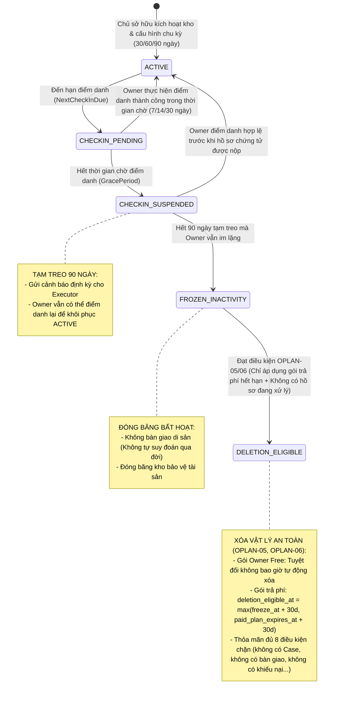
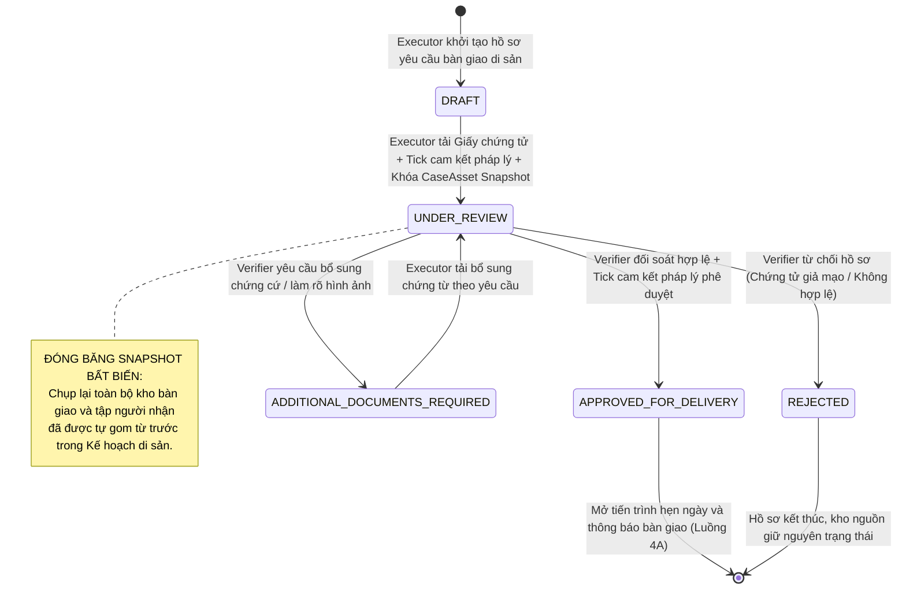
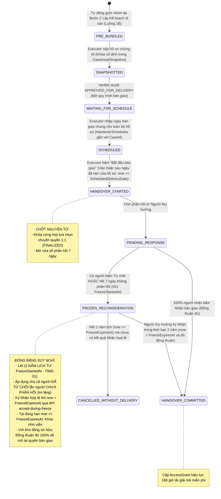
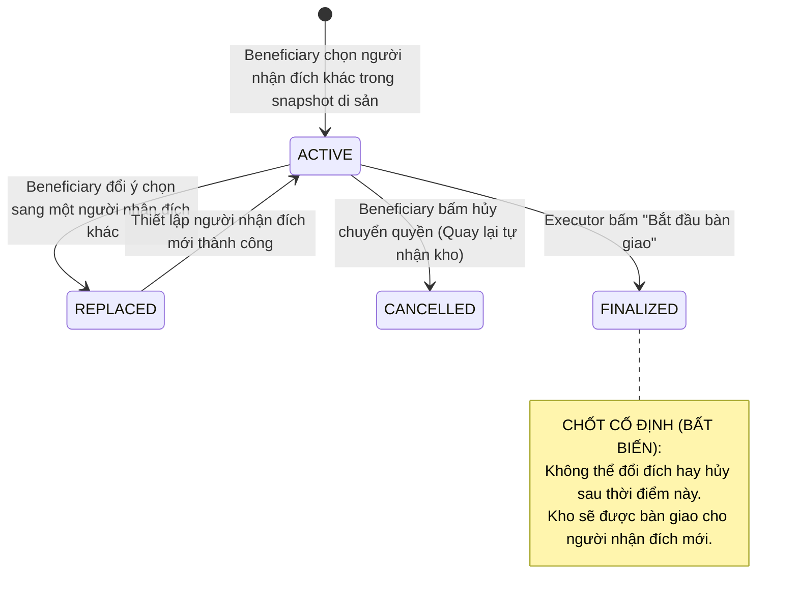
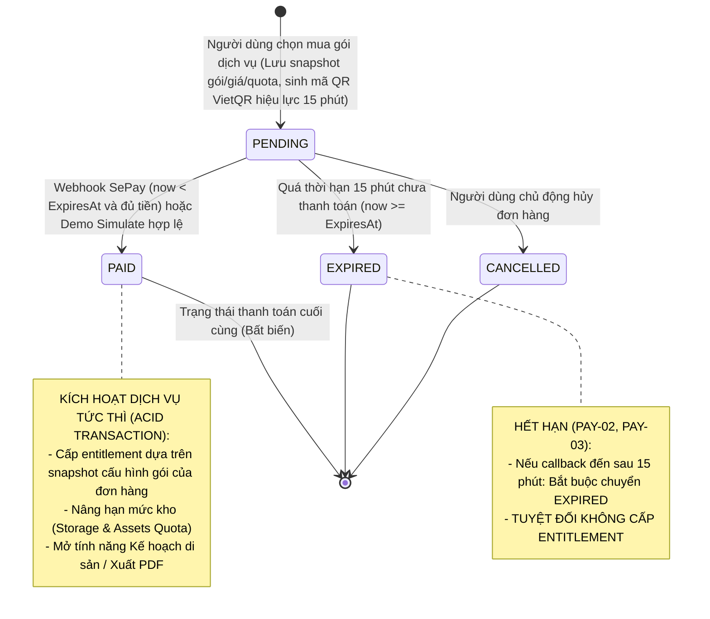

# QUY CHUẨN VÒNG ĐỜI TRẠNG THÁI NGHIỆP VỤ (STATE MACHINES)

## DỰ ÁN: LEGACYVAULT — HỆ THỐNG LƯU GIỮ VÀ BÀN GIAO TÀI SẢN SỐ
### Phiên bản: Baseline 3.11.0 (26/09/2026) — Đồng Bộ Với SRS v3.11.0 & SAD
### Công nghệ: SQL Server 2022 + Entity Framework Core 10 (.NET 10 LTS) + React 19

---

## 1. VÒNG ĐỜI ĐIỂM DANH SINH TỒN (DEAD MAN'S SWITCH - DMS)

Theo đặc tả SRS 3.11.0 (Luồng 2A & 2B):
* Quá hạn điểm danh không tự kết luận qua đời, chuyển sang chế độ tạm treo và đóng băng an toàn.
* **Quy tắc bảo vệ dữ liệu (OPLAN-05 & OPLAN-06):**
  * Gói **Owner Free**: Dữ liệu **không bao giờ tự động xóa vật lý** do bất hoạt.
  * Các gói **Trả phí (Legacy XS & XS Max)**: Chỉ khi gói hết hạn, gửi thông báo cảnh báo 3 lần thất bại, và xác nhận **không có hồ sơ chứng tử nào đang thẩm định**, kho mới đủ điều kiện xóa dữ liệu vật lý.

---

## 2. VÒNG ĐỜI HỒ SƠ THẨM ĐỊNH CHỨNG TỬ (DEATH VERIFICATION CLAIM)

Theo đặc tả SRS 3.11.0 (Luồng 3A & 3B): Áp dụng nguyên tắc duyệt toàn bộ hồ sơ (All-or-Nothing) và bắt buộc 2 xác nhận cam kết trách nhiệm pháp lý độc lập (`DEATH-02`).

---

## 3. VÒNG ĐỜI KHO BÀN GIAO TỰ GOM (HANDOVER VAULT)

> [!IMPORTANT]
> **Điểm khởi tạo Kho bàn giao:** Kho bàn giao được hệ thống **tự gom TRƯỚC snapshot** ngay tại Bước 2 Lập di sản (Luồng 1B). Khi nộp hồ sơ, CSDL chỉ chụp lại snapshot các kho đã gom đó. Phê duyệt hồ sơ (`APPROVED_FOR_DELIVERY`) chỉ mở bước hẹn ngày và thông báo, **tuyệt đối không tạo lại kho gốc**.

---

## 4. VÒNG ĐỜI LỰA CHỌN CHUYỂN QUYỀN 1:1 (TRANSFER CHOICE)

Theo đặc tả SRS 3.11.0 (Luồng 4B - `REDIST-01` đến `REDIST-06`): Chỉ áp dụng cho kho một người (`SINGLE_RECIPIENT`), chuyển nguyên kho cho người nhận hợp lệ khác trong cùng snapshot.

---

## 5. VÒNG ĐỜI ĐƠN HÀNG THANH TOÁN SEPAY VIETQR (PAYMENT ORDER)

Theo đặc tả SRS 3.11.0 (Luồng 1A & 4G): Cổng thanh toán VietQR SePay tự động 24/7 với thời hạn mã QR 15 phút.

