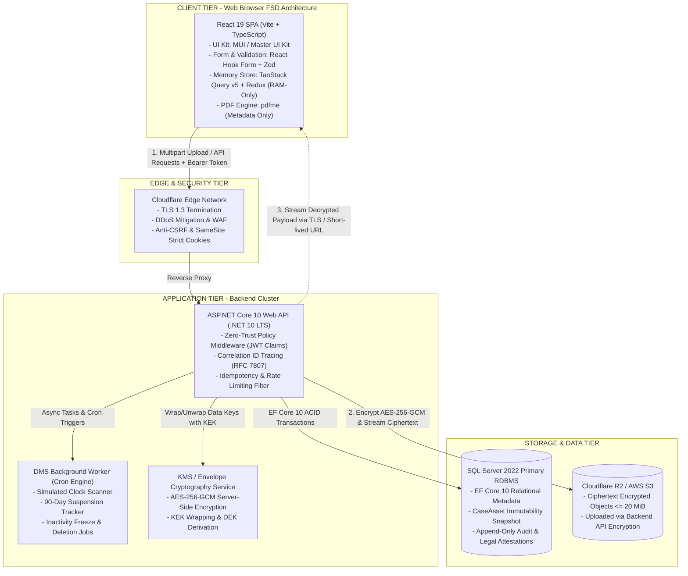
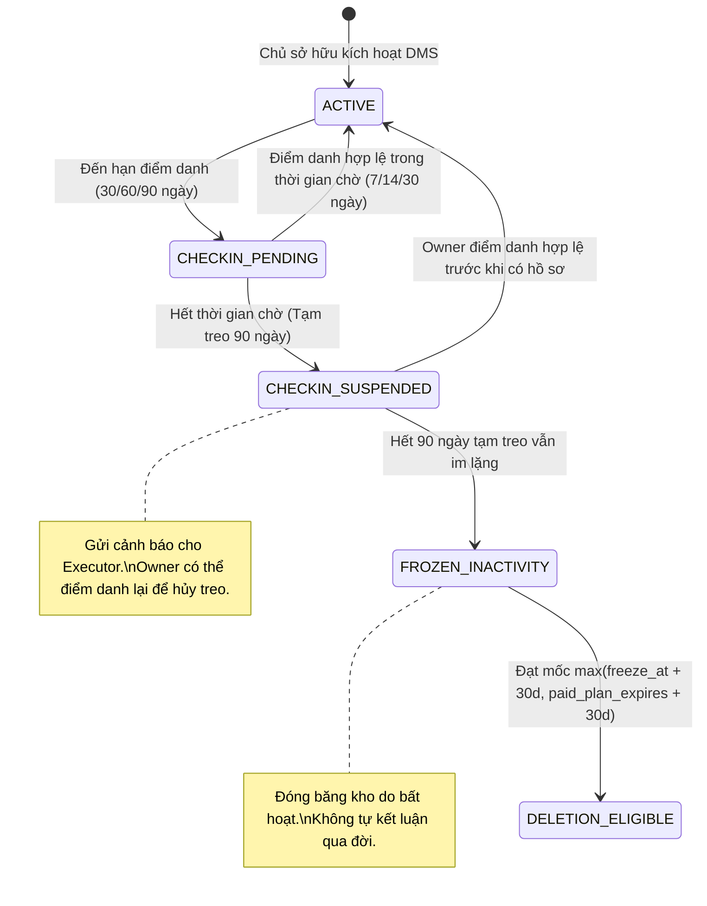
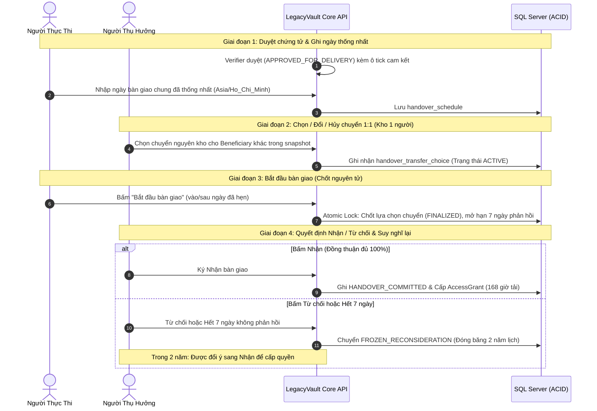
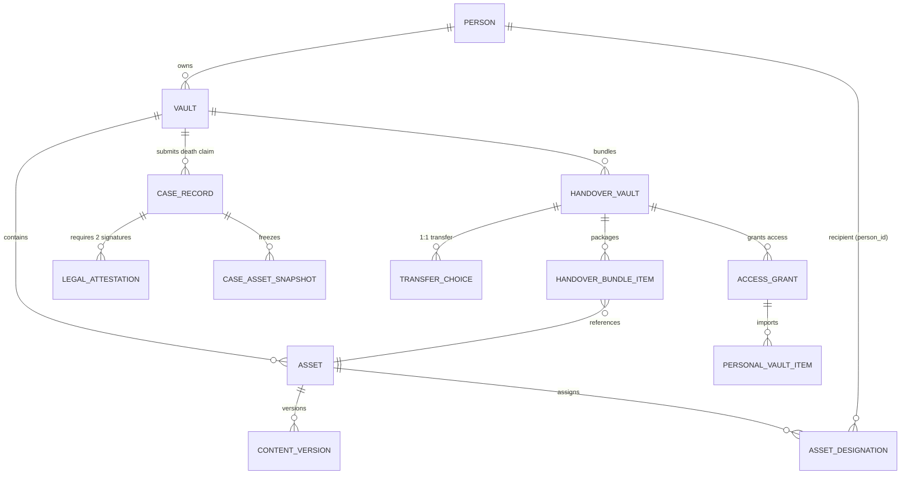
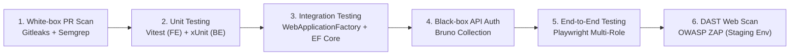

# TÀI LIỆU KIẾN TRÚC HỆ THỐNG (SYSTEM ARCHITECTURE DOCUMENT - SAD)

## DỰ ÁN: LEGACYVAULT — HỆ THỐNG LƯU GIỮ VÀ BÀN GIAO TÀI SẢN SỐ

### Phiên bản: Baseline 3.11.0 (26/09/2026) — Chuẩn Phương Pháp Luận System Design Primer

---

## 1. TỔNG QUAN HỆ THỐNG (SYSTEM OVERVIEW & SCOPE)

### 1.1. Tầm nhìn & Mục tiêu giải pháp

**LegacyVault** là nền tảng điện tử bảo vệ và bàn giao tài sản số (tệp tin dữ liệu, tài khoản bảo mật và ví tiền mã hóa) từ Chủ sở hữu (Owner) đến Người thụ hưởng (Beneficiary) sau khi sự kiện đời thực (qua đời) được Người thực thi (Executor) nộp chứng từ và được Người xác minh độc lập (Verifier) thẩm định hợp pháp.

### 1.2. Định hướng chiến lược SRS 3.11.0 (Paradigm Shifts)

Hệ thống tuân thủ triệt để mô hình bàn giao độc lập có kiểm soát thay thế cho các lý thuyết phân bổ phức tạp:

1. **Một tệp tin / Một tài khoản = Một tài sản số (`Asset`)**: Không chia cắt byte, không cắt trang.
2. **Chỉ định trực tiếp không tỷ lệ (`Direct Designation`)**: Loại bỏ 100% tỷ lệ phần trăm (%). Mỗi người thụ hưởng được cấp quyền tải một bản sao toàn vẹn độc lập.
3. **Tự gom kho bàn giao (`Auto-Bundled Handover Vaults`)**: Hệ thống tự động chuẩn hóa tập `person_id` và gom các tài sản có cùng người nhận thành đúng 1 Kho bàn giao (`handover_vault_id`).
4. **Hai xác nhận trách nhiệm pháp lý độc lập (`Legal Attestations`)**: Cả Executor và Verifier bắt buộc phải tự tick xác nhận *"Tôi chịu trách nhiệm trước pháp luật"* trước khi nộp hoặc phê duyệt hồ sơ.
5. **Chốt bàn giao nguyên tử bằng thao tác của Executor**: Thao tác bấm *"Bắt đầu bàn giao"* của Executor là mốc duy nhất khóa cứng các lựa chọn chuyển 1:1 và kích hoạt cửa sổ phản hồi.
6. **Thời hạn suy nghĩ lại 2 năm (`2-Year Reconsideration`)**: Nếu người thụ hưởng từ chối hoặc hết 7 ngày không phản hồi, kho được đóng băng trong 2 năm cho phép đổi ý sang Nhận.

---

## 2. ƯỚC LƯỢNG NĂNG LỰC & RÀNG BUỘC KIẾN TRÚC (SYSTEM DESIGN ESTIMATION)

*(Theo phương pháp luận Back-of-the-envelope calculations trong System Design Primer)*

### 2.1. Giả định quy mô & Chỉ số tải (Traffic & Storage Estimates)

* **Tổng số người dùng đăng ký:** 100.000 tài khoản.
* **Người dùng hoạt động hàng ngày (DAU):** ~5.000 DAU; Đỉnh điểm (Peak): 15.000 DAU.
* **Tỷ lệ đọc/ghi (Read/Write Ratio):**

  * Giai đoạn thiết lập: 1:2 (Write-Heavy: tải tệp, tạo tài sản, mã hóa dữ liệu).
  * Giai đoạn vận hành/DMS: 10:1 (Read-Heavy: điểm danh nhịp tim, đối soát trạng thái).
  * Giai đoạn bàn giao: 50:1 (Burst Read: Người thụ hưởng tải tệp, xuất JSON).
* **Ước tính thông lượng yêu cầu (Throughput):**

  $$
  \text{RPS Trung bình} = \frac{5.000 \times 40 \text{ requests/ngày}}{86.400 \text{ giây}} \approx 2.3 \text{ RPS}
  $$

  $$
  \text{RPS Đỉnh điểm (Peak Factor 5x)} \approx 12 - 20 \text{ RPS}
  $$
* **Ước tính lưu trữ tệp tin (Storage Footprint):**

  * 30.000 kho trả phí hoạt động (trung bình 15 tài sản $\times$ 10 MiB/tệp) = $4.5 \text{ TB}$ dữ liệu mã hóa.
  * Tăng trưởng hàng năm: $\approx 1.5 - 2.5 \text{ TB/năm}$.
  * **Băng thông tải xuống đỉnh điểm (Peak Egress Bandwidth):**
    * 50 luồng tải tệp 20 MiB đồng thời = $1.000 \text{ MiB} \approx 8.000 \text{ Mbit}$ dữ liệu.
    * Giả định hoàn tất tải trong $8 \text{ giây}$, thông lượng mạng yêu cầu tại đỉnh điểm là:
      $$
      \text{Peak Network Bandwidth} = \frac{8.000 \text{ Mbit}}{8 \text{ s}} \approx 1.0 \text{ Gbps}
      $$

### 2.2. Phân tích định lý CAP (CAP Theorem Trade-Off)

Trong tam giác CAP (**C**onsistency - **A**vailability - **P**artition Tolerance), LegacyVault là hệ thống tài chính - pháp lý mang tính chất chuyển giao quyền sở hữu bất biến, do đó hệ thống bắt buộc lựa chọn:

$$
\mathbf{CP \ (Consistency \ + \ Partition \ Tolerance)}
$$

* **Tính nhất quán nghiêm ngặt (Strict Consistency):** Không chấp nhận *Eventual Consistency* cho các hành vi: duyệt hồ sơ chứng tử, trừ hạn ngạch (quota), chốt lựa chọn chuyển quyền 1:1, và sinh `AccessGrant`. Mọi thao tác phải thỏa mãn tính nguyên tử (Atomicity) và cô lập (Isolation) qua giao dịch ACID CSDL.
* **Đánh đổi tính khả dụng (Availability Trade-off):** Nếu mạng giữa các vùng CSDL bị phân mảnh, hệ thống ưu tiên từ chối yêu cầu (HTTP 503 / 422) hơn là ghi nhận sai người nhận hoặc cấp quyền trùng lặp.

---

## 3. KIẾN TRÚC PHÂN TẦNG TỔNG THỂ (C4 CONTAINER ARCHITECTURE)



---

## 4. THIẾT KẾ CÁC KHỐI THÀNH PHẦN CỐT LÕI (CORE COMPONENTS DESIGN)

### 4.1. Động cơ gom kho tự động theo tập người nhận (`Direct Designation & Auto-Bundling`)

Theo đặc tả SRS 3.11.0 (Luồng 1B, `SETUP-03`, `ASSET-04`, `ASSET-08`), Chủ sở hữu không tạo kho bàn giao thủ công. Hệ thống tự động phân tích:

* **Mã giả thuật toán gom kho (Normalization & Grouping Algorithm):**
  $$
  \text{Bundle Key} = \text{Sort}(\{p_1, p_2, \dots, p_k\}) \quad \text{với } p_i \in \text{Person IDs}
  $$
* Nếu $|\{p_i\}| = 1 \implies \text{RecipientMode} = \mathbf{SINGLE\_RECIPIENT}$ (Cho phép chọn chuyển 1:1).
* Nếu $|\{p_i\}| \ge 2 \implies \text{RecipientMode} = \mathbf{CO\_OWNED}$ (Bắt buộc đồng thuận 100%, cấm chuyển).

### 4.2. Kiến trúc mã hóa phong bì & Tải tệp bảo mật (Envelope Encryption & Secure Ingestion)

Tuân thủ Hard Rule 1.4 ([AGENTS.md](../AGENTS.md)) và tiêu chuẩn NIST SP 800-57, hệ thống loại bỏ hoàn toàn việc upload trực tiếp tệp rõ lên Object Storage:

```
[ Browser Client ]
       │  1. Gửi tệp qua multipart/form-data + Hash SHA-256 tính từ Web Crypto
       ▼
[ ASP.NET Core 10 Web API (.NET 10 LTS) ]
       │  2. Kiểm tra MIME thực tế, giới hạn kích thước (<= 20 MiB)
       │  3. Sinh DEK ngẫu nhiên (AES-256-GCM, 96-bit Nonce, 128-bit Auth Tag)
       │  4. Mã hóa nội dung tệp thành Ciphertext
       ├─────────────────────────────────────────────┐
       ▼                                             ▼
[ Cloudflare R2 / AWS S3 ]              [ KMS / Key Derivation ]
(Lưu trữ Ciphertext)                    (Bọc DEK bằng KEK máy chủ)
                                                     │
                                                     ▼
                                        [ SQL Server (WrappedDataKey) ]
```

* **Quy trình Tải xuống giải mã qua Backend Stream (Zero-Trust Backend-Mediated TLS Stream):**
  * Quyền của Beneficiary có thể hết hạn hoặc bị thu hồi/đóng băng theo SRS 3.11.0. **Tuyệt đối không cấp Presigned URL tải về thời hạn dài và không gửi DEK cho trình duyệt Client trong bản MVP.**
  * Mỗi lượt yêu cầu tải: Beneficiary gọi đến API $\rightarrow$ Backend kiểm tra quyền tại chỗ:
    1. Xác thực JWT Token và danh tính `PersonId` của Beneficiary.
    2. Đối soát `AccessGrant`: Trạng thái `ACTIVE`, còn trong cửa sổ 168 giờ kể từ lúc ký nhận.
    3. **Tách biệt quyền tải và Quota kho:** Người nhận được phép tải về bản sao giải mã hoàn toàn miễn phí; Quota kho cá nhân chỉ kiểm tra khi người nhận bấm "Lưu vào Kho cá nhân" (`PERSONAL-01` $\rightarrow$ `PERSONAL-06`).
  * Khi thỏa mãn: Backend lấy Ciphertext từ Cloudflare R2 $\rightarrow$ giải mã DEK bằng KEK nội bộ $\rightarrow$ giải mã nội dung và stream trực tiếp qua TLS 1.3 về trình duyệt Client (`DEL-02`). Đảm bảo an toàn Zero-Trust tuyệt đối.

### 4.3. Đóng băng bất biến qua Snapshot & Chiến lược giao dịch CSDL (ACID Concurrency Strategy)

Hệ thống phân tách rõ hai cấp độ cách ly giao dịch trong SQL Server 2022:

* **Mặc định đọc (Default Read Mode):** Kích hoạt `READ COMMITTED SNAPSHOT` (RCSI) ở cấp độ Database. Các truy vấn đọc thông thường (kiểm tra trạng thái DMS, danh sách tài sản, xem lịch sử hóa đơn) không bị chặn bởi các thao tác ghi và không gây deadlock.
* **Giao dịch nhạy cảm bắt buộc (Strict ACID Transactions):** Các nghiệp vụ làm thay đổi trạng thái pháp lý bắt buộc bọc trong `IDbContextTransaction` kết hợp Isolation Level `SERIALIZABLE` hoặc Pessimistic Locking (`UPDLOCK, HOLDLOCK`):
  1. **Nộp hồ sơ chứng tử (DEATH-01):** Khóa nguyên tử bộ ba $(\text{asset\_id}, \text{content\_version\_id}, \text{designation\_version\_id})$, tạo snapshot `CaseAsset` bất biến; mọi sửa đổi của Owner sau thời điểm nộp không làm ảnh hưởng đến bản chụp.
  2. **Bắt đầu bàn giao (HANDOVER-03):** Khóa bản ghi `HandoverVault`, chuyển nguyên tử các lựa chọn chuyển 1:1 sang `FINALIZED`, ngăn chặn việc Beneficiary bấm đổi đích chuyển cùng tích tắc.
  3. **Cấp quyền truy cập (AccessGrant):** Kiểm tra quota và ghi nhận với ràng buộc `UNIQUE(personal_vault_id, source_access_grant_id)`.
  4. **Webhook thanh toán (SePay):** Kiểm tra tính duy nhất qua bảng `IdempotencyRecords` với `UNIQUE(provider_event_id)` để chống trùng đơn hàng.

### 4.4. Quy chế nhịp tim sinh tồn (Dead Man's Switch Engine)

Theo SRS 3.11.0 (Luồng 2A & 2B):



### 4.5. Phối hợp bàn giao & Thời hạn suy nghĩ lại 2 năm (`Handover & Reconsideration Engine`)

Theo SRS 3.11.0 (Luồng 4A $\rightarrow$ 4H):



---

## 5. MÔ HÌNH DỮ LIỆU CỐT LÕI (DATABASE ERD & SCHEMAS)



### Các ràng buộc toàn vẹn bất biến (Integrity Constraints)

1. `UNIQUE(plan_id, normalized_recipient_set)`: Đảm bảo một tập người nhận trong cùng kế hoạch chỉ sinh đúng 1 Kho bàn giao duy nhất.
2. `UNIQUE(personal_vault_id, source_access_grant_id)`: Kiểm soát quota kho cá nhân, ngăn chặn nhập trùng lặp tài sản từ một quyền truy cập.
3. `CaseLegalAttestations` (Tách biệt hai hành vi pháp lý độc lập):
   * **Bản ghi 1 (Executor Submission):** `case_id`, `person_id` (Executor), `role = EXECUTOR`, `confirmed_at`, `statement_hash`, `client_ip`, `user_agent`, `snapshot_version`.
   * **Bản ghi 2 (Verifier Approval):** `case_id`, `person_id` (Verifier), `role = VERIFIER`, `confirmed_at`, `statement_hash`, `client_ip`, `user_agent`, `snapshot_version`.
   * Trạng thái hồ sơ chỉ được duyệt sang `APPROVED_FOR_DELIVERY` khi có đủ 2 bản ghi cam kết độc lập hợp lệ.

---

## 6. CHIẾN LƯỢC MỞ RỘNG & XỬ LÝ NÚT THẮT (SCALABILITY & BOTTLENECK MITIGATION)

| Thành phần                                 | Nút thắt tiềm ẩn                                                                        | Giải pháp theo System Design Primer                                                                                                                                                                                                                                                                 |
| :------------------------------------------- | :------------------------------------------------------------------------------------------ | :---------------------------------------------------------------------------------------------------------------------------------------------------------------------------------------------------------------------------------------------------------------------------------------------------- |
| **Object Storage Ingestion**           | Băng thông và tải xử lý mã hóa khi nhiều người cùng tải tệp 20 MiB            | **Backend Streaming Encryption:** Client gửi `multipart/form-data` $\rightarrow$ Backend kiểm tra MIME/kích thước $\rightarrow$ Mã hóa streaming AES-256-GCM trực tiếp lên Cloudflare R2 / S3 (không giữ toàn bộ tệp thô trong RAM server).                               |
| **Thanh toán & Nâng gói**           | Trùng lặp thanh toán do người dùng bấm nhiều lần hoặc Webhook gửi lặp           | **Idempotency Key Pattern:** Webhook xử lý theo `provider_event_id` với bảng `IdempotencyRecords`. Gọi lại thành công trả HTTP 200 kèm trạng thái hiện tại.                                                                                                                   |
| **Cạnh tranh chốt chuyển 1:1**      | Beneficiary bấm đổi đích chuyển cùng thời điểm Executor bấm Bắt đầu bàn giao | **Pessimistic Locking (`UPDLOCK, HOLDLOCK`):** Giao dịch bắt đầu bàn giao nâng cấp lock lên `SERIALIZABLE` để chốt nguyên tử trạng thái `FINALIZED` trước khi chấp nhận bất kỳ thay đổi nào.                                                                      |
| **Bảo mật mã nguồn Client & CSRF** | Lộ lọt mã bí mật qua XSS hoặc tấn công giả mạo yêu cầu qua Cookie               | **Zero LocalStorage & Anti-CSRF Defense:** Access Token chỉ lưu trong Redux RAM; Refresh Token lưu trong HttpOnly Cookie (`SameSite=Strict; Secure; Path=/api/v1/auth/refresh`). Mọi request bắt buộc đính kèm header `X-Requested-With: XMLHttpRequest` và `X-Correlation-ID`. |
| **Truy vết lỗi hệ thống**          | Lỗi phân tán khó xác định nguyên nhân giữa Client, API và Worker                 | **Distributed Tracing:** Header `X-Correlation-ID: crypto.randomUUID()` gắn liền xuyên suốt mọi request và lưu trữ trong bảng `AuditEvents` append-only theo chuẩn RFC 7807 ProblemDetails.                                                                                       |

---

## 7. BIÊN BẢN QUYẾT ĐỊNH KIẾN TRÚC (ARCHITECTURE DECISION RECORDS - ADR)

### ADR-01: Chỉ định trực tiếp không tỷ lệ thay vì phân bổ theo phần trăm (%)

* **Bối cảnh:** Các phiên bản cũ (SRS v1.1 - v3.5) sử dụng tỷ lệ phần trăm (Điều 612/644 BLDS), dẫn đến xung đột làm tròn số lẻ, cắt trang tệp tin phi thực tế và bế tắc khi một người từ chối nhận.
* **Quyết định:** Áp dụng mô hình **Direct Designation**: Một tài sản cấp 1 bản sao toàn vẹn độc lập cho từng người thụ hưởng đủ điều kiện.
* **Hệ quả:** Loại bỏ hoàn toàn bài toán chia lại di sản phức tạp, giao diện đơn giản, an toàn dữ liệu tuyệt đối.

### ADR-02: Bọc khóa DEK qua KEK (Envelope Encryption) thay vì E2EE hoàn toàn

* **Bối cảnh:** E2EE thuần túy (End-to-End Encryption) đòi hỏi Beneficiary phải giữ private key từ trước lúc lập di sản (phi thực tế vì người thụ hưởng thường không biết trước mình được nhận tài sản).
* **Quyết định:** Áp dụng **Server-Side Envelope Encryption**: Backend mã hóa tệp bằng DEK, bọc DEK bằng KEK. Sau khi hồ sơ được duyệt và người nhận xác thực thành công, hệ thống giải mã DEK để cấp quyền stream.
* **Hệ quả:** Giải quyết triệt để bài toán bàn giao tài sản bất đối xứng mà vẫn bảo vệ dữ liệu chống dump database.

### ADR-03: Sử dụng .NET 10 LTS + EF Core 10 + SQL Server 2022

* **Bối cảnh:** .NET 9 là bản Standard Term Support (hết hạn hỗ trợ vào tháng 11/2026). Dự án SWP391 triển khai từ cuối tháng 9/2026 nên cần nền tảng dài hạn, ổn định cao.
* **Quyết định:** Chốt **.NET 10 LTS** kết hợp **Entity Framework Core 10** và **SQL Server 2022** (bỏ Prisma).
* **Hệ quả:** Được hỗ trợ chính thức dài hạn, tối ưu hóa hiệu năng Native AOT, hỗ trợ giao dịch phân tán và ACID snapshot mạnh mẽ.

### ADR-04: Áp dụng Feature-Sliced Design (FSD) cho React 19 Frontend

* **Bối cảnh:** Kiến trúc thư mục theo component/page truyền thống dẫn đến import vòng, rò rỉ trạng thái giữa các vai trò nghiệp vụ.
* **Quyết định:** Phân tầng nghiêm ngặt một chiều theo chuẩn FSD: `app` $\rightarrow$ `pages` $\rightarrow$ `widgets` $\rightarrow$ `features` $\rightarrow$ `entities` $\rightarrow$ `shared`.
* **Hệ quả:** Mã nguồn sạch sẽ, cách ly hoàn toàn nghiệp vụ giữa Owner, Executor, Verifier và Beneficiary.

### ADR-05: Cửa sổ suy nghĩ lại 2 năm lịch (2-Year Reconsideration)

* **Bối cảnh:** Người thụ hưởng có thể từ chối nhận vì tâm lý bối rối hoặc vướng mắc gia đình tại thời điểm Executor bắt đầu bàn giao.
* **Quyết định:** Áp dụng thời hạn đóng băng 2 năm lịch (`FROZEN_RECONSIDERATION`) cho phép đổi ý từ Từ chối sang Nhận.
* **Hệ quả:** Thể hiện tính nhân văn của sản phẩm di sản số và bảo vệ quyền lợi tối đa cho người thụ hưởng.

### ADR-06: Xác minh Danh tính & Thẩm định Hồ sơ Thủ công (Bỏ API eKYC khỏi Prototype)

* **Bối cảnh:** Việc mở khóa di sản số liên quan trực tiếp đến quyền tài sản và trách nhiệm pháp lý dân sự tối cao (Điều 616, 624 BLDS 2015). Việc tích hợp API eKYC tự động vừa phụ thuộc vào dịch vụ bên thứ ba chưa ổn định về chính sách B2B, vừa tiềm ẩn rủi ro Deepfake/nhầm lẫn không thể quy trách nhiệm cá nhân trong giao dịch thừa kế.
* **Quyết định:** 
  1. **Chốt xác minh danh tính thủ công:** Bỏ tích hợp API eKYC khỏi phạm vi prototype; đưa eKYC tự động (FPT.AI / OCR / Liveness) vào hướng phát triển tương lai. Đổi tên toàn bộ "eKYC" thành "Xác minh danh tính thủ công" trên SRS, kiến trúc và giao diện.
  2. **Quy trình 4 bước chuẩn:** (1) Người dùng gửi thông tin và giấy tờ xác minh $\rightarrow$ (2) Nhân sự được phân quyền (Verifier) đối chiếu thủ công, yêu cầu bổ sung khi cần $\rightarrow$ (3) Ghi nhận kết quả `Chờ duyệt` $\rightarrow$ `Đã xác minh` / `Bị từ chối` kèm người duyệt (`verifier_id`), thời điểm (`verified_at`) và lý do $\rightarrow$ (4) Hồ sơ chuyển giao tiếp tục qua bước thẩm định giấy chứng tử, thời gian chờ bảo vệ và cấp Grant.
  3. **Ràng buộc an toàn:** Tuyệt đối không tự đánh dấu "Đã xác minh" chỉ vì đã tải giấy tờ lên. Xác minh danh tính đạt cũng chưa đủ để nhận di sản (bắt buộc phải qua thẩm định chứng tử và cấp Grant).
  4. **Quyền riêng tư & Lưu trữ:** Giấy tờ tùy thân chỉ cho nhân sự có quyền thẩm định xem; áp dụng thời hạn lưu trữ rõ ràng và tiêu hủy an toàn theo quy định.
* **Hệ quả:** Đảm bảo 100% tuân thủ pháp lý, phân định trách nhiệm cá nhân minh bạch, triệt tiêu rủi ro lỗi tự động hóa và định hình lộ trình nâng cấp AI/eKYC chuẩn mực trong tương lai.

---

## 8. MA TRẬN KIỂM THỬ PHÂN QUYỀN & BẢO MẬT (SECURITY & AUTHORIZATION TEST MATRIX)

Bảo đảm quy tắc Zero-Trust: Phân quyền phải được kiểm tra 100% tại Server, tuyệt đối không dựa vào việc Frontend ẩn nút bấm.

| Mã Ca          | Kịch bản kiểm thử (Test Scenario)                                                                                                                                           | Công cụ thực hiện                          | Kết quả mong đợi (Expected Outcome)                                                                                                                                                  |
| :-------------- | :------------------------------------------------------------------------------------------------------------------------------------------------------------------------------ | :--------------------------------------------- | :--------------------------------------------------------------------------------------------------------------------------------------------------------------------------------------- |
| **TC-01** | **Beneficiary A truy cập trước ngày bàn giao:** Người nhận gọi API xem/tải tài sản khi Executor chưa bấm Bắt đầu bàn giao.                              | **Bruno / Vitest / Playwright**          | HTTP 403 Forbidden. Response**không chứa payload, presigned URL hay khóa DEK**.                                                                                                 |
| **TC-02** | **Tấn công IDOR (Insecure Direct Object Reference):** Beneficiary A sửa `assetId` hoặc `caseId` sang tài sản của Beneficiary B.                                | **Bruno / xUnit Integration**            | HTTP 403 Forbidden hoặc 404 Not Found. Backend từ chối dựa trên quan hệ`person_id` trong CSDL.                                                                                   |
| **TC-03** | **Cách ly dữ liệu Verifier:** Verifier mở hồ sơ thẩm định chứng tử.                                                                                            | **Playwright / xUnit**                   | Verifier đọc được ảnh Giấy chứng tử;**tuyệt đối không đọc được payload tài khoản, ví hay tệp bí mật**.                                                     |
| **TC-04** | **Cách ly dữ liệu Admin:** Quản trị viên hệ thống truy cập xem Audit Logs và danh sách người dùng.                                                          | **Playwright / Bruno**                   | Admin thấy metadata sự kiện (timestamp, IP, action);**tuyệt đối không có endpoint nào giải mã tài sản cho Admin**.                                                    |
| **TC-05** | **Đồng sở hữu (Co-owned Asset):** 2 người nhận chung 1 tài sản. Người A bấm Nhận, Người B bấm Từ chối.                                                  | **Vitest / Playwright**                  | Kho bàn giao chuyển sang`FROZEN_RECONSIDERATION` (2 năm). Cả hai chưa được cấp `AccessGrant` cho đến khi B đổi ý thành Nhận (đồng thuận 100%).                    |
| **TC-06** | **Rà soát rò rỉ dữ liệu nhạy cảm (Data Leakage):** Kiểm tra Network tab, `localStorage`, `sessionStorage`, console log, source maps, PDF xuất ra và email. | **Playwright / Semgrep / Gitleaks**      | **Zero Plaintext Secrets**: Không chứa mật khẩu, OTP, seed phrase, private key hay token giải mã.                                                                            |
| **TC-07** | **Phòng chống XSS Injection:** Người dùng nhập `<script>alert('XSS')</script>` vào tiêu đề tài sản, ghi chú di chúc hay họ tên.                         | **Playwright / ZAP**                     | Nội dung được escape và hiển thị thuần văn bản (plain text), không được phép thực thi script.                                                                            |
| **TC-08** | **Cạnh tranh chốt bàn giao (Race Condition):** Beneficiary A gửi lệnh Đổi đích chuyển 1:1 cùng thời điểm Executor gửi lệnh Bắt đầu bàn giao.          | **xUnit Integration (`Task.WhenAll`)** | Giao dịch của Executor khóa`SERIALIZABLE`. Một trong hai thao tác thành công trước; thao tác sau bị từ chối với mã lỗi hợp lệ, không gây trạng thái bất định. |

---

## 9. BỘ CÔNG CỤ CI/CD & TESTING WORKFLOW

Quy trình tự động hóa kiểm thử và rà soát an ninh bắt buộc trước khi hợp nhất mã nguồn (Pull Request Merge):



* **Frontend:**
  * **UI & Components:** Master UI Kit (Heritage Forest & Champagne Gold) / Material UI.
  * **Forms & Validation:** `react-hook-form` + `zod` (Xử lý form và validate client-side trước khi gửi lên API).
  * **Unit & State Tests:** `vitest` (Kiểm thử tính toán hạn ngạch, logic gom kho, state machine chuyển bước).
  * **End-to-End Tests:** `@playwright/test` (Chạy luồng thực tế đa vai trò: Owner $\rightarrow$ Executor $\rightarrow$ Verifier $\rightarrow$ Beneficiary).
  * **PDF Generation (XS Max):** `pdfme` (Chỉ đưa metadata, danh mục tài sản và mã băm SHA-256 vào PDF, không nhúng secret).
* **Backend:**
  * **Nền tảng:** `ASP.NET Core 10 (.NET 10 LTS)` + `Entity Framework Core 10`.
  * **Unit Tests:** `xUnit` + `Coverlet` (Đo lường coverage $\ge 80\%$).
  * **Integration Tests:** `Microsoft.AspNetCore.Mvc.Testing` (`WebApplicationFactory`) với cơ sở dữ liệu test thực tế.
* **Security & DevSecOps:**
  * **Secret Scanning:** `gitleaks` (Chặn commit/PR chứa API keys, token, password).
  * **Static Application Security Testing (SAST):** `semgrep` (Rà soát lỗ hổng OWASP Top 10, kiểm tra quyền, upload handler).
  * **API Authorization Collection:** `bruno` (Lưu trữ bộ request collection trong Git để kiểm thử phân quyền tự động).
  * **Dynamic Application Security Testing (DAST):** `OWASP ZAP` (Quét lỗ hổng web tự động trên môi trường Staging).
