# SƠ ĐỒ LUỒNG BƠI (SWIMLANE WORKFLOW) HỆ THỐNG LEGACYVAULT
## Quy Trình: Đăng Nhập Google OIDC, Thiết Lập Kho Di Sản Số & Ủy Quyền Thực Thi
*Tuân thủ Luật Giao dịch điện tử 2023 & Bộ luật Dân sự 2015*

---

### Mã Mermaid để Nhập Trực Tiếp Vào draw.io (diagrams.net)
> **Hướng dẫn dán vào draw.io**:
> 1. Mở [app.diagrams.net](https://app.diagrams.net).
> 2. Chọn menu **Sắp xếp (Arrange)** $\rightarrow$ **Chèn (Insert)** $\rightarrow$ **Nâng cao (Advanced)** $\rightarrow$ **Mermaid**.
> 3. Dán toàn bộ khối mã bên dưới vào và nhấn **Chèn (Insert)**.

```mermaid
flowchart TD
    %% ==========================================
    %% LÀN 1: ASSET OWNER (CHỦ SỞ HỮU KHO DI SẢN)
    %% ==========================================
    subgraph LANE_OWNER ["👤 LÀN 1: ASSET OWNER (CHỦ KHO DI SẢN)"]
        O_Start(["🟢 Start: Bắt đầu"])
        O_Login["1. Bấm 'Sign in with Google'"]
        O_MfaOtp["4. Nhập mã OTP xác thực MFA"]
        O_Ekyc["5. Quét CCCD gắn chip & Đối soát khuôn mặt<br/>(eKYC FPT.AI - Match Score >= 80%)"]
        O_CreateVault["6. Tạo kho di sản & Thêm tài sản<br/>• Phân định 3 nhóm dữ liệu<br/>• Video tuyên thệ minh mẫn 15s (Đ.630 BLDS)"]
        O_AssignRecipients["7. Chỉ định Người thụ hưởng từng tài sản<br/>(Hợp đồng vì lợi ích người thứ ba - Đ.415 BLDS)"]
        O_ChooseExecutor["8. Chọn Người thi hành (Executor) từ hệ thống<br/>(Hợp đồng ủy quyền - Đ.562 BLDS)"]
        O_CheckReady{"10. Sẵn sàng kích hoạt<br/>(Ready to active)?"}
        O_ActivePlan["11. Kích hoạt kế hoạch (Active the plan)<br/>Khởi động chu trình DMS Heartbeat"]
        O_KeepDraft["Lưu bản nháp (Keep draft)<br/>Chưa phát sinh hiệu lực điều kiện"]
        O_End(["🔴 End: Hoàn thành niêm phong kho"])
    end

    %% ==========================================
    %% LÀN 2: GOOGLE AUTH SERVER (OIDC PROVIDER)
    %% ==========================================
    subgraph LANE_GOOGLE ["🌐 LÀN 2: GOOGLE AUTH SERVER (OIDC / OAuth 2.0)"]
        G_Prompt["Hiển thị màn hình đăng nhập Google"]
        G_CheckValid{"Tài khoản Google<br/>hợp lệ?"}
        G_IssueToken["Ký phát JWT ID Token (RS256)<br/>Chứa Subject, Email, Name, Picture"]
    end

    %% ==========================================
    %% LÀN 3: LEGACYVAULT SYSTEM (CORE, FPT.AI & CLOUD R2)
    %% ==========================================
    subgraph LANE_SYSTEM ["⚙️ LÀN 3: LEGACYVAULT SYSTEM (BACKEND .NET 8, FPT.AI & R2)"]
        S_VerifyGoogle["2. Xác thực chữ ký số Google OIDC<br/>• GoogleJsonWebSignature (RSA 2048-bit)<br/>• Cấp Access Token RAM-Only (Hard Rule 1.3)"]
        S_CheckMfa{"Yêu cầu MFA<br/>(Setup MFA)?"}
        S_SendOtp["3. Gửi mã OTP xác thực qua MailKit SMTP<br/>(smtp.gmail.com:587)"]
        S_VerifyEkyc["Xác thực OCR CCCD & Liveness FPT.AI<br/>• Bóc tách 12 số CCCD, phát hiện cắt góc<br/>• Đối soát khuôn mặt sinh trắc học >= 80%"]
        S_EncryptVault["9. MÃ HÓA PHONG BÌ PHÍA SERVER (ENVELOPE AES-256-GCM)<br/>━━━━━━━━━━━━━━━━━━━━━━━━━━━━━━━━━━━━━━━━━<br/>• Sinh khóa DEK 256-bit ngẫu nhiên mã hóa kho<br/>• Niêm phong DEK bằng Master KEK<br/>• Chia 3 mảnh Shamir SSS (2/3 Threshold)<br/>• Lưu Ciphertext trực tiếp lên Cloudflare R2 Private S3<br/>• Tem thời gian RFC 3161 TSA & Băm SHA-256 (Đ.95 BLTTDS)"]
        S_NotifyBeneficiary["Gửi thông báo người thụ hưởng qua MailKit"]
        S_NotifyExecutor["Gửi email mời Executor xác nhận nhận ủy quyền"]
        S_NotifyOwnerAccept["Thông báo cho Chủ kho: Executor đã nhận ủy quyền"]
    end

    %% ==========================================
    %% LÀN 4: EXECUTOR & BENEFICIARY
    %% ==========================================
    subgraph LANE_EXECUTOR ["🤝 LÀN 4: EXECUTOR & BENEFICIARY (NGƯỜI THI HÀNH / THỤ HƯỞNG)"]
        E_ReceiveInvite["Nhận email thông báo ủy quyền"]
        E_Decision{"Chấp nhận ủy quyền<br/>(Accept invitation - Đ.562)?"}
    end

    %% ==========================================
    %% CÁC ĐƯỜNG LIÊN KẾT LUỒNG NGHIỆP VỤ (FLOW)
    %% ==========================================
    O_Start --> O_Login
    O_Login --> G_Prompt
    G_Prompt --> G_CheckValid
    G_CheckValid -- "No (Sai thông tin)" --> G_Prompt
    G_CheckValid -- "Yes (Hợp lệ)" --> G_IssueToken
    G_IssueToken --> S_VerifyGoogle

    S_VerifyGoogle --> S_CheckMfa
    S_CheckMfa -- "Yes" --> S_SendOtp
    S_SendOtp --> O_MfaOtp
    O_MfaOtp --> O_Ekyc
    S_CheckMfa -- "No" --> O_Ekyc
    O_Ekyc --> S_VerifyEkyc
    S_VerifyEkyc --> O_CreateVault

    O_CreateVault --> O_AssignRecipients
    O_AssignRecipients --> O_ChooseExecutor
    O_ChooseExecutor --> S_EncryptVault

    S_EncryptVault --> S_NotifyBeneficiary
    S_EncryptVault --> S_NotifyExecutor
    S_NotifyExecutor --> E_ReceiveInvite
    E_ReceiveInvite --> E_Decision

    E_Decision -- "No (Từ chối)" --> O_ChooseExecutor
    E_Decision -- "Yes (Đồng ý)" --> S_NotifyOwnerAccept
    S_NotifyOwnerAccept --> O_CheckReady

    O_CheckReady -- "Yes" --> O_ActivePlan
    O_CheckReady -- "No" --> O_KeepDraft
    O_ActivePlan --> O_End
    O_KeepDraft --> O_End

    %% ==========================================
    %% STYLING / MÀU SẮC CHUẨN HERITAGE DESIGN SYSTEM
    %% ==========================================
    classDef ownerStyle fill:#FAF6EE,stroke:#B88E4C,stroke-width:2px,color:#0B291E;
    classDef googleStyle fill:#E8F0FE,stroke:#4285F4,stroke-width:2px,color:#174EA6;
    classDef systemStyle fill:#E5EDE8,stroke:#0B291E,stroke-width:2px,color:#0B291E;
    classDef executorStyle fill:#F3EDE0,stroke:#66786E,stroke-width:2px,color:#14241C;
    classDef cryptoStyle fill:#0B291E,stroke:#B88E4C,stroke-width:3px,color:#FAF9F5;

    class O_Start,O_Login,O_MfaOtp,O_Ekyc,O_CreateVault,O_AssignRecipients,O_ChooseExecutor,O_CheckReady,O_ActivePlan,O_KeepDraft,O_End ownerStyle;
    class G_Prompt,G_CheckValid,G_IssueToken googleStyle;
    class S_VerifyGoogle,S_CheckMfa,S_SendOtp,S_VerifyEkyc,S_NotifyBeneficiary,S_NotifyExecutor,S_NotifyOwnerAccept systemStyle;
    class S_EncryptVault cryptoStyle;
    class E_ReceiveInvite,E_Decision executorStyle;
```

---

### BẢNG ĐỐI SOÁT CÔNG NGHỆ & CĂN CỨ PHÁP LÝ

| Thành phần trong Swimlane | Công nghệ hiện thực | Căn cứ pháp lý dân sự |
| :--- | :--- | :--- |
| **Google Auth Server** | Google Identity Services (GIS v2) & `Google.Apis.Auth` (.NET 8) | Luật Giao dịch điện tử 2023 (Điều 23 - Xác thực điện tử) |
| **Setup MFA / Send OTP** | **MailKit SMTP Engine** (`smtp.gmail.com:587`), quản lý phiên RAM-Only | Hard Rule 1.3 - Zero-Knowledge Security |
| **Phân loại 3 nhóm dữ liệu** | Phân loại: Kinh tế, Kỷ vật lưu niệm, Bí mật đời tư tiêu hủy | Điều 105, 115 & Điều 25, 38 Bộ luật Dân sự 2015 |
| **Mã hóa Server-Side Envelope AES-GCM** | AES-256-GCM + Master KEK + **Cloudflare R2 Private S3** | Điều 12, 15 Luật GDĐT 2023 (Bảo đảm giá trị bản gốc) |
| **Phân mảnh khóa 2/3** | Shamir's Secret Sharing (Mảnh 1 System, 2 Verifier, 3 Executor) | Điều 106 BLTTDS 2015 (Phục hồi khóa theo Lệnh Tòa án) |
| **Mời Người thụ hưởng (Beneficiary)** | MailKit SMTP thông báo tự động | Điều 415 BLDS 2015 (Hợp đồng vì lợi ích người thứ ba) |
| **Mời Người thi hành (Executor)** | MailKit SMTP thông báo kèm token xác nhận | Điều 562 BLDS 2015 (Hợp đồng ủy quyền thực hiện công việc) |
| **Kích hoạt kế hoạch (Active Plan)** | Khởi động Dead Man's Switch & Time-Lock Delay | Điều 120 BLDS 2015 (Giao dịch dân sự có điều kiện phát sinh) |
