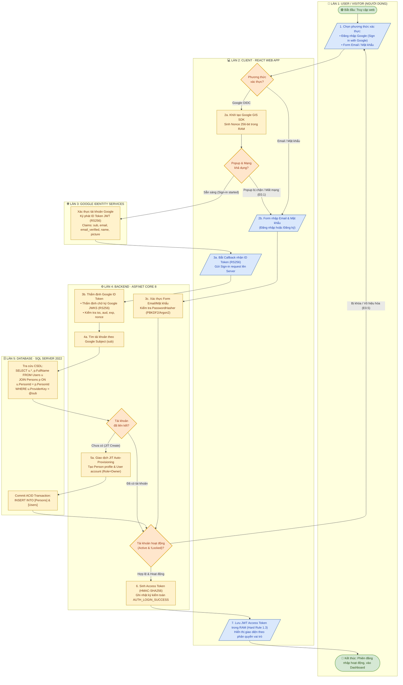

# SƠ ĐỒ LUỒNG BƠI KIẾN TRÚC (SWIMLANE WORKFLOW ARCHITECTURE)
## HỆ THỐNG QUẢN LÝ & BÀN GIAO DI SẢN SỐ AN TOÀN LEGACYVAULT
*Tuân thủ Bộ luật Dân sự 2015, Luật Giao dịch điện tử 2023 & Nghị định 13/2023/NĐ-CP*

---

### TIÊU CHUẨN KÝ HIỆU LƯU ĐỒ ISO/ANSI (FLOWCHART SYMBOLS STANDARD)
Hệ thống tuân thủ bảng quy chuẩn hình khối và màu sắc lưu đồ quốc tế ISO 5807 / ANSI:
* 🟢 **Start / Stop (Bắt đầu / Kết thúc)**: Hình bầu dục / Oval (`([ ... ])`), nền Xanh lá (`#D5E8D4`, viền `#82B366`).
* 🟡 **Process (Tiến trình nội bộ)**: Hình chữ nhật (`[ ... ]`), nền Vàng (`#FFF2CC`, viền `#D6B656`).
* 🔵 **Input / Output (Đầu vào / Đầu ra)**: Hình bình hành (`[/ ... /]`), nền Xanh dương nhạt (`#DAE8FC`, viền `#6C8EBF`).
* 🟠 **Decision (Phân nhánh điều kiện)**: Hình thoi / Diamond (`{ ... }`), nền Cam (`#FFE6CC`, viền `#D79B00`).
* 🟣 **On-page Connector (Điểm nối cùng trang)**: Hình tròn (`((A))`), nền Tím nhạt (`#E1D5E7`, viền `#9673A6`).
* 🟣 **Off-page Connector (Điểm nối khác trang)**: Hình ngũ giác hướng xuống, kết nối chuyển tiếp giữa Flow 01 và Flow 02.

---

### HƯỚNG DẪN IMPORT VÀO DRAW.IO (DIAGRAMS.NET)
> 1. Truy cập **[app.diagrams.net](https://app.diagrams.net)**.
> 2. Chọn menu **Sắp xếp (Arrange)** $\rightarrow$ **Chèn (Insert)** $\rightarrow$ **Nâng cao (Advanced)** $\rightarrow$ **Mermaid**.
> 3. Sao chép và dán mã Mermaid của từng Luồng (Flow 01 hoặc Flow 02) bên dưới vào hộp thoại rồi bấm **Chèn (Insert)**.
> 4. *Lưu ý*: Đối với file vẽ chi tiết đa làn bơi chuẩn đồ họa ISO/ANSI kèm điểm nối On-page và Off-page connector, mở trực tiếp file XML đồ họa gốc tại [`FLOW_01_SYSTEM_MERGED.xml`](./FLOW_01_SYSTEM_MERGED.xml), [`FLOW_02_SYSTEM_MERGED.xml`](./FLOW_02_SYSTEM_MERGED.xml) và [`FLOW_03_SYSTEM_MERGED.xml`](./FLOW_03_SYSTEM_MERGED.xml).

---

## 1. SWIMLANE FLOW 01: ĐĂNG NHẬP VÀ ĐĂNG KÝ TÀI KHOẢN (FLOW 01 · SIGN-IN AND ACCOUNT REGISTRATION)

---

## 2. SWIMLANE FLOW 02: THIẾT LẬP KHO, MÃ HÓA ENVELOPE, GOM KHO THỤ HƯỞNG, MỜI EXECUTOR, XÁC MINH DANH TÍNH THỦ CÔNG & KÍCH HOẠT KẾ HOẠCH

```mermaid
flowchart TD
    %% ==========================================
    %% FLOW 02: CREATE VAULT, ENVELOPE ENCRYPTION, ASYNC AUDIT & PLAN ACTIVATION (ISO/ANSI)
    %% ==========================================
    subgraph LANE_OWNER ["👤 LÀN 1: ASSET OWNER (CHỦ KHO DI SẢN)"]
        F2_Start(["🟢 Bắt đầu: Đã đăng nhập (JWT trong RAM)"])
        F2_SelectTier[/"1. Chọn gói cước lưu trữ<br/>(Free 0đ / XS 199k / XSMax 399k)"/]
        F2_UploadAsset[/"2. Tải tệp tài sản (<= 20 MiB)<br/>Phân loại 3 nhóm pháp lý (Đ.105, 115, 25, 38)"/]
        F2_AssignBeneficiary[/"4. Chỉ định Người thụ hưởng từng tài sản<br/>(Hợp đồng vì lợi ích người thứ ba - Đ.415)"/]
        F2_AssignExecutor[/"5. Chỉ định Người thi hành (Executor) độc lập<br/>Tuân thủ tam quyền phân lập ASSIGN-06"/]
        F2_SubmitId[/"7. Nộp hồ sơ danh tính: ảnh 2 mặt CCCD<br/>& số định danh cá nhân"/]
        F2_ConfirmActive[/"9. Xác nhận cam kết pháp lý & Bấm Kích hoạt"/]
        F2_End(["🏁 Kết thúc: Kế hoạch ACTIVE, DMS đếm ngược 30 ngày"])
    end

    subgraph LANE_CLIENT ["💻 LÀN 2: CLIENT (REACT 19 WEB APP)"]
        F2_ShowQr[/"Hiển thị Dynamic VietQR thanh toán"/]
        F2_ValidateFile{"File <= 20 MiB &<br/>hợp lệ dung lượng?"}
        F2_ShowErrorFile["Báo lỗi E2: Quá dung lượng / Sai định dạng"]
        F2_ConsolidateUI["Gom kho tự động theo tập người nhận (AC-01)"]
        F2_ReviewChecklist[/"Hiển thị bảng kiểm tra điều kiện SETUP-01"/]
    end

    subgraph LANE_SEPAY ["💳 LÀN 3: SEPAY (CỔNG THANH TOÁN VIETQR)"]
        F2_WaitPayment["⏳ [BẤT ĐỒNG BỘ: Chờ thanh toán VietQR]"]
        F2_SepayWebhook[/"Xác nhận chuyển khoản thành công<br/>Phát Webhook POST /api/payment/sepay-webhook"/]
    end

    subgraph LANE_SERVER ["⚙️ LÀN 4: SERVER (.NET 8 WEBAPI & CRYPTO ENGINE)"]
        F2_ProcessPayment["Xử lý Webhook SePay: Kích hoạt gói XS/XSMax"]
        F2_EnvelopeEncrypt["3. MÃ HÓA PHONG BÌ ENVELOPE AES-256-GCM<br/>• Sinh DEK 256-bit ngẫu nhiên<br/>• Mã hóa với AAD (OwnerId, VaultId, AssetId)<br/>• Bọc DEK bằng Master KEK (WrappedDataKey)<br/>• Phân 3 mảnh Shamir SSS (2/3 Threshold)<br/>• Tính SHA-256 Checksum & Stream lên R2<br/>• Xóa DEK khỏi RAM"]
        F2_SendInvite["6. Tạo Token ủy quyền (48h)<br/>Gọi MailKit gửi email mời Executor"]
        F2_WaitExec["⏳ [BẤT ĐỒNG BỘ: Chờ Executor phản hồi (48h)]"]
        F2_RecordExecAccept["Ghi nhận ExecutorStatus = ACCEPTED"]
        F2_RecordExecReject["Ghi vết từ chối / Hết hạn token (Lỗi E5)"]
        F2_WaitVerify["⏳ [BẤT ĐỒNG BỘ: Chờ thẩm định danh tính]"]
        F2_RecordVerified["Ghi nhận: IdentityStatus = VERIFIED<br/>Lưu verifier_id, verified_at, audit_notes"]
        F2_RecordRejected["Ghi nhận lý do từ chối CCCD (Lỗi E5.1)<br/>Gửi thông báo yêu cầu bổ sung"]
        F2_SetupChecklist{"Tất cả tiêu chí<br/>SETUP-01 đạt?"}
        F2_RejectIncomplete["Báo lỗi E1/E6: Chưa đủ điều kiện<br/>(Gói Free cần nâng cấp / Thiếu giấy tờ)"]
        F2_CommitActive["10. Giao dịch Serializable ACID:<br/>Plan.State = ACTIVE, Kích hoạt DMS 30 ngày,<br/>Time-Lock 7-14 ngày, ghi AuditEvents."]
    end

    subgraph LANE_R2 ["☁️ LÀN 5: CLOUDFLARE R2 (OBJECT STORAGE)"]
        F2_R2Upload["Lưu Ciphertext .enc vào Private Bucket<br/>Key: vaults/{vaultId}/assets/{assetId}/v1.enc<br/>($0 Egress Fee, Zero-Knowledge)"]
    end

    subgraph LANE_SMTP ["📧 LÀN 6: GMAIL SMTP (DỊCH VỤ EMAIL)"]
        F2_SmtpSend[/"Tiếp nhận thư & trả kết quả:<br/>SMTP acceptance / transmission status"/]
    end

    subgraph LANE_EXECUTOR ["🤝 LÀN 7: EXECUTOR (NGƯỜI THI HÀNH)"]
        F2_ExecDecision{"Chấp nhận ủy quyền<br/>(Hợp đồng Đ.562)?"}
    end

    subgraph LANE_VERIFIER ["⚖️ LÀN 8: VERIFIER / COMPLIANCE (THẨM ĐỊNH THỦ CÔNG)"]
        F2_VerifierReview["8. Thẩm định hồ sơ danh tính thủ công (ADR-06)<br/>• Đối chiếu CCCD với dữ liệu người dùng<br/>• Bắt buộc lưu verifier_id, verified_at, reason"]
        F2_VerifierDecision{"Hồ sơ danh tính<br/>hợp lệ (VERIFIED)?"}
    end

    %% Connections Flow 2
    F2_Start --> F2_SelectTier
    F2_SelectTier -- "Chọn XS/XSMax (Nâng cấp)" --> F2_ShowQr
    F2_ShowQr --> F2_WaitPayment
    F2_WaitPayment --> F2_SepayWebhook
    F2_SepayWebhook --> F2_ProcessPayment
    F2_ProcessPayment --> F2_UploadAsset
    F2_SelectTier -- "Gói Free (Lưu trữ cá nhân)" --> F2_UploadAsset
    F2_UploadAsset --> F2_ValidateFile
    F2_ValidateFile -- "Quá 20MB / Hết quota (Lỗi E2)" --> F2_ShowErrorFile
    F2_ShowErrorFile -. "Quay lại chọn file (Loop-back)" .-> F2_UploadAsset
    F2_ValidateFile -- "Hợp lệ" --> F2_EnvelopeEncrypt
    F2_EnvelopeEncrypt --> F2_R2Upload
    F2_R2Upload --> F2_AssignBeneficiary
    F2_AssignBeneficiary --> F2_ConsolidateUI
    F2_ConsolidateUI --> F2_AssignExecutor
    F2_AssignExecutor --> F2_SendInvite
    F2_SendInvite --> F2_SmtpSend
    F2_SmtpSend --> F2_WaitExec
    F2_WaitExec --> F2_ExecDecision
    F2_ExecDecision -- "Từ chối / Quá 48h (Lỗi E5)" --> F2_RecordExecReject
    F2_RecordExecReject -. "Quay lại chọn người khác (Loop-back)" .-> F2_AssignExecutor
    F2_ExecDecision -- "Đồng ý chấp nhận" --> F2_RecordExecAccept
    F2_RecordExecAccept --> F2_SubmitId
    F2_SubmitId --> F2_WaitVerify
    F2_WaitVerify --> F2_VerifierReview
    F2_VerifierReview --> F2_VerifierDecision
    F2_VerifierDecision -- "Không đạt (Lỗi E5.1)" --> F2_RecordRejected
    F2_RecordRejected -. "Quay lại nộp lại CCCD (Loop-back)" .-> F2_SubmitId
    F2_VerifierDecision -- "Đạt (VERIFIED)" --> F2_RecordVerified
    F2_RecordVerified --> F2_ConfirmActive
    F2_ConfirmActive --> F2_ReviewChecklist
    F2_ReviewChecklist --> F2_SetupChecklist
    F2_SetupChecklist -- "Chưa đủ điều kiện (Lỗi E1/E6)" --> F2_RejectIncomplete
    F2_RejectIncomplete -. "Quay lại nâng cấp gói / hoàn tất (Loop-back)" .-> F2_SelectTier
    F2_SetupChecklist -- "Đủ 100% điều kiện" --> F2_CommitActive
    F2_CommitActive --> F2_End

    %% Styling Flow 2 (ISO Color Palette)
    classDef isoStartEnd fill:#D5E8D4,stroke:#82B366,stroke-width:2px,color:#274E13;
    classDef isoProcess fill:#FFF2CC,stroke:#D6B656,stroke-width:2px,color:#78350F;
    classDef isoIO fill:#DAE8FC,stroke:#6C8EBF,stroke-width:2px,color:#1E40AF;
    classDef isoDecision fill:#FFE6CC,stroke:#D79B00,stroke-width:2px,color:#9A3412;

    class F2_Start,F2_End isoStartEnd;
    class F2_SelectTier,F2_UploadAsset,F2_AssignBeneficiary,F2_AssignExecutor,F2_SubmitId,F2_ConfirmActive,F2_ShowQr,F2_SepayWebhook,F2_ReviewChecklist,F2_SmtpSend isoIO;
    class F2_ValidateFile,F2_ExecDecision,F2_VerifierDecision,F2_SetupChecklist isoDecision;
    class F2_ShowErrorFile,F2_ConsolidateUI,F2_WaitPayment,F2_ProcessPayment,F2_EnvelopeEncrypt,F2_R2Upload,F2_SendInvite,F2_WaitExec,F2_RecordExecAccept,F2_RecordExecReject,F2_WaitVerify,F2_VerifierReview,F2_RecordVerified,F2_RecordRejected,F2_RejectIncomplete,F2_CommitActive isoProcess;
```

---

## 3. SWIMLANE FLOW 03: DEAD MAN'S SWITCH (DMS) · HEARTBEAT, SUSPENSION & SAFE FREEZE

```mermaid
flowchart TD
    %% ==========================================
    %% FLOW 03: DEAD MAN'S SWITCH (DMS), SUSPENSION & SAFE FREEZE (ISO/ANSI)
    %% ==========================================
    subgraph LANE_OWNER ["👤 LANE 1: ASSET OWNER"]
        F3_Start(["🟢 Start: Plan ACTIVE (From Flow 02)"])
        F3_Config[/"1. Configure DMS Settings<br/>Cycle (30/60/90d) & Grace (7/14/30d)"/]
        F3_Ping[/"6. Check-in: Click 'I Am Alive'<br/>via Web App or Email Auth Link"/]
        F3_LateRecovery[/"11. Late Check-in Request<br/>(Initiated while SUSPENDED or FROZEN)"/]
        F3_EndFrozen(["🏁 Stop: Safe Inactivity Freeze<br/>Read-only; No Data Deletion"/])
    end

    subgraph LANE_CLIENT ["💻 LANE 2: CLIENT · REACT 19 WEB APP"]
        F3_SubmitConfig[/"2. Submit Settings Form<br/>POST /api/v1/dms/settings"/]
        F3_RenderCard[/"4. Render Heartbeat Card<br/>Countdown to NextDue & Pulse Wave"/]
        F3_SendPing[/"7. POST /api/v1/dms/check-in<br/>(With RAM JWT or Single-Use Email Token)"/]
        F3_ShowError["Display Check-in Error (400/401)<br/>Token invalid / expired / already used"]
        F3_PulseActive["9. Update UI: Active Green Pulse<br/>Display new NextDue from Server"]
        F3_LoopActive((A))
        F3_ShowSuspended[/"10. Display Suspension Banner<br/>Show remaining days to FreezeAt & 1-Click Ping"/]
        F3_ShowFrozen[/"16. Safe Frozen Vault Interface<br/>Asset Editing Locked; Data Preserved"/]
    end

    subgraph LANE_SERVER ["⚙️ LANE 3: SERVER · .NET 8 & DMS WORKER"]
        F3_InitTimer["3. Process Initial Schedule<br/>NextDue = now + Cycle; Changes apply next cycle"]
        F3_AckConfig["Return HTTP 200 OK<br/>Confirmed NextDue & Schedule"]
        F3_WorkerCron["DmsHeartbeatWorker (HostedService)<br/>Hourly Autonomous Background Audit"]
        F3_DecActiveScan{"ACTIVE AND<br/>now >= NextDue?"}
        F3_TriggerGrace["5. Transition to CHECKIN_PENDING<br/>GraceExpiresAt = NextDue + GraceDays"]
        F3_DecValidate{"Validate Check-in:<br/>Token valid & no death claim<br/>approved or under review?"}
        F3_FlagRescue["Flag Status = RESCUE_PENDING<br/>Check-in conflicts with claim under review;<br/>Notify Verifier for urgent investigation"]
        F3_ResetTimer["8. Process ACID Check-in<br/>Insert CheckInLogs; Status = ACTIVE;<br/>NextDue = now + Cycle; Close alert task"]
        F3_AckCheckIn["Return HTTP 200 OK<br/>New NextDue returned by Server"]
        F3_DecGraceScan{"CHECKIN_PENDING AND<br/>now >= GraceExpiresAt?"}
        F3_SuspendVault["10. Transition to CHECKIN_SUSPENDED<br/>suspended_at = now; FreezeAt = GraceExpires + 90d;<br/>Pause regular check-in countdown"]
        F3_DecHasExec{"Qualified Executor<br/>Assigned (XS/XSMax)?"}
        F3_DispatchAlert["Dispatch ExecutorAlertTasks in DB<br/>Remind after 48h; 72h SLA window;<br/>Does not control 90-day freeze timer"]
        F3_VerifyExec["Validate Executor Response<br/>Verify TaskId & token authorization"]
        F3_DecSuspendedScan{"Worker Audit:<br/>CHECKIN_SUSPENDED<br/>Vaults"}
        F3_StagedReminders["12. Send Staged Reminders<br/>Countdown: Start, 30d, 7d, 24h (Deduplicated)"]
        F3_DecFreezeReached{"CHECKIN_SUSPENDED AND<br/>now >= FreezeAt<br/>(90-Day Window Closed)?"}
        F3_FreezeVault["15. Safe Freeze Transaction<br/>Status = FROZEN_INACTIVITY; Audit Event Logged;<br/>Lock mutations, preserve all data"]
    end

    subgraph LANE_DB ["🗄️ LANE 4: DATABASE · SQL SERVER 2022"]
        F3_SaveSchedule["COMMIT TRANSACTION:<br/>UPDATE [Vaults] SET NextDue & Settings"]
        F3_SavePending["COMMIT TRANSACTION:<br/>UPDATE [Vaults] Status='CHECKIN_PENDING', GraceExpiresAt"]
        F3_SaveCheckIn["COMMIT TRANSACTION:<br/>INSERT [CheckInLogs]; UPDATE Status='ACTIVE',<br/>Tasks='OWNER_CHECKED_IN'"]
        F3_SaveSuspension["COMMIT TRANSACTION:<br/>UPDATE Status='CHECKIN_SUSPENDED', FreezeAt=due+90d"]
        F3_SaveExecTask["INSERT [ExecutorAlertTasks];<br/>Queue Outbox Warning Email"]
        F3_SaveExecResp["COMMIT TRANSACTION:<br/>UPDATE [ExecutorAlertTasks]<br/>SET Status='NO_CERTIFICATE_AVAILABLE'"]
        F3_SaveFreeze["COMMIT TRANSACTION:<br/>UPDATE Status='FROZEN_INACTIVITY';<br/>Log [AuditEvents]"]
    end

    subgraph LANE_SMTP ["📧 LANE 5: GMAIL SMTP SERVICE"]
        F3_SendReminder[/"Send Check-in Reminder Email<br/>Link to Single-Use Auth Verification"/]
        F3_SendSuspension[/"Send 90-Day Suspension Notice<br/>and Safe Freeze Warning to Owner"/]
        F3_SendExecWarning[/"Send Wellbeing Alert to Executor:<br/>Action Required: Check on Owner"/]
        F3_SendStagedNotice[/"Deliver Staged Warning Email<br/>Impending Safe Freeze Alert"/]
        F3_SendFreezeNotice[/"Send Safe Freeze Notification:<br/>90 Days Expired Without Response"/]
    end

    subgraph LANE_EXECUTOR ["🤝 LANE 6: EXECUTOR · HANDOVER EXECUTOR"]
        F3_ExecReceiveAlert[/"Receive Owner Wellbeing Alert<br/>(Death NOT Presumed)"/]
        F3_DecExecAction{"Actual In-Person<br/>Verification Result?"}
        F3_ExecSubmitResp[/"14a. Submit Status to Server:<br/>Record NO_CERTIFICATE_AVAILABLE"/]
        F3_ExecSubmitDeath[["14b. Submit Legal Death Certificate<br/>(Transition to FLOW 04)"]]
    end

    %% Connections Flow 3 - Phase 1: Setup & Initialization
    F3_Start --> F3_Config
    F3_Config --> F3_SubmitConfig
    F3_SubmitConfig --> F3_InitTimer
    F3_InitTimer --> F3_SaveSchedule
    F3_SaveSchedule --> F3_AckConfig
    F3_AckConfig --> F3_RenderCard
    F3_AckConfig --> F3_WorkerCron

    %% Phase 2: Worker Scan 1 (Active Due Date Check)
    F3_WorkerCron --> F3_DecActiveScan
    F3_DecActiveScan -- "now < NextDue -> Wait for next scan" --> F3_WorkerCron
    F3_DecActiveScan -- "ACTIVE AND now >= NextDue" --> F3_TriggerGrace
    F3_TriggerGrace --> F3_SavePending
    F3_SavePending --> F3_SendReminder
    F3_SendReminder --> F3_Ping

    %% Phase 3: Unified Check-in Flow (Regular & Late Recovery)
    F3_Ping --> F3_SendPing
    F3_LateRecovery --> F3_SendPing
    F3_SendPing --> F3_DecValidate
    F3_DecValidate -- "Token invalid / expired / used" --> F3_ShowError
    F3_DecValidate -- "Claim under review exists" --> F3_FlagRescue
    F3_DecValidate -- "Token valid & no active claim" --> F3_ResetTimer
    F3_ResetTimer --> F3_SaveCheckIn
    F3_SaveCheckIn --> F3_AckCheckIn
    F3_AckCheckIn --> F3_PulseActive
    F3_PulseActive --> F3_LoopActive
    F3_LoopActive -. "Connector A: Continue ACTIVE cycle" .-> F3_WorkerCron

    %% Phase 4: Worker Scan 2 (Grace Period Expiration)
    F3_WorkerCron --> F3_DecGraceScan
    F3_DecGraceScan -- "now < GraceExpiresAt -> Continue monitoring" --> F3_WorkerCron
    F3_DecGraceScan -- "CHECKIN_PENDING AND now >= GraceExpiresAt" --> F3_SuspendVault
    F3_SuspendVault --> F3_SaveSuspension
    F3_SaveSuspension --> F3_SendSuspension
    F3_SaveSuspension --> F3_ShowSuspended

    %% Phase 5: Independent Executor Sub-Workflow
    F3_SaveSuspension --> F3_DecHasExec
    F3_DecHasExec -- "Qualified Executor assigned" --> F3_DispatchAlert
    F3_DispatchAlert --> F3_SaveExecTask
    F3_SaveExecTask --> F3_SendExecWarning
    F3_SendExecWarning --> F3_ExecReceiveAlert
    F3_ExecReceiveAlert --> F3_DecExecAction
    F3_DecExecAction -- "Alive / No certificate available" --> F3_ExecSubmitResp
    F3_ExecSubmitResp --> F3_VerifyExec
    F3_VerifyExec --> F3_SaveExecResp
    F3_DecExecAction -- "Death confirmed -> Submit claim" --> F3_ExecSubmitDeath

    %% Phase 6: Independent Worker Scan 3 (Suspended Vaults & Freeze)
    F3_WorkerCron --> F3_DecSuspendedScan
    F3_DecSuspendedScan -- "Staged reminder milestone reached" --> F3_StagedReminders
    F3_StagedReminders --> F3_SendStagedNotice
    F3_DecSuspendedScan --> F3_DecFreezeReached
    F3_DecFreezeReached -- "now < FreezeAt -> Continue countdown" --> F3_WorkerCron
    F3_DecFreezeReached -- "now >= FreezeAt (90 days elapsed)" --> F3_FreezeVault
    F3_FreezeVault --> F3_SaveFreeze
    F3_SaveFreeze --> F3_SendFreezeNotice
    F3_SaveFreeze --> F3_ShowFrozen
    F3_ShowFrozen --> F3_EndFrozen
    F3_EndFrozen -. "Late recovery permitted anytime post-freeze" .-> F3_LateRecovery

    %% Styling Flow 3 (ISO Color Palette)
    classDef isoStartEnd fill:#D5E8D4,stroke:#82B366,stroke-width:2px,color:#274E13;
    classDef isoProcess fill:#FFF2CC,stroke:#D6B656,stroke-width:2px,color:#78350F;
    classDef isoIO fill:#DAE8FC,stroke:#6C8EBF,stroke-width:2px,color:#1E40AF;
    classDef isoDecision fill:#FFE6CC,stroke:#D79B00,stroke-width:2px,color:#9A3412;
    classDef isoConn fill:#E1D5E7,stroke:#9673A6,stroke-width:2px,color:#581C87;

    class F3_Start,F3_EndFrozen isoStartEnd;
    class F3_Config,F3_Ping,F3_LateRecovery,F3_SubmitConfig,F3_RenderCard,F3_SendPing,F3_ShowSuspended,F3_ShowFrozen,F3_SendReminder,F3_SendSuspension,F3_SendExecWarning,F3_SendStagedNotice,F3_SendFreezeNotice,F3_ExecReceiveAlert,F3_ExecSubmitResp isoIO;
    class F3_DecActiveScan,F3_DecValidate,F3_DecGraceScan,F3_DecHasExec,F3_DecExecAction,F3_DecSuspendedScan,F3_DecFreezeReached isoDecision;
    class F3_ShowError,F3_PulseActive,F3_InitTimer,F3_AckConfig,F3_WorkerCron,F3_TriggerGrace,F3_FlagRescue,F3_ResetTimer,F3_AckCheckIn,F3_SuspendVault,F3_DispatchAlert,F3_VerifyExec,F3_StagedReminders,F3_FreezeVault,F3_SaveSchedule,F3_SavePending,F3_SaveCheckIn,F3_SaveSuspension,F3_SaveExecTask,F3_SaveExecResp,F3_SaveFreeze isoProcess;
    class F3_LoopActive,F3_ExecSubmitDeath isoConn;
```

---

## 4. BẢNG ĐỐI SOÁT CÔNG NGHỆ & CĂN CỨ PHÁP LÝ

| Thành phần trong Swimlane | Công nghệ hiện thực trên Prototype | Căn cứ pháp lý dân sự & an toàn thông tin |
| :--- | :--- | :--- |
| **Google Auth Server (OIDC)** | Google Identity Services (GIS v2) & `Google.Apis.Auth` (.NET 8) | Luật Giao dịch điện tử 2023 (Điều 23 - Xác thực điện tử) |
| **JIT Auto-Provisioning** | Microsoft SQL Server 2022 (Bảng `[Persons]` tách bạch `[Users]`) | Quy tắc tam quyền phân lập `ASSIGN-06` (Quản lý căn cước thực tế) |
| **Cổng thanh toán SePay** | SePay Dynamic VietQR & Webhook đối soát tự động | Điều 119 BLDS 2015 (Hình thức giao dịch dân sự điện tử) |
| **Xác minh danh tính thủ công** | Chuyên viên Verifier độc lập đối chiếu CCCD, ghi Sổ kiểm toán (`Audit Trail`) | Điều 616, 624 BLDS 2015; Nghị định 13/2023/NĐ-CP (Bỏ API eKYC tự động) |
| **Phân loại 3 nhóm dữ liệu** | Phân loại: Kinh tế, Kỷ vật lưu niệm, Bí mật đời tư tiêu hủy | Điều 105, 115 & Điều 25, 38 Bộ luật Dân sự 2015 |
| **Mã hóa Server-Side Envelope AES-GCM** | AES-256-GCM + Master KEK + **Cloudflare R2 Private S3** ($0 Egress) | Điều 12, 15 Luật GDĐT 2023 (Bảo đảm giá trị bản gốc) |
| **Phân mảnh khóa 2/3** | Shamir's Secret Sharing (Mảnh 1 System, 2 Verifier, 3 Executor) | Điều 106 BLTTDS 2015 (Phục hồi khóa theo Lệnh Tòa án) |
| **Gom kho tự động (AC-01)** | Thuật toán gom nhóm tài sản theo tập người thụ hưởng duy nhất | Điều 415 BLDS 2015 (Hợp đồng vì lợi ích người thứ ba) |
| **Mời Người thi hành (Executor)** | MailKit SMTP Engine (`smtp.gmail.com:587`), quản lý token 48h | Điều 562 BLDS 2015 (Hợp đồng ủy quyền thực hiện công việc) |
| **Kích hoạt kế hoạch (Active Plan)** | Khởi động Dead Man's Switch (DMS 30 ngày) & Time-Lock Delay | Điều 120 BLDS 2015 (Giao dịch dân sự có điều kiện phát sinh) |
| **Giám sát sự sống DMS (Flow 03)** | `DmsHeartbeatWorker` (.NET 8 HostedService) quét chu kỳ 30/60/90 ngày | Điều 120 BLDS 2015 (Xác lập điều kiện biến cố phát sinh quyền thừa kế) |
| **Tạm treo 90 ngày cố định (DMS-04)** | Mốc đếm ngược `suspended_at + 90 days`, cảnh báo kiểm tra tình hình | Điều 68 BLDS 2015 (Thông báo tìm kiếm người vắng mặt, không suy đoán chết) |
| **Đóng băng an toàn (DMS-09)** | Trạng thái `FROZEN_INACTIVITY`: Khóa sửa đổi, bảo toàn dữ liệu vĩnh viễn | OPLAN-05, OPLAN-06; Nghị định 13/2023/NĐ-CP (Bảo vệ dữ liệu cá nhân) |
| **Phục hồi điểm danh muộn (DMS-06)** | Khôi phục tức thì `ACTIVE` khi Owner check-in trước khi có hồ sơ chứng tử | Quyền tự định đoạt tài sản của chủ sở hữu khi còn sống |
