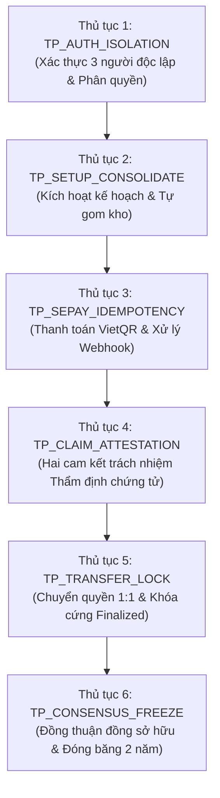

# ĐẶC TẢ THỦ TỤC KIỂM THỬ (TEST PROCEDURE SPECIFICATION)
## DỰ ÁN: LEGACYVAULT — HỆ THỐNG LƯU GIỮ VÀ BÀN GIAO TÀI SẢN SỐ
### Chuẩn phương pháp: Foundations of Software Testing – ISTQB Certification (Dorothy Graham et al.) & Mẫu chuẩn IEEE 829 (Chương 4.1.5, trang 85)

---

## 1. TEST PROCEDURE SPECIFICATION IDENTIFIER
- **Mã tài liệu:** `LV-TPS-2026-V3.11.0`
- **Phiên bản:** 1.0
- **Ngày ban hành:** 28/09/2026
- **Test Basis tham chiếu:** `LegacyVault-SRS-v3.11.0.md` & `TEST_CASE_SPECIFICATION.md`

---

## 2. PURPOSE (Mục đích)
Tài liệu này quy định chi tiết các bước tuần tự (step-by-step instructions) để thiết lập dữ liệu (Setup), thực thi kiểm thử (Execution), quan sát kết quả (Observation), đánh giá tiêu chí đạt/không đạt và dọn dẹp môi trường (Teardown/Cleanup).
Phân biệt rõ giữa **Thủ tục kiểm thử tự động (Automated Test Procedures)** chạy qua CI/CLI và **Thủ tục kiểm thử thủ công (Manual Test Procedures)** trên giao diện Web Testbench.

---

## 3. SPECIAL REQUIREMENTS (Yêu cầu đặc biệt & Ràng buộc)
1. **Ràng buộc an toàn & Dữ liệu tổng hợp:**
   - Tuyệt đối không sử dụng số Căn cước công dân thật, họ tên người thật hoặc số điện thoại thật.
   - Sử dụng Mock Adapter và InMemory Provider cho các dịch vụ bên ngoài (SePay, Cloudflare R2, FPT.AI eKYC).
   - Kiểm thử các mốc thời gian (15 phút, 7 ngày, 90 ngày, 2 năm lịch) bằng đồng hồ giả lập (`DateTime.UtcNow` được thiết lập tĩnh hoặc tham số hóa), tuyệt đối không dùng lệnh `Thread.Sleep` chờ thời gian thực tế.
2. **Quy tắc cô lập tiến trình:**
   - Dừng các tiến trình nền đang chiếm dụng tệp thực thi (`LegacyVault.Prototype.WebApi.dll`) trước khi chạy lệnh test.

---

## 4. TEST EXECUTION SCHEDULE (Lịch trình thực thi có phụ thuộc - Mục 4.1.5, trang 84)
Thứ tự thực thi tuân theo nguyên tắc *"Find the scary stuff first"* (Ưu tiên các rủi ro bảo mật và toàn vẹn dữ liệu nghiêm trọng nhất):



---

## 5. CHI TIẾT THỦ TỤC KIỂM THỬ (PROCEDURE STEPS)

### 5.1. Thủ tục tự động `TP_AUTO_SETUP_CONSOLIDATE` (Automated Procedure)
- **Mục tiêu:** Kiểm thử tự động logic tự gom kho bàn giao (`SETUP-05`, `ASSET-04`, `AC-01`).
- **Test Cases liên quan:** `TC_EP_03`.
- **Loại thủ tục:** Tự động hóa hoàn toàn bằng C# xUnit.
- **Thực thi:**
  ```powershell
  dotnet test server/LegacyVault.Prototype.Tests/LegacyVault.Prototype.Tests.csproj --filter "FullyQualifiedName~EP02_VaultConsolidation_RecipientPartitions"
  ```
- **Các bước tiến hành:**
  1. **Bước 1 (Setup Data):** Khởi tạo bộ nhớ với `planId = Guid.NewGuid()`, tạo 3 mã định danh `person1`, `person2`, `person3`.
  2. **Bước 2 (Input):** Nạp danh sách 5 tài sản:
     - Asset 1 (Tài sản chưa gán): `Recipients = {}`
     - Asset 2 (Tài sản A): `Recipients = { person1 }`
     - Asset 3 (Tài sản C): `Recipients = { person1 }`
     - Asset 4 (Tài sản B): `Recipients = { person1, person2 }`
     - Asset 5 (Tài sản D): `Recipients = { person3 }`
  3. **Bước 3 (Execute):** Gọi hàm `_rulesService.ConsolidateVaults(planId, assets)`.
  4. **Bước 4 (Observe & Assert):**
     - Kiểm tra `vaults.Count == 3`.
     - Kiểm tra kho chứa `person1` có đúng 2 tài sản (A và C) và mang chế độ `SINGLE_RECIPIENT`.
     - Kiểm tra kho chứa `person1, person2` có chế độ `CO_OWNED`.
     - Kiểm tra tài sản chưa gán không xuất hiện trong bất kỳ kho nào.
  5. **Bước 5 (Teardown):** Dọn dẹp dữ liệu biến cục bộ trong bộ nhớ RAM.

---

### 5.2. Thủ tục tự động `TP_AUTO_MCDC_ATTESTATION` (Automated Procedure)
- **Mục tiêu:** Kiểm thử White-box đạt 100% MC/DC trên biểu thức cam kết pháp lý (`DEATH-02`, dòng 206 `EstatePlanRulesService.cs`).
- **Test Cases liên quan:** `WB_MCDC_01`, `WB_MCDC_02`, `WB_MCDC_03`.
- **Thực thi:**
  ```powershell
  dotnet test server/LegacyVault.Prototype.Tests/LegacyVault.Prototype.Tests.csproj --filter "FullyQualifiedName~WB_MCDC"
  ```
- **Các bước tiến hành:**
  1. **Bước 1:** Chạy test case `WB_MCDC_01` với `(true, true)` -> Quan sát kết quả trả về `true`.
  2. **Bước 2:** Chạy test case `WB_MCDC_02` với `(true, false)` -> Quan sát kết quả trả về `false`. (Chứng minh VerifierAttested quyết định kết quả).
  3. **Bước 3:** Chạy test case `WB_MCDC_03` với `(false, true)` -> Quan sát kết quả trả về `false`. (Chứng minh ExecutorAttested quyết định kết quả).

---

### 5.3. Thủ tục thủ công `TP_MANUAL_SEPAY_FLOW` (Manual Verification Procedure)
- **Mục tiêu:** Kiểm chứng trực quan quy trình tạo mã QR VietQR SePay và mô phỏng thanh toán Demo Mode trên trình duyệt Web.
- **Test Cases liên quan:** `TC_DT_03`.
- **Loại thủ tục:** Thủ công trên giao diện Web Testbench (`http://localhost:5173`).
- **Các bước tiến hành:**
  1. **Bước 1 (Khởi tạo):** Mở trình duyệt tại địa chỉ `http://localhost:5173`, chuyển đến Tab **2. SePay VietQR**.
  2. **Bước 2 (Tạo đơn hàng):** Chọn gói `Legacy XS (199.000đ / 365 ngày)`, nhấn nút **Tạo Đơn Hàng & Mã QR**.
  3. **Bước 3 (Quan sát 1):**
     - Kiểm tra mã QR SePay hiển thị đầy đủ thông tin: Ngân hàng MBBank, Số tiền 199.000 VNĐ, Nội dung chuyển khoản định dạng `LVxxxxxx`.
     - Đồng hồ đếm ngược thời hạn hiển thị chính xác 15 phút.
  4. **Bước 4 (Mô phỏng thanh toán):** Nhấn nút **Mô phỏng Thanh toán Thành công (Demo Hook)**.
  5. **Bước 5 (Quan sát 2):**
     - Đơn hàng chuyển ngay lập tức sang trạng thái `PAID` (Màu xanh lục).
     - Banner thông báo dịch vụ được kích hoạt thành công, mở khóa tính năng xuất PDF và lập di sản.
  6. **Bước 6 (Kiểm tra Idempotency):** Nhấn lại nút mô phỏng lần thứ 2. Hệ thống phải giữ nguyên trạng thái `PAID` với mã HTTP 200, không bị nhân đôi thời hạn sử dụng.
