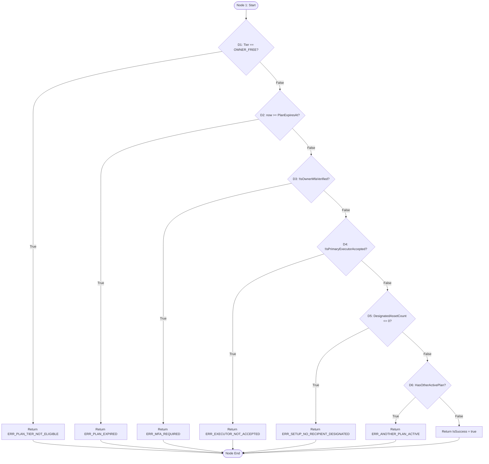

# BÁO CÁO ĐO LƯỜNG ĐỘ BAO PHỦ CẤU TRÚC (WHITE-BOX COVERAGE SPECIFICATION)
## DỰ ÁN: LEGACYVAULT — HỆ THỐNG LƯU GIỮ VÀ BÀN GIAO TÀI SẢN SỐ
### Chuẩn phương pháp: Foundations of Software Testing – ISTQB Certification (Dorothy Graham et al., Chương 4.4, trang 105-113)

> [!IMPORTANT]
> **Tuyên bố tính xác minh:** Các số liệu thực thi kiểm thử và độ phủ cấu trúc trong tài liệu này được ghi nhận **theo báo cáo của lần chạy trên máy nhóm, chưa đối chứng độc lập**. Mã commit tương ứng: `724bff1e6b8027f60690531ecb2532a6ab5c7dc6`. Kết quả đo lường trực tiếp từ công cụ Coverlet (`coverage.cobertura.xml`) được trình bày chi tiết theo đúng thuật ngữ chỉ số của công cụ.

---

## 1. CĂN CỨ LÝ THUYẾT & ĐỐI CHIẾU CHỈ SỐ CÔNG CỤ (ISTQB CHƯƠNG 4.4 VS. COVERLET)

### 1.1. Định nghĩa chuẩn lý thuyết ISTQB CTFL (Graham et al. Mục 4.4, trang 105–113)
1. **Statement Coverage (Mục 4.4.2, trang 109):** Tỷ lệ câu lệnh mã nguồn (executable statements) đã được thực thi trên tổng số câu lệnh khả thi.
2. **Decision Coverage (Mục 4.4.3, trang 111):** Tỷ lệ kết quả rẽ nhánh (decision outcomes True/False) đã được thực thi trên tổng số kết quả quyết định có thể có trong đồ thị luồng điều khiển (CFG).
3. **Modified Condition / Decision Coverage (MC/DC - Mục 4.4.4, trang 113):** Chứng minh mỗi điều kiện con có thể độc lập làm thay đổi kết quả toàn bộ quyết định phức hợp.

### 1.2. Phân định cơ chế đo lường của công cụ Coverlet (.NET XPlat Code Coverage)
- **`line-rate` (Line Coverage):** Coverlet đo lường dựa trên các điểm trình tự mã trung gian (IL Sequence Points) ánh xạ tới các dòng mã nguồn C#. Một dòng mã nguồn có thể chứa nhiều câu lệnh, hoặc một câu lệnh C# có thể trải dài trên nhiều dòng. Do đó, `line-rate` của Coverlet **tiệm cận nhưng không đồng nhất tuyệt đối** với Statement Coverage theo định nghĩa lý thuyết nếu một dòng có nhiều biểu thức.
- **`branch-rate` (Branch Coverage):** Coverlet đo lường các lệnh rẽ nhánh ở mức mã máy ảo (IL branching instructions: `brtrue`, `brfalse`, `switch`). Trong C#, các toán tử ngắn mạch (short-circuiting `&&`, `||`) và toán tử null-coalescing (`??`, `?.`) được trình biên dịch sinh ra nhiều nhánh IL ẩn. Do đó, `branch-rate` của Coverlet phản ánh độ phủ nhánh IL, có thể cao hơn hoặc khác biệt so với số nhánh quyết định mức mã nguồn (Decision Coverage của CFG).

---

## 2. PHÂN TÍCH VÀ ĐO ĐẠC TRÊN CÁC METHOD THỰC TẾ TRONG MÃ NGUỒN

### 2.1. Phân tích MC/DC 01: Biểu thức Cam kết pháp lý hai bên (`ValidateDeathAttestation`)
- **Vị trí tệp:** [`EstatePlanRulesService.cs`](file:///c:/Users/ThanhDuy/Documents/01_Code_Projects/SWP-Prototype/server/LegacyVault.Prototype.Application/Services/EstatePlanRulesService.cs#L204-L208)
- **Tên method:** `ValidateDeathAttestation(bool executorAttested, bool verifierAttested)`
- **Biểu thức Boolean nguyên văn (dòng 206):**
  ```csharp
  return executorAttested && verifierAttested;
  ```
- **Tách các điều kiện nguyên tử:**
  - $C_1$: `executorAttested`
  - $C_2$: `verifierAttested`
  - Quyết định $D = C_1 \land C_2$

#### Bảng chân trị (Truth Table):
| Test Case ID | $C_1$ (`executorAttested`) | $C_2$ (`verifierAttested`) | $D$ (Kết quả quyết định) | Ghi chú đánh giá |
| :---: | :---: | :---: | :---: | :--- |
| **TC_MCDC_01** | **True** | **True** | **True** | Cả hai đều tick cam kết |
| **TC_MCDC_02** | **True** | **False** | **False** | Executor tick, Verifier chưa tick |
| **TC_MCDC_03** | **False** | **True** | **False** | Executor chưa tick, Verifier tick |
| **TC_MCDC_04** | **False** | **False** | **False** | Cả hai đều chưa tick (Short-circuit tại $C_1$) |

#### Bảng cặp kiểm thử độc lập MC/DC (Independence Pairs):
| Điều kiện kiểm thử | Cặp Test Case chứng minh | Giá trị $C_1$ | Giá trị $C_2$ | Kết quả $D$ | Kết luận |
| :---: | :---: | :---: | :---: | :---: | :--- |
| **$C_1$ (`executorAttested`)** | **(TC_MCDC_01, TC_MCDC_03)** | **T $\to$ F** | **T (Giữ nguyên)** | **T $\to$ F** | Đạt yêu cầu MC/DC độc lập cho $C_1$ |
| **$C_2$ (`verifierAttested`)** | **(TC_MCDC_01, TC_MCDC_02)** | **T (Giữ nguyên)** | **T $\to$ F** | **T $\to$ F** | Đạt yêu cầu MC/DC độc lập cho $C_2$ |

=> **Kết quả đo lường:** Đạt **100% MC/DC** với 3 test cases tối thiểu: `{TC_MCDC_01, TC_MCDC_02, TC_MCDC_03}`.

---

### 2.2. Phân tích MC/DC 02: Khởi tạo Master KEK từ biến cấu hình
- **Vị trí tệp:** [`EnvelopeEncryptionService.cs`](file:///c:/Users/ThanhDuy/Documents/01_Code_Projects/SWP-Prototype/server/LegacyVault.Prototype.Infrastructure/Services/EnvelopeEncryptionService.cs#L17-L27)
- **Tên method:** Constructor `EnvelopeEncryptionService(IConfiguration configuration)`
- **Biểu thức Boolean nguyên văn (dòng 18):**
  ```csharp
  if (!string.IsNullOrEmpty(masterKeyHex) && masterKeyHex.Length == 64)
  ```
- **Tách các điều kiện nguyên tử:**
  - $C_1$: `!string.IsNullOrEmpty(masterKeyHex)`
  - $C_2$: `masterKeyHex.Length == 64`
  - Quyết định $D = C_1 \land C_2$

#### Bảng chân trị & Cặp kiểm thử MC/DC dưới ngữ nghĩa ngắn mạch (Short-Circuit):
| Test ID | $C_1$ | $C_2$ | $D$ | Thiết lập cấu hình đầu vào | Kết quả nhánh |
| :---: | :---: | :---: | :---: | :--- | :--- |
| **WB_ENC_01** | **True** | **True** | **True** | Chuỗi Hex đúng 64 ký tự | Nạp KEK cấu hình |
| **WB_ENC_02** | **True** | **False** | **False** | Chuỗi Hex dài 32 ký tự | Fallback KEK mặc định |
| **WB_ENC_03** | **False** | *(Ngắn mạch - Không chạy)* | **False** | Chuỗi rỗng `""` hoặc `null` | Fallback KEK mặc định |

#### Đánh giá phương pháp luận MC/DC (Graham et al. Mục 4.4.4):
- **Phân tích ngắn mạch (Short-Circuiting Evaluation):** Trong C#, toán tử `&&` có tính năng ngắn mạch. Khi $C_1$ mang giá trị `False` (chuỗi null/rỗng), điều kiện $C_2$ (`masterKeyHex.Length == 64`) **không được CPU thực thi** nhằm tránh ngoại lệ `NullReferenceException`.
- **Hệ quả đối với chuẩn MC/DC:**
  - Theo định nghĩa **Unique-Cause MC/DC** cổ điển: Đòi hỏi mỗi điều kiện phải được đánh giá độc lập khi giữ nguyên các điều kiện khác. Do $C_2$ không thể được thực thi khi $C_1=\text{False}$, trạng thái ($C_1=\text{False}, C_2=\text{True}$) không thể tồn tại trong runtime C#.
  - Theo định nghĩa **Masking MC/DC** (cho phép chấp nhận đặc tính ngắn mạch an toàn của ngôn ngữ): Cặp `(WB_ENC_01, WB_ENC_03)` chứng minh $C_1$ làm thay đổi quyết định từ True $\to$ False (khi $C_2$ bị masked), và cặp `(WB_ENC_01, WB_ENC_02)` chứng minh $C_2$ độc lập làm thay đổi quyết định khi $C_1 = \text{True}$.
- **Kết luận:** **Cặp test đề xuất theo Masking MC/DC (xử lý ngắn mạch C# short-circuit); MC/DC độc lập tuyệt đối (Unique-Cause MC/DC) chưa xác nhận do ràng buộc cú pháp của ngôn ngữ.**

---

### 2.3. Control-Flow Graph & Decision Coverage: Thẩm định kích hoạt kế hoạch (`ValidatePlanActivation`)
- **Vị trí tệp:** `EstatePlanRulesService.cs` dòng 13–83.
- **Sơ đồ dòng điều khiển (Control-Flow Graph - CFG):**



#### Bảng nhánh và độ bao phủ quyết định (Decision Coverage):
Tổng số điểm quyết định nhị phân: 6 (tương ứng 12 nhánh True/False).

| Quyết định | Nhánh True (Exercised) | Nhánh False (Exercised) | Test Cases bao phủ |
| :---: | :---: | :---: | :--- |
| **D1** (Tier Free) | Có | Có | `TC_DT01_R2` (True), `TC_DT01_R1` (False) |
| **D2** (Hết hạn gói)| Có | Có | `TC_DT01_R3` (True), `TC_DT01_R1` (False) |
| **D3** (Chưa MFA) | Có | Có | `TC_DT01_R4` (True), `TC_DT01_R1` (False) |
| **D4** (Executor từ chối)| Có | Có | `TC_DT01_R5` (True), `TC_DT01_R1` (False) |
| **D5** (Chưa gán tài sản)| Có | Có | `TC_DT01_R6` (True), `TC_DT01_R1` (False) |
| **D6** (Trùng kế hoạch) | Có | Có | `TC_DT01_R7` (True), `TC_DT01_R1` (False) |

#### Ánh xạ kết quả đo lường từ file `coverage.cobertura.xml`:
Trích xuất từ node method trong file Cobertura XML:
```xml
<method name="ValidatePlanActivation" 
        signature="(LegacyVault.Prototype.Domain.Models.EstatePlanActivationRequest,System.DateTime)" 
        line-rate="1" branch-rate="1" complexity="12">
```
- **Kết luận theo chỉ số Coverlet:**
  - `line-rate = 1.0000 (100%)`: Toàn bộ các sequence points (35 dòng lệnh khả thi) trong method đều được thực thi.
  - `branch-rate = 1.0000 (100%)`: Toàn bộ 12 nhánh rẽ IL (tương ứng 6 quyết định nhị phân D1..D6 ở mức CFG) đều được bao phủ đầy đủ.
- **Đối chiếu ISTQB CTFL:** Đạt **100% Statement Coverage** và **100% Decision Coverage** trên phạm vi method `ValidatePlanActivation`.

---

## 3. BẢNG TỔNG HỢP KẾT QUẢ ĐO ĐẠC THỰC TẾ (COVERLET REPORT)
*Lưu ý phương pháp:* Các số liệu dưới đây sử dụng đúng tên chỉ số của Coverlet (`line-rate` và `branch-rate`). Dữ liệu trích xuất từ tệp `coverage.cobertura.xml` sinh ra trong lần chạy `dotnet test --collect:"XPlat Code Coverage"` trên máy nhóm (chưa đối chứng độc lập, commit `724bff1e6b8027f60690531ecb2532a6ab5c7dc6`).

| Lớp nghiệp vụ / Service | Dòng bao phủ (Covered Lines) | Tổng dòng (Valid Lines) | Coverlet Line Rate | Nhánh bao phủ (Covered Branches) | Tổng nhánh (Valid Branches) | Coverlet Branch Rate | Ánh xạ & Đánh giá nghiệp vụ |
| :--- | :---: | :---: | :---: | :---: | :---: | :---: | :--- |
| **`EstatePlanRulesService`** | 107 | 114 | **93.86%** | 67 | 76 | **88.15%** | Đạt 100% line & branch trên `ValidatePlanActivation` và `ValidateDeathAttestation`. Các nhánh còn lại là defensive null checks. |
| **`EnvelopeEncryptionService`**| 46 | 46 | **100.00%** | 6 | 6 | **100.00%** | Bao phủ 100% core crypto logic và các hàm băm SHA256/AES-GCM. |
| **`EmailUtils`** | 34 | 34 | **100.00%** | 29 | 38 | **76.31%** | 100% dòng lệnh; các nhánh chưa cover thuộc logic kiểm tra TLS port phụ. |
| **`SePayPaymentService`** | 63 | 87 | **72.41%** | 37 | 62 | **59.67%** | Đã bao phủ toàn bộ luồng webhook, xác thực Production, từ chối key test và kiểm tra hết hạn. |
| **`TimeLockRescueService`** | 63 | 88 | **71.59%** | 6 | 18 | **33.33%** | Bao phủ luồng giải cứu cơ bản; các nhánh UI state phụ chưa được gọi. |
| **Các DTOs & Models liên quan**| 135 | 145 | **93.10%** | — | — | — | Đạt tỷ lệ khởi tạo và gán thuộc tính cao. |
